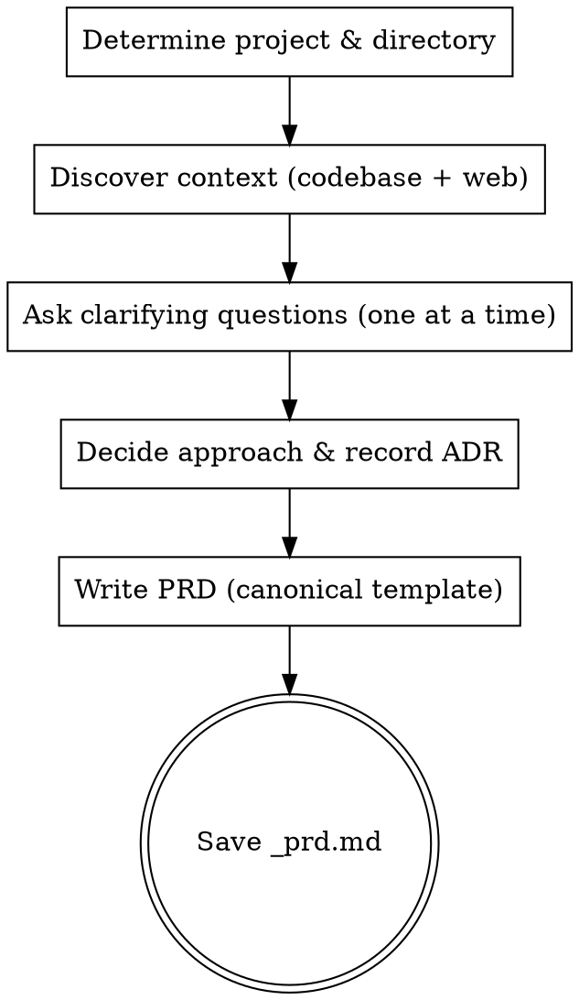

# Create PRD

Create a business-focused Product Requirements Document through structured brainstorming.

<HARD-GATE>
Do NOT skip the research phase — every PRD MUST be enriched with codebase and market context.
Do NOT skip the clarifying questions — the user MUST participate in shaping the PRD before it is written.
Do NOT present multiple approaches for selection or a draft for approval. Once the clarifying questions are answered and the ADRs are recorded, write the PRD file directly. The user reviews the generated file and requests changes afterward if needed.
This applies to EVERY PRD regardless of perceived simplicity.
</HARD-GATE>

## Asking Questions

When this skill instructs you to ask the user a question, you MUST use your runtime's dedicated interactive question tool — the tool or function that presents a question to the user and **pauses execution until the user responds**. Do not output questions as plain assistant text and continue generating; always use the mechanism that blocks until the user has answered.

If your runtime does not provide such a tool, present the question as your complete message and stop generating. Do not answer your own question or proceed without user input.

## Anti-Pattern: "This Feature Is Too Simple For Full Brainstorming"

Every PRD goes through the full brainstorming process. A single button, a minor workflow tweak, a configuration option — all of them. "Simple" features are where unexamined business assumptions cause the most rework. The brainstorming can be brief for genuinely simple features, but you MUST ask clarifying questions before writing the artifact.

## Anti-Pattern: End-Of-Flow Bureaucracy

Once the user has answered the clarifying questions, do not force them through an approach-selection gate or a draft-approval loop before writing. Decide the product direction, record it as an ADR, synthesize the PRD, and write the file directly. The user reviews the generated file and requests edits afterward if needed.

## Anti-Pattern: Technical Drift On Technical-Sounding Features

When the feature name sounds technical (e.g., "webhook notifications", "CSV export", "dark mode", "API rate limiting"), you will be tempted to discuss HOW to implement it. Resist this. Your job is the WHAT and WHY:

- WRONG: "Should we use WebSockets or polling for notifications?" (implementation)
- WRONG: "What CSV library format should we target?" (implementation)
- RIGHT: "Which events should trigger a notification to the user?" (user need)
- RIGHT: "What information do users need in their exported reports?" (user need)

Translate every technical-sounding feature into the user experience question behind it.

## Required Inputs

- Feature name or product idea.
- Optional: existing `_idea.md` file as primary input for context.
- Optional: existing `_prd.md` file for update mode.

## Checklist

You MUST create a task for each phase and complete them in order:

1. **Determine project & directory** — derive slug, create `.compozy/tasks/<slug>/` and `adrs/`
2. **Discover context** — parallel codebase exploration and web research
3. **Understand the need** — ask 3-6 targeted questions to refine scope and intent
4. **Decide the approach & record ADRs** — choose the best product direction from the answers and research, then record it (with alternatives considered) as an ADR
5. **Write the PRD** — write using the canonical template from `references/prd-template.md` and save to `.compozy/tasks/<slug>/_prd.md`

## Workflow

1. Determine the project name and working directory.
   - Derive the slug from the feature name provided by the user.
   - Use `.compozy/tasks/<slug>/` as the target directory.
   - If `_idea.md` exists in the target directory, read it as primary context input.
   - If `_prd.md` already exists in the target directory, read it and operate in update mode.
   - If the directory does not exist, create it.
   - Create `.compozy/tasks/<slug>/adrs/` directory if it does not exist.

2. Discover context through parallel research. You MUST perform BOTH tracks before asking any questions.

   **Track A — Codebase exploration** (REQUIRED):
   - Search the codebase for files, patterns, and features related to the user's request.
   - Look for existing implementations, data models, and integration points that are relevant.
   - Summarize what you found in 3-5 bullet points.

   **Track B — Market and user research** (REQUIRED):
   - Perform 3-5 web searches for market trends, competitive products, and user needs related to the feature.
   - Look for how similar products solve this problem and what users expect.
   - Summarize what you found in 3-5 bullet points.

   Run both tracks in parallel (e.g., two Agent tool calls, two search batches, etc.). Present a brief merged summary of findings from BOTH tracks to the user before moving to questions. If web search tools are unavailable, note the limitation explicitly and proceed with codebase findings only.

3. Ask clarifying questions following `references/question-protocol.md`.
   - Focus exclusively on WHAT features users need, WHY it provides business value, and WHO the target users are.
   - Ask about success criteria and constraints.
   - Never ask technical implementation questions about databases, APIs, frameworks, or architecture.
   - **ONE question per message — strictly enforced.** Your message must contain exactly one question mark. After asking the question, STOP. Do not add follow-up questions, "also" questions, or "additionally" prompts. If a topic needs more exploration, ask a follow-up in the NEXT message after the user responds.

     Anti-pattern (FORBIDDEN):
     "What is the primary user persona? Also, what are the key success metrics?"
     This is TWO questions. Split them into two separate messages.

   - Every question MUST be multiple-choice when reasonable options can be predetermined. Format as labeled options (A, B, C, etc.) so the user can respond with a single letter. Only use open-ended questions when the answer space is genuinely unbounded (e.g., "What problem are you trying to solve?").
   - Include a fallback option (e.g., "D) Other — describe") for flexibility.
   - For complex features with many dimensions, decompose into sub-topics and ask about one dimension at a time. Each sub-topic usually has predeterminable options. Example: instead of the open-ended "What should the collaboration feature include?", ask "Which aspect of team collaboration is most important to start with? A) Shared workspaces B) Real-time presence C) Permission controls D) Activity feeds".
   - Complete at least one full clarification round before deciding the approach.

4. Decide the product approach.
   - Based on the clarifying answers and research, choose the best product direction yourself. Do NOT present a menu of approaches for the user to select.
   - Record the decision as an ADR:
     - Read `references/adr-template.md`.
     - Determine the next ADR number by listing existing files in `.compozy/tasks/<slug>/adrs/`.
     - Fill the template: the chosen direction as "Decision", the alternatives you weighed as "Alternatives Considered" with their trade-offs, and outcomes as "Consequences". Set Status to "Accepted" and Date to today.
     - Write the ADR to `.compozy/tasks/<slug>/adrs/adr-NNN.md` (zero-padded 3-digit number, e.g., `adr-001.md`).

5. Write the PRD.
   - Synthesize the chosen direction into the final product design. Do not present each section for separate approval.
   - If a significant scope decision surfaced during clarification, create an additional ADR following the same process as step 4.
   - Only pause before writing if a blocking ambiguity remains that would force guessing; otherwise proceed directly to document generation.
   - Read `references/prd-template.md` and fill every section with gathered context.
   - Include an "Architecture Decision Records" section listing all ADRs created during this session with their numbers, titles, and one-line summaries as links to the `adrs/` directory.
   - Apply YAGNI ruthlessly: challenge every feature and remove anything the MVP does not need.
   - The PRD must describe user capabilities and business outcomes only.
   - No databases, APIs, code structure, frameworks, testing strategies, or architecture decisions.
   - Mandatory sections (ALWAYS include): Overview, Goals, User Stories, Core Features, User Experience, Non-Goals, Phased Rollout Plan, Success Metrics, Risks and Mitigations, Architecture Decision Records, Open Questions.
   - Optional sections (include when relevant): High-Level Technical Constraints.
   - Prefer active voice, omit needless words, use definite and specific language over vague generalities. Every sentence should earn its place.
   - Language: **English**. Tone: clear, technical, consistent with existing project artifacts.

6. Save the PRD file.
   - Write the completed document to `.compozy/tasks/<slug>/_prd.md`.
   - Confirm the file path to the user.
   - Tell the user the PRD is ready to review and that they can ask for any changes directly.
   - Remind the user that the next step is to create a TechSpec using `cy-create-techspec` from this PRD.

## Process Flow

## Error Handling

- If the user provides insufficient context to complete a section, note it in the Open Questions section rather than guessing.
- If web research tools are unavailable, proceed with codebase exploration only and note the limitation.
- If the target directory cannot be created, stop and report the filesystem error.
- If operating in update mode, preserve sections the user has not asked to change.

## Key Principles

- **One question at a time** — Do not overwhelm with multiple questions in a single message
- **Multiple choice mandatory** — Every question MUST be multiple-choice (A/B/C) when options can be predetermined; open-ended only when the answer space is genuinely unbounded
- **YAGNI ruthlessly** — Challenge every feature; remove anything the MVP does not need
- **Decide then write** — Make the product decisions through the clarifying questions, record them as ADRs, write the file directly, and iterate only if the user requests changes afterward
- **Business focus only** — Never ask about implementation; that belongs in TechSpec
- **Idea as input** — When `_idea.md` exists, use it as primary context to accelerate brainstorming
- **Pipeline awareness** — The PRD feeds into `cy-create-techspec`; focus on WHAT and WHY, not HOW
- **Template compliance** — Every PRD MUST follow the canonical template
- **Language consistency** — Write all PRD content in English
