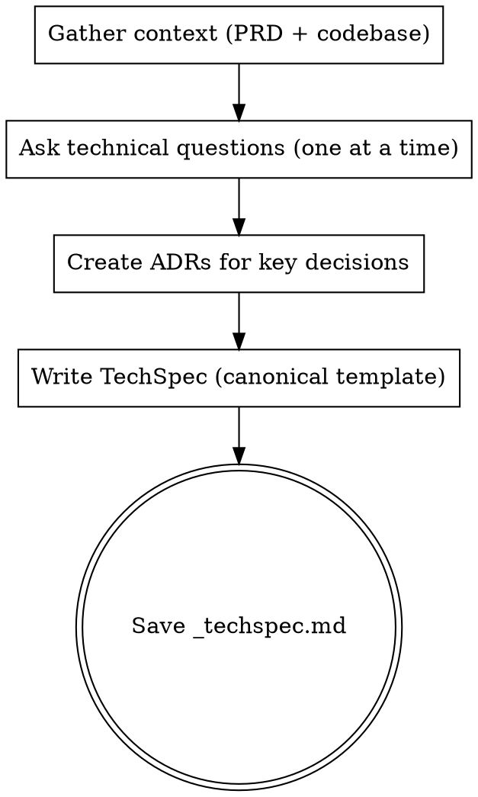

# Create TechSpec

Translate business requirements into a detailed technical specification.

<HARD-GATE>
Do NOT skip the codebase exploration — every TechSpec MUST be informed by existing architecture.
Do NOT skip the technical clarification questions — the user MUST participate in shaping the TechSpec before it is written.
Do NOT present a draft for approval. Once the clarification questions are answered and the ADRs are recorded, write the TechSpec file directly. The user reviews the generated file and requests changes afterward if needed.
This applies to EVERY TechSpec regardless of perceived simplicity.
</HARD-GATE>

## Asking Questions

When this skill instructs you to ask the user a question, you MUST use your runtime's dedicated interactive question tool — the tool or function that presents a question to the user and **pauses execution until the user responds**. Do not output questions as plain assistant text and continue generating; always use the mechanism that blocks until the user has answered.

If your runtime does not provide such a tool, present the question as your complete message and stop generating. Do not answer your own question or proceed without user input.

## Anti-Pattern: "This Is Too Simple To Need Technical Design Review"

Every TechSpec goes through the full design review process. A single endpoint, a minor refactor, a configuration change — all of them. "Simple" technical changes are where unexamined assumptions about existing architecture cause the most integration failures. The design review can be brief for genuinely simple changes, but you MUST ask technical clarification questions before writing the artifact.

## Anti-Pattern: End-Of-Flow Bureaucracy

Once the user has answered the technical clarification questions, do not force them through a draft-approval loop before writing. Record the decisions as ADRs, synthesize the TechSpec, and write the file directly. The user reviews the generated file and requests edits afterward if needed.

## Required Inputs

- Feature name identifying the `.compozy/tasks/<name>/` directory.
- Optional: existing `_prd.md` as primary input.
- Optional: existing `_techspec.md` for update mode.

## Checklist

You MUST create a task for each phase and complete them in order:

1. **Gather context** — read PRD, ADRs, and explore codebase architecture
2. **Ask technical questions** — 3-6 targeted questions on architecture, data models, APIs, testing
3. **Create ADRs** — record significant technical decisions (architecture pattern, technology choices, data model approach)
4. **Write the TechSpec** — write using the canonical template from `references/techspec-template.md` and save to `.compozy/tasks/<name>/_techspec.md`

## Workflow

1. Gather context.
   - Check for `_prd.md` in `.compozy/tasks/<name>/`. If it exists, read it as the primary input.
   - If no PRD exists, ask the user for a description of what needs technical specification.
   - Read existing ADRs from `.compozy/tasks/<name>/adrs/` to understand decisions already made during PRD creation.
   - Create `.compozy/tasks/<name>/adrs/` directory if it does not exist.
   - Spawn an Agent tool call to explore the codebase for architecture patterns, existing components, dependencies, and technology stack.
   - If `_techspec.md` already exists, read it and operate in update mode.

2. Ask technical clarification questions.
   - Focus on HOW to implement, WHERE components live, and WHICH technologies to use.
   - Cover architecture approach and component boundaries.
   - Cover data models and storage choices.
   - Cover API design and integration points.
   - Cover testing strategy and performance requirements.
   - Ask only one question per message. If a topic needs more exploration, break it into a sequence of individual questions.
   - Prefer multiple-choice questions when the options can be predetermined.
   - Include a fallback option (e.g., "D) Other — describe") for flexibility.

3. Create ADRs for significant technical decisions.
   - For each significant decision (architecture pattern chosen, technology selected, data model approach, etc.):
     - Read `references/adr-template.md`.
     - Determine the next ADR number by listing existing files in `.compozy/tasks/<name>/adrs/`.
     - Fill the template: the chosen design as "Decision", rejected alternatives as "Alternatives Considered", and trade-offs as "Consequences". Set Status to "Accepted" and Date to today.
     - Write each ADR to `.compozy/tasks/<name>/adrs/adr-NNN.md` (zero-padded 3-digit sequential number).

4. Write the TechSpec.
   - Read `references/techspec-template.md` and fill every applicable section.
   - **MANDATORY — Architecture Decision Records section:** The generated TechSpec MUST end with an "Architecture Decision Records" section listing every ADR created during this process. Each entry must include the ADR number (e.g., ADR-001), title, and a one-line summary formatted as a link to the `adrs/` directory. Even simple features require at least one ADR documenting the primary technical approach chosen and alternatives rejected. If no ADRs were created in step 3, go back and create at least one before generating the document.
   - Apply YAGNI ruthlessly: remove any component, interface, or abstraction that is not strictly necessary. Do NOT propose new packages or directories when the feature can be implemented by adding a single file to an existing package.
   - Every PRD goal and user story should map to a technical component.
   - Reference PRD sections by name but do not duplicate business context.
   - Include code examples only for core interfaces, limited to 20 lines each. The Core Interfaces section must contain at least one Go interface or struct definition as a code block, even for simple features — show the primary type that other components will depend on.
   - The Development Sequencing section MUST include a numbered Build Order where every step after the first explicitly states which previous steps it depends on.
   - Prefer active voice, omit needless words, use definite and specific language over vague generalities. Every sentence should earn its place.
   - Language: **English**. Tone: clear, technical, consistent with existing project artifacts.

5. Save the TechSpec file.
   - Write the completed document to `.compozy/tasks/<name>/_techspec.md`.
   - Confirm the file path to the user.
   - Tell the user the TechSpec is ready to review and that they can ask for any changes directly.
   - Remind the user that the next step is to create tasks using `cy-create-tasks` from this TechSpec.

## Process Flow

## Error Handling

- If the PRD is missing, proceed with user-provided context and note the absence in the Executive Summary.
- If codebase exploration reveals conflicting architectural patterns, document both and recommend one with rationale.
- If the user requests changes after the TechSpec is written, incorporate the feedback and update the file.
- If the target directory does not exist, create it.
- If operating in update mode, preserve sections the user has not asked to change.

## Key Principles

- **One question at a time** — Do not overwhelm with multiple questions in a single message
- **Multiple choice preferred** — Easier for users to answer than open-ended when possible
- **YAGNI ruthlessly** — Remove unnecessary components, abstractions, and interfaces from all designs
- **Decide then write** — Make the technical decisions through the clarification questions, record them as ADRs, write the file directly, and iterate only if the user requests changes afterward
- **Technical focus only** — Never ask business questions; that belongs in the PRD
- **Trade-offs are mandatory** — Every Executive Summary must state the primary technical trade-off of the chosen approach
- **PRD as input** — When `_prd.md` exists, use it as primary context; every PRD goal should map to a technical component
- **Pipeline awareness** — The TechSpec feeds into `cy-create-tasks`; focus on HOW, not WHAT or WHY
- **Template compliance** — Every TechSpec MUST follow the canonical template
- **Language consistency** — Write all TechSpec content in English
