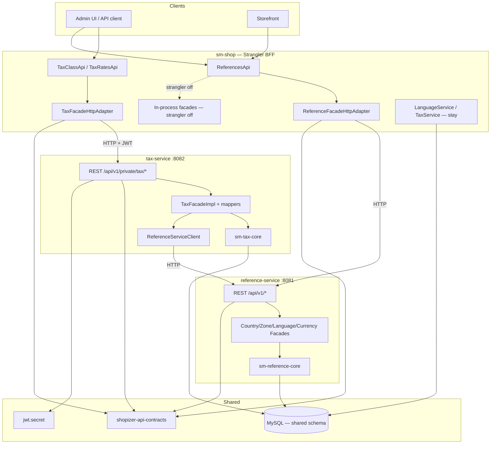

# TechSpec: Wave 1 — Extração dos serviços Reference + Tax

**Feature slug:** `onda-1-reference-tax`  
**PRD:** [`_prd.md`](_prd.md)  
**Fonte de design TLC:** `.specs/features/onda-1-reference-tax/design.md`  
**Date:** 2026-07-18

---

## Resumo executivo

A Wave 1 extrai **runtime e API** de dados de reference e administração de tax em dois executáveis Spring Boot (`reference-service` na 8081, `tax-service` na 8082), enquanto o monolito (`sm-shop`) permanece o BFF voltado ao client. Um módulo `shopizer-api-contracts` livre de JPA carrega DTOs e interfaces de client. Cores finas (`sm-reference-core`, `sm-tax-core`) guardam services/repositories movidos sem puxar todo o `sm-core`. Adapters Strangler usam `RestTemplate` atrás de `@ConditionalOnProperty` (`wave1.strangler.enabled`).

**Trade-off técnico principal:** Aceitamos um **schema de database compartilhado** e deixamos **cálculo de tax + ~60 callers de LanguageService + InitializationDatabaseImpl** no monolito para provar rapidamente Strangler + Pact + boundaries DTO. Autonomia de ownership de dados e extração completa do domínio tax ficam adiadas. Esta é decomposição intencional runtime-first, não um estado final puro de microsserviços.

Mapeia aos objetivos do PRD: deployabilidade independente, estabilidade de path, pureza de DTO, cutover Strangler, gates de contrato, continuidade do checkout.

---

## Arquitetura do sistema

### Visão geral dos componentes



| Componente | Propósito | Boundary |
| ---------- | --------- | -------- |
| `shopizer-api-contracts` | DTOs livres de JPA + interfaces `ReferenceServiceClient` / `TaxServiceClient` | Sem Spring Boot, sem `sm-core-model` |
| `sm-reference-core` | Services + repos de Country/Zone/Language/Currency | Depende apenas de `sm-core-model` (fino) |
| `sm-tax-core` | Services + repos de TaxClass/TaxRate (não `TaxService`) | Depende de `sm-core-model` |
| `reference-service` | Espelho REST público dos paths de reference; Ehcache; actuator | Porta 8081; sem JWT nas rotas P1 |
| `tax-service` | REST privado de tax; cadeia JWT; mappers de tax; HTTP para reference | Porta 8082 |
| Adapters Strangler do `sm-shop` | Implementações HTTP condicionais das interfaces de facade existentes | Controllers permanecem no monolito |
| MySQL compartilhado | Tabelas existentes; FKs intactas | ADR-002 |

**Fluxo de dados (GET country, Strangler on):** Client → `ReferencesApi` → resolução language/store → `CountryFacadeHttpAdapter` → RestTemplate → `reference-service` → JPA → DTO JSON → client.

**Fluxo de dados (create tax rate):** Client + JWT → `TaxRatesApi` do monolito → `TaxFacadeHttpAdapter` (encaminha JWT) → `tax-service` → `PersistableTaxRateMapper` → `ReferenceServiceClient` resolve country/zone → persiste `TAX_RATE`.

---

## Design de implementação

### Interfaces principais

Dependência primária para mapeamento de rate no tax-service e para adapters do monolito (Java / Spring Boot — não Go):

```java
package com.salesmanager.contracts.client;

import com.salesmanager.contracts.reference.ReadableCountry;
import com.salesmanager.contracts.reference.ReadableLanguage;
import com.salesmanager.contracts.reference.ReadableZone;

public interface ReferenceServiceClient {
    ReadableCountry getCountryByCode(String isoCode, String langCode);
    ReadableZone getZoneByCode(String countryCode, String zoneCode, String langCode);
    ReadableLanguage getLanguageByCode(String code);
}
```

```java
// sm-shop strangler — pattern for each reference facade
@ConditionalOnProperty(name = "wave1.strangler.enabled", havingValue = "true")
@Service
public class CountryFacadeHttpAdapter implements CountryFacade {
    // RestTemplate + wave1.reference-service.base-url
    // propagate X-Correlation-Id; map connection failures to 503
}
```

```java
// tax-service — delete guard (OQ-03)
public void delete(TaxClass taxClass) {
    long n = productRepository.countByTaxClassId(taxClass.getId());
    if (n > 0) throw new TaxClassInUseException(taxClass.getId(), n);
    // then delete
}
```

**Convenções de erro**

| Cenário | HTTP | Notas |
| ------- | ---- | ----- |
| Country desconhecido em `/zones` | 200 + `[]` | OQ-02 congelado |
| Country/zone inválido em tax rate | 400 | Mensagem de validação |
| Tax class em uso no DELETE | 409 | Body `TAX_CLASS_IN_USE` |
| Class/rate não encontrado | 404 | Paridade com o monolito |
| Store mismatch | 403 | Paridade |
| Serviço downstream fora (Strangler on) | 503 | Sem fallback silencioso |
| JWT inválido/ausente | 401 | tax-service + BFF |
| `existsTaxRate` com code ausente | 200 | `{exists: false}` — TAX-09 |

### Modelos de dados

**DTOs de contracts (wire)**

| Tipo | Campos-chave |
| ---- | ------------ |
| `ReadableCountry` | id, code, name, zones… (formato existente) |
| `ReadableZone` | id, code, name |
| `ReadableLanguage` | apenas id, code, sortOrder |
| `ReadableCurrency` **NOVO** | id, code, name, symbol, supported |
| `SizeReferences` | enums de measure (inalterado) |
| `PersistableTaxClass` / `ReadableTaxClass` | CRUD de class com escopo de store |
| `PersistableTaxRate` / `ReadableTaxRate` | codes + descriptions i18n |
| `Entity`, `ReadableEntityList`, `EntityExists` | wrappers comuns |

**Tabelas (schema compartilhado, ownership em runtime)**

| Serviço | Tabelas |
| ------- | ------- |
| reference-service | `COUNTRY`, `COUNTRY_DESCRIPTION`, `ZONE`, `ZONE_DESCRIPTION`, `LANGUAGE`, `CURRENCY` |
| tax-service | `TAX_CLASS`, `TAX_RATE`, `TAX_RATE_DESCRIPTION` |

**FKs cross-domain retidas:** `TAX_RATE.COUNTRY_ID` / `ZONE_ID`; `TAX_CLASS.MERCHANT_ID`; `PRODUCT.TAX_CLASS_ID` (guard 409).

**Interno:** overload `LanguageService.toLocale(Language, String countryCode)` (REF-08) no reference core — desacopla da entidade `MerchantStore` na API do service.

**GeoZone:** entidades podem permanecer no model; sem API (ADR-006).

### Endpoints da API

#### reference-service (público; espelhado pelos paths do monolito)

| Method | Path | Response | Req |
| ------ | ---- | -------- | --- |
| GET | `/api/v1/country` | `List<ReadableCountry>` | REF-02, REF-03 |
| GET | `/api/v1/zones?code={iso}` | `List<ReadableZone>` | REF-02; 200+`[]` se desconhecido |
| GET | `/api/v1/languages` | `List<ReadableLanguage>` | REF-04, REF-06 |
| GET | `/api/v1/currency` | `List<ReadableCurrency>` | REF-05, REF-06 |
| GET | `/api/v1/measures` | `SizeReferences` | REF-10 |

Query params preservados: `lang`, `store` (resolução default de language).

#### tax-service (JWT privado)

| Method | Path | Notas | Req |
| ------ | ---- | ----- | --- |
| POST | `/api/v1/private/tax/class` | Create; retorna Entity id | TAX-02, TAX-03 |
| GET | `/api/v1/private/tax/class` | List para a store | TAX-03 |
| GET | `/api/v1/private/tax/class/{code}` | 404 se ausente | TAX-03 |
| PUT/DELETE | `/api/v1/private/tax/class/{id}` | Escopo de store; DELETE→409 se products | TAX-03, OQ-03 |
| GET | `/api/v1/private/tax/class/unique?code=` | Existência | TAX-03 |
| POST/GET/PUT/DELETE | `/api/v1/private/tax/rate/*` | CRUD + descriptions i18n | TAX-04, TAX-06 |
| GET | `/api/v1/private/tax/rate/unique?code=` | `{exists:false}` sem throw | TAX-09 |

O monolito mantém `ReferencesApi`, `TaxClassApi`, `TaxRatesApi` como entrypoints BFF (STR-04).

#### Configuração

```properties
# reference-service
server.port=8081

# tax-service
server.port=8082
wave1.reference-service.base-url=http://localhost:8081

# sm-shop (strangler)
wave1.strangler.enabled=true
wave1.reference-service.base-url=http://reference-service:8081
wave1.tax-service.base-url=http://tax-service:8082
wave1.http.client.timeout-ms=5000
```

`wave1.strangler.enabled=false` (matchIfMissing) → facades in-process para dev local (STR-01).

---

## Pontos de integração

| Sistema | Propósito | Auth | Erros / retries |
| ------- | --------- | ---- | --------------- |
| MySQL (compartilhado) | JPA para tabelas reference/tax; user/store para JWT | Credenciais de DB | Datasource padrão; sem split |
| Monolito → reference-service | Delegação de facade Strangler | Rotas públicas | Timeout 5s; 503 em falha de connect; sem retry storm exigido na Wave 1 |
| Monolito → tax-service | Facade Strangler de tax | Encaminhar `Authorization` | Propagar 4xx/5xx; 503 em falha de connect |
| tax-service → reference-service | Resolver codes de country/zone/language | Nenhuma (público) | 400 ao client se codes inválidos |
| JWT secret / properties de auth | Validação compartilhada de token admin | Secret compartilhado via env | Testes de paridade de config |
| Actuator | Health DB (+ tax→reference HTTP) | Endurecer em prod conforme necessário | Usado por compose/ops |
| Artefatos Pact | Contratos consumer/provider | N/A | Gate de CI; arquivos Pact locais aceitáveis na Wave 1 |

Login permanece `POST /api/v1/private/login` apenas no monolito.

---

## Análise de impacto

| Componente | Tipo de impacto | Descrição e risco | Ação necessária |
| ---------- | --------------- | ----------------- | --------------- |
| Root `pom.xml` | modificado | Adicionar módulos contracts + cores + services | Ordem de módulos: contracts antes dos services |
| `shopizer-api-contracts` | novo | JAR DTO/client | Scaffold; zero `sm-core-model` |
| `sm-shop-model` | modificado | Depender de contracts; re-exportar/deprecar DTOs duplicados | Manter compatibilidade de compile |
| `sm-reference-core` | novo | Repos/services de reference movidos | Atualizar dependência de `sm-core` |
| `sm-tax-core` | novo | Apenas CRUD de tax movido | Manter `TaxService*` em `sm-core` |
| `sm-core` | modificado | Perde classes movidas; ganha deps nos cores finos | Testes de regressão |
| `reference-service` | novo | App Boot + facades/populators/controllers | Portar de sm-shop |
| `tax-service` | novo | App Boot + JWT + facade/mappers/controllers | Portar + ReferenceServiceClient |
| Packages strangler do `sm-shop` | novo | Adapters HTTP + config RestTemplate | Beans condicionais |
| `ReferencesApi` / tax APIs | modificado (wiring) | Permanecem como BFF; troca de impl de facade | Sem mudanças de path |
| `InitializationDatabaseImpl` | nenhum (intencional) | Permanece no monolito | Documentar ordem de seed |
| Order / `TaxService` | nenhum | Cálculo permanece in-process | Proteger com testes de regressão |
| GeoZone | nenhum | Fora de escopo | Não expor |
| Docker compose | novo | Topologia wave1 | MySQL → ref → tax → shop |

---

## Abordagem de testes

### Testes unitários

- Guard de delete de tax e semântica de `existsTaxRate` (`sm-tax-core`)
- Units de facade/mapper nos services (mapeamento DTO; sem JPA nas assertions de JSON)
- `ReferenceServiceClient` com `MockRestServiceServer` / WireMock
- Binding de properties de `Wave1ClientConfig`
- Units de health indicator

### Testes de integração

- Smoke `@DataJpaTest` para repositories extraídos
- IT de API do `reference-service`: 5 endpoints; `/zones?code=XX` → 200 `[]`
- IT de security do `tax-service`: sem token → 401; CRUD class+rate com JWT
- ITs de adapter Strangler em `sm-shop` (modo HTTP)
- Testes de profile: `monolith` e `strangler` ambos wiring exatamente um bean por facade
- `TaxRateIntegrationTest` existente verde sob profile monolito (TAX-07)
- Testes Pact provider em cada serviço; Pact consumer em `sm-shop` (STR-02, TAX-08)

### Contratos / gate

- Reactor completo `./mvnw clean install` como gate final da Wave 1
- Quebra intencional de campo no provider deve falhar a verificação do consumer

---

## Sequenciamento de desenvolvimento

Alinhado às fases do TLC tasks.md (T1–T30) para consciência; arquivos de task Compozy são um passo posterior.

### Ordem de build

1. **Scaffold `shopizer-api-contracts`** — sem dependências de outros módulos Wave 1.
2. **DTOs comuns + reference + tax e interfaces de client** — depende do passo 1.
3. **Wire `sm-shop-model` → contracts** — depende do passo 2.
4. **Extrair `sm-reference-core` (repos → services → rewire de `sm-core`)** — depende do passo 3.
5. **Extrair `sm-tax-core` (repos → services → fixes 409/TAX-09 → rewire de `sm-core`)** — depende do passo 3; paralelizável com o passo 4 após o passo 3.
6. **Build `reference-service` (Boot → facades/populators → REST)** — depende do passo 4.
7. **Build `tax-service` (Boot+JWT → ReferenceServiceClient → facade/mappers → REST)** — depende dos passos 5 e 6 (client precisa dos endpoints de reference).
8. **Strangler do monolito (config `RestTemplate` → adapters reference → adapter tax → wiring condicional)** — depende dos passos 3, 6 e 7.
9. **Providers Pact (reference, tax) depois consumer (monolito)** — depende dos passos 6–8 para endpoints/adapters reais.
10. **Compose, correlation id, health customizado, gate completo do reactor** — depende dos passos 8 e 9.

### Dependências técnicas

- MySQL (ou testcontainers/H2 conforme convenções do módulo) disponível para ITs
- `jwt.secret` / config de auth compartilhado para tax-service
- DB com seed para greenfield (`InitializationDatabaseImpl` do monolito — ADR-007)
- Ordem de startup: MySQL → reference-service → tax-service → monolito (strangler)
- Sem discovery Eureka/K8s na Wave 1 (apenas URLs de config)

---

## Monitoramento e observabilidade

| Sinal | Onde | Notas |
| ----- | ---- | ----- |
| `/actuator/health` | ambos os serviços | Componente DB; tax também checa reference HTTP |
| `X-Correlation-Id` | monolito + ambos os serviços | Gerar se ausente; log em cada hop |
| Métricas HTTP server | serviços | Contagens de request / status |
| Latência HTTP client | adapters do monolito + client de tax | Histogramas quando metrics habilitadas |
| Alerting (ops P3) | integração/prod | Health DOWN; taxa elevada de 503 do BFF; p95 reference > 2× baseline |

---

## Considerações técnicas

### Decisões-chave

| Decisão | Escolha | Rationale | Trade-off | Rejeitado |
| -------- | ------- | --------- | --------- | --------- |
| Estilo de extração | Strangler runtime/API | Pilotar domínios de baixo risco | DB compartilhado permanece | Big-bang + DBs dedicados |
| Escopo de tax | Apenas CRUD admin | Manter checkout seguro | Contextos dual de tax | Mover calculateTax |
| Client HTTP | RestTemplate | Precedente + simplicidade | Menos declarativo | Feign / WebClient |
| Contracts | JAR só-DTOs + Pact | Anti-corrupção + gate CI | Churn de migração | Mappers em contracts |
| Split de core | `sm-reference-core` / `sm-tax-core` | Evitar dep completa de `sm-core` | Módulos extras | Depender de todo sm-core |
| Auth tax | Replicação JWT | Paridade com APIs privadas | Security duplicada | Confiança só na rede |
| Discovery | URLs de config | YAGNI | Ops manual | Eureka na Wave 1 |
| GeoZone | Excluído | Sem service layer | Modelo geo incompleto | Inventar APIs |
| Bootstrap | Seed no monolito | Hub cross-domain | Acoplamento greenfield | Mover init para serviços |
| Cache | Ehcache local | Casar com o atual | Sem cache distribuído | Cache em cluster Wave 1 |

### Riscos conhecidos

| Risco | Probabilidade | Mitigação |
| ----- | ------------- | --------- |
| Assinaturas de facade B-001 ainda passam Language/MerchantStore | Alta (aceito) | Adapters mantêm assinaturas; HTTP traduz; LanguageCode na Wave 3 |
| Fallback de description `descriptions.get(0)` frágil | Média | Preservar comportamento; melhorar depois |
| Acoplamento acidental via DB compartilhado | Média | Cores finos; não mover TaxService; revisar uso de FK |
| Drift de config JWT | Média | Env compartilhado; IT de security |
| Strangler on + reference fora quebra create de tax rate | Média | Health indicator; ordem de deploy; clareza do 503 |
| Flakiness de Pact | Baixa–Média | Provider states mínimos; assertar campos que o consumer precisa |

---

## Registros de decisão de arquitetura

- [ADR-001: TLC-sourced Compozy PRD for Wave 1 Reference+Tax](adrs/adr-001.md) — TLC é autoritativo; piloto Strangler para reference + tax admin.
- [ADR-002: Shared DB schema for Wave 1](adrs/adr-002.md) — Schema compartilhado; sem split de DB (STATE AD-003).
- [ADR-003: Tax admin only; calculation stays in monolith](adrs/adr-003.md) — `TaxService.calculateTax` permanece in-process (STATE AD-002).
- [ADR-004: RestTemplate Strangler clients](adrs/adr-004.md) — RestTemplate + URLs de config (STATE AD-005).
- [ADR-005: Contract DTOs / no JPA in REST responses; Pact](adrs/adr-005.md) — Contracts livres de JPA + gates Pact.
- [ADR-006: GeoZone excluded from Wave 1](adrs/adr-006.md) — Sem API GeoZone (STATE AD-007).
- [ADR-007: InitializationDatabaseImpl stays in the monolith](adrs/adr-007.md) — Seed permanece multi-domínio (STATE AD-004).
- [ADR-008: JWT replication for tax-service](adrs/adr-008.md) — Cadeia JWT completa no tax-service (STATE AD-006).

---

*Próximo passo: criar tasks executáveis com `cy-create-tasks` a partir deste TechSpec (o TLC `tasks.md` já sequencia T1–T30 como referência).*
