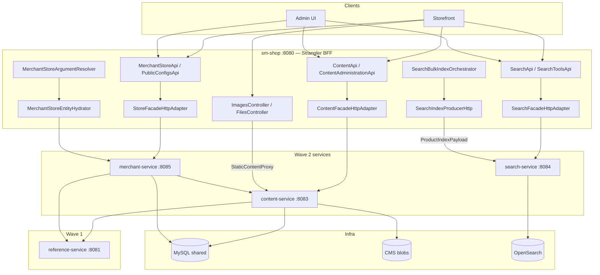
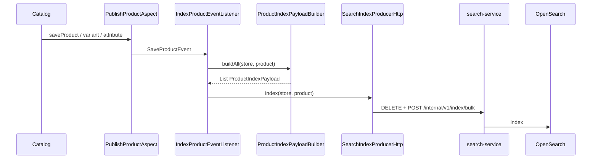

# TechSpec: Onda 2 — Content, Search, Merchant

**PRD:** [._prd.md](_prd.md)  
**Design TLC (COMO autoritativo):** `.specs/features/onda-2-content-search-merchant/design.md`  
**Slug da feature:** `onda-2-content-search-merchant`  
**Data:** 2026-07-18  
**Status:** Pronto para `cy-create-tasks`

---

## Resumo executivo

A Onda 2 extrai **três serviços Spring Boot** — `content-service` (:8083), `search-service` (:8084), `merchant-service` (:8085) — enquanto `sm-shop` permanece como **Strangler BFF**. O schema MySQL compartilhado continua (AD-003 herdado). DTOs estendem `shopizer-api-contracts`; subsets de domínio vão para cores thin `sm-content-core` e `sm-merchant-core`. Search é único: **sem JPA**, atualizações de índice via `ProductIndexPayload` versionado sobre HTTP.

**Trade-off principal:** Aceitar um DTO intermediário de índice e lacunas documentadas de reindex para que a busca possa sair do monólito **antes** do `ProductSnapshot` da Onda 3, em troca de manter o `ProductIndexPayloadBuilder` acoplado ao catálogo dentro do monólito até ondas posteriores. Segundo trade-off: DB compartilhado + APIs internas isoladas por rede em vez de databases por serviço ou complexidade total de mTLS/saga.

**Pré-requisito:** Execute da Onda 1 completo (reference-service, tax-service, pacote de contratos, padrões Strangler/RestTemplate/JWT/Pact). O código da Onda 2 só começa após esse gate.

---

## Arquitetura do sistema

### Visão geral dos componentes



| Componente | Responsabilidade | Limite |
| ---------- | ---------------- | ------ |
| `shopizer-api-contracts` | DTOs content/merchant/search + interfaces de cliente | Sem JPA; sem mappers |
| `sm-content-core` | Repos de content, `ContentService`, backends CMS de conteúdo | Exclui product file managers |
| `content-service` | REST + static/logo internos; JWT em `/private/**` | Porta 8083; JPA + blobs |
| `search-service` | Query/autocomplete; API interna de índice; dono do OpenSearch | Porta 8084; **sem DB** |
| `sm-merchant-core` | Serviços/repos de merchant store/config/log | Sem ProductType |
| `merchant-service` | REST de store/config; orquestração de logo; store snapshot | Porta 8085; JPA |
| Adapters strangler de `sm-shop` | Facades HTTP, proxy estático, producer de índice, hydrator do resolver | Feature flag `wave2.strangler.enabled` |
| `reference-service` | Language/country/zone/currency (Onda 1) | Consumido por content + merchant |

### Princípios (herdados Onda 1 + Onda 2)

1. Caminhos REST congelados (STR-04); o BFF mantém os controllers originais.
2. Sem entidades JPA no JSON REST; DTOs nos contracts.
3. Mappers/populators vivem nos serviços, não no JAR de contracts.
4. Clientes RestTemplate; properties `wave2.*.base-url` (coexistem com `wave1.*`).
5. JWT replicado em cada serviço para `/private/**`.
6. Content colocaliza acesso a DB + blobs (ADR-008).
7. Search sem JPA; índice via payload (ADR-002, ADR-003).
8. Merchant sem ProductType (ADR-007); logo via content (ADR-006).

---

## Design de implementação

### Interfaces principais

Contratos Java dos quais outros componentes dependem (≤20 linhas cada):

```java
// shopizer-api-contracts — content client
package com.salesmanager.contracts.client;

public interface ContentServiceClient {
  byte[] getStaticFile(String storeCode, String imageType, String fileName);
  void uploadLogo(String storeCode, String fileName, byte[] content, String contentType);
  void deleteLogo(String storeCode, String fileName);
}
```

```java
// shopizer-api-contracts — search index client
package com.salesmanager.contracts.client;

import com.salesmanager.contracts.search.ProductIndexBulkPayload;
import com.salesmanager.contracts.search.ProductIndexPayload;
import java.util.List;

public interface SearchIndexClient {
  void index(ProductIndexPayload payload);
  void indexBulk(ProductIndexBulkPayload bulk);
  void deleteDocument(Long productId, String store, List<String> languages);
}
```

```java
// shopizer-api-contracts — merchant client
package com.salesmanager.contracts.client;

import com.salesmanager.contracts.merchant.MerchantStoreSnapshot;

public interface MerchantServiceClient {
  MerchantStoreSnapshot getStoreSnapshot(String code);
}
```

```java
// sm-core — index producer (strangler)
package com.salesmanager.core.business.services.search.index;

import com.salesmanager.core.model.catalog.product.Product;
import com.salesmanager.core.model.merchant.MerchantStore;

public interface SearchIndexProducer {
  void index(MerchantStore store, Product product);
  void deleteDocument(MerchantStore store, Long productId, java.util.List<String> languages);
}
```

```java
// search-service — query port
package com.salesmanager.search.services;

import modules.commons.search.request.SearchProductRequest;
import modules.commons.search.response.SearchItem;
import com.salesmanager.contracts.search.ValueList;
import java.util.List;

public interface SearchQueryService {
  List<SearchItem> search(String store, String lang, SearchProductRequest request);
  ValueList autocomplete(String store, String lang, String query);
}
```

```java
// search-service — index port
package com.salesmanager.search.services;

import com.salesmanager.contracts.search.ProductIndexPayload;
import java.util.List;

public interface SearchIndexService {
  void index(ProductIndexPayload payload);
  void indexBulk(List<ProductIndexPayload> payloads);
  void delete(Long productId, String store, List<String> languages);
}
```

Convenção de erro: falhas remotas/strangler → HTTP **503** com `{ error, correlationId }`; validação → **400**; `schemaVersion` não suportado → **422**; token interno inválido → **401**; nunca fallback silencioso in-process quando o strangler está ligado.

### Modelos de dados

#### ProductIndexPayload (`shopizer-api-contracts`)

| Campo | Tipo | Notas |
| ----- | ---- | ----- |
| `schemaVersion` | int | default `1`; não suportado → 422 |
| `id` | Long | product id |
| `store` | String | store code em minúsculas |
| `language` | String | código de lang |
| `name`, `description`, `link`, `image`, `reviews`, `brand`, `category` | String | campos de índice |
| `attributes` | Map&lt;String,String&gt; | |
| `variants` | List&lt;Map&lt;String,String&gt;&gt; | |
| `inventory` | List&lt;Map&lt;String,String&gt;&gt; | chaves SKU, QTY, PRICE, DISCOUNT |
| `addToCart` | Boolean | default false; incluir no schema |

Também: `ProductIndexBulkPayload` (lista + batch máximo 50), DTOs Readable/Persistable de content, `MerchantStoreSnapshot`, `Configs`, `ValueList`.

#### Persistência (schema compartilhado)

- Content: `CONTENT`, `CONTENT_DESCRIPTION` (+ tabelas CMS existentes como hoje).
- Merchant: `MerchantStore`, `MerchantConfiguration`, regras relacionadas de hierarquia/`PARENT_ID` inalteradas.
- Search: **sem tabelas**.

#### Blobs

Chaveados por `merchantStoreCode` + `FileContentType`; backends via `config.cms.method` (infinispan/httpd/aws/gcp). Volume/bucket apenas no content-service.

### Endpoints da API

#### content-service (:8083)

| Área | Caminhos | Auth |
| ---- | -------- | ---- |
| Pages | `/api/v1/content/pages*`, `/private/content/page*` | public / JWT |
| Boxes | `/api/v1/content/boxes*` | public / JWT |
| Files | `/private/file*`, `/content/images` | JWT / listagem pública |
| Admin CMS | `/private/content/list`, `/folder`, `/images/*` | JWT; stubs preservados |
| Static interno | `GET /internal/v1/static/files/**` | rede |
| Logo interno | `POST/DELETE /internal/v1/content/logo` | rede |

#### search-service (:8084)

| Método | Caminho | Resposta / notas |
| ------ | ------- | ---------------- |
| POST | `/api/v1/search` | `List<SearchItem>` (commons) |
| POST | `/api/v1/search/autocomplete` | `ValueList` |
| POST | `/api/v1/private/system/search/index` | **501** (orquestrado pelo monólito) |
| POST | `/internal/v1/index` | `X-Internal-Token` |
| POST | `/internal/v1/index/bulk` | token; máx. 50 |
| DELETE | `/internal/v1/index/{productId}?store=&languages=` | token |

#### merchant-service (:8085)

| Área | Caminhos | Notas |
| ---- | -------- | ----- |
| Store API | Espelha `MerchantStoreApi` (~18 ativos) | **Sem rotas ProductType** |
| Config | `GET /api/v1/config` | flags públicas + social |
| Interno | `GET /internal/v1/store/{code}` | `MerchantStoreSnapshot` |

#### Configuração Strangler (`sm-shop`)

```properties
wave2.strangler.enabled=true
wave2.content-service.base-url=http://content-service:8083
wave2.search-service.base-url=http://search-service:8084
wave2.search-service.internal-token=${SEARCH_INTERNAL_TOKEN}
wave2.merchant-service.base-url=http://merchant-service:8085
wave2.http.client.timeout-ms=5000
wave2.search.index.reindex-delay-ms=...
wave2.merchant-service.cache.ttl-seconds=60
# coexist
wave1.strangler.enabled=true
wave1.reference-service.base-url=http://reference-service:8081
```

Matriz de adapters: `ContentFacade`, `SearchFacade`, `StoreFacade`, `MerchantConfigurationFacade` — in-process vs HTTP via `@ConditionalOnProperty(wave2.strangler.enabled)` (`matchIfMissing` → in-process).

---

## Pontos de integração

| Integração | Propósito | Auth | Falha |
| ---------- | --------- | ---- | ----- |
| content → reference-service | `getLanguageByCode` | Padrão de cliente da Onda 1 | 503 |
| merchant → reference-service | country/zone/language/currency | mesmo | 503 |
| merchant → content | upload/delete de logo | rede interna | upload: compensate; delete: orphan WARN |
| monólito → content/search/merchant | facades strangler | JWT forward + correlação | 503 sem fallback |
| monólito → search interno | producer de índice | `X-Internal-Token` | log; GAP-SRCH-07 sem outbox |
| search → OpenSearch | query + índice | credenciais do cluster | 503 |
| content → backend CMS | blobs | específico do método | erro; rename mid-fail pode ficar inconsistente |

Pipeline de índice (monólito):



---

## Análise de impacto

| Componente | Tipo de impacto | Descrição e risco | Ação necessária |
| ---------- | --------------- | ----------------- | --------------- |
| `shopizer-api-contracts` | modificado | Novos pacotes content/merchant/search | Adicionar DTOs + clients |
| `pom.xml` raiz | modificado | Novos módulos | Registrar 5 módulos |
| `sm-content-core` | novo | Extrair content + CMS | Mover + testes |
| `content-service` | novo | App Boot 8083 | Controllers, JWT, health |
| `search-service` | novo | App Boot 8084, sem JPA | Bootstrap OpenSearch |
| `sm-merchant-core` | novo | Extrair serviços merchant | Remover inject de ProductType |
| `merchant-service` | novo | App Boot 8085 | Logo AD-014 |
| `sm-core` | modificado | Delegar a thin cores; builder; listener | Trim CMS XML; producer |
| `sm-shop` | modificado | Config Wave2, adapters, proxy, orchestrator, resolver | Profile Strangler |
| `ImagesController` / `FilesController` | modificado | Proxy quando strangler ligado | Wire StaticContentProxy |
| `ProductOptionFacadeImpl` / grupo variant | modificado | Cliente de blob P2 | HTTP content |
| OpenSearch no monólito | deprecated (strangler) | Desabilitar client quando wave2 ligado | Beans condicionais |
| Schema DB | nenhum (compartilhado) | Migrações coordenadas se houver | Documentar processo de ownership |
| `.specs/` | nenhum | Não modificar neste passo Compozy | — |

---

## Abordagem de testes

### Testes unitários

- `ProductIndexPayloadBuilder` com fixtures de produto.
- `SearchQueryServiceImpl` / `SearchIndexServiceImpl` (mock do client OpenSearch).
- Populators de facade com `ReferenceServiceClient` / `ContentServiceClient` mockados.
- `CorrelationIdFilter` e interceptor RestTemplate.
- Testes unitários de health indicator por serviço.

### Testes de integração

- Content: páginas (2 langs), boxes, upload de arquivo, stubs admin, static/logo internos.
- Search: app context **sem** DataSource; token interno de índice/schemaVersion; search/autocomplete públicos; reindex → 501.
- Merchant: security, store API (sem ProductType), config, snapshot, compensação de logo.
- sm-shop: Wave2ClientConfig; cada adapter HTTP; StaticContentProxy; SearchIndexProducerHttp; hydrator do resolver; profiles monólito vs strangler-wave2.
- Pact: testes provider nos três serviços; consumer `Wave2ConsumerPactTest` em sm-shop.
- Gates: módulo `./mvnw test -pl …`; final `./mvnw clean install`.

### Lacunas conhecidas (documentar, não expandir escopo)

GAP-SRCH-01…10 conforme design (eventos perdidos, inventory/reviews stale, sem outbox, facets null, SearchItem em commons, etc.). Correções triviais opcionais apenas.

---

## Sequenciamento de desenvolvimento

### Ordem de construção

Cada passo após o primeiro declara explicitamente suas dependências.

1. **Onda 1 completa (gate externo)** — sem dependências da Onda 2; bloqueia todos os passos abaixo.
2. **DTOs de content + `ContentServiceClient` nos contracts** — depende do passo 1.
3. **DTOs de search + `SearchIndexClient` nos contracts** — depende do passo 1 (paralelo ao passo 2 após a base de contracts existir).
4. **DTOs de merchant + `MerchantStoreSnapshot` + `MerchantServiceClient`** — depende do passo 1 (paralelo aos passos 2–3).
5. **Properties Strangler Wave2 + RestTemplate + stub de impl de `SearchIndexClient` em sm-shop** — depende dos passos 2, 3, 4.
6. **Scaffold `sm-content-core` + repositórios de content** — depende do passo 2.
7. **Mover `ContentService` + módulos CMS de conteúdo (sem product managers)** — depende do passo 6.
8. **Adicionar `shopizer-content-cms.xml`** — depende do passo 7.
9. **Scaffold app Boot `content-service` (:8083)** — depende do passo 8.
10. **Security JWT no content-service** — depende do passo 9.
11. **`ReferenceServiceClient` no content-service** — depende do passo 10.
12. **Controllers de pages/boxes/files/admin de content + port facade** — depende do passo 11.
13. **APIs internas static + logo (`C-ready`)** — depende do passo 12.
14. **Wire `sm-core` → `sm-content-core`; trim do CMS XML só de produto** — depende dos passos 8 e 13.
15. **Scaffold `search-service` (sem JPA) + deps OpenSearch** — depende dos passos 3 e 5.
16. **Migrar mappings/settings OpenSearch + bootstrap** — depende do passo 15.
17. **`SearchQueryService` + `SearchIndexService` + API interna de índice (`S-ready`)** — depende dos passos 3 e 16.
18. **SearchController público (reindex → 501)** — depende do passo 17.
19. **`ProductIndexPayloadBuilder` em sm-core** — depende do passo 3 (paralelo aos passos 15–18 após o passo 3).
20. **`SearchIndexProducer` in-process + HTTP; refactor do listener; bulk orchestrator; SearchFacadeHttpAdapter; desabilitar OpenSearch do monólito** — depende dos passos 5, 17, 18, 19.
21. **Documentar GAP-SRCH-01…10** — depende do passo 16.
22. **Scaffold `sm-merchant-core` + repos; mover serviços; remover inject de ProductType; wire sm-core** — depende do passo 4.
23. **Scaffold `merchant-service` + JWT** — depende do passo 22.
24. **Clientes HTTP de reference + content no merchant-service** — depende dos passos 13 e 23 (`C-ready`).
25. **Portar facades Store/Config; REST de store; snapshot interno; logo AD-014** — depende dos passos 24 e 13.
26. **Gate do módulo merchant** — depende do passo 25.
27. **Adapters Strangler: ContentFacadeHttp, StaticContentProxy, ContentBlobClient, adapters merchant, hydrator do resolver, gate de wiring condicional** — depende dos passos 14, 20, 26.
28. **Correlation ID + health indicators** — depende dos passos 9, 15, 23, 5 (filters) e readiness dos serviços.
29. **Pact providers + consumer** — depende dos passos 14, 18, 26.
30. **Docker Compose Onda 2 + suite de integração + install completo do reactor + rastreabilidade** — depende dos passos 27–29.

Gates de marco: **`C-ready`** = passo 13; **`S-ready`** = passo 17/18. Não iniciar clientes de logo merchant nem clientes de blob do catálogo antes de `C-ready`. Não iniciar o producer HTTP de índice antes de `S-ready` + builder (passo 19).

### Dependências técnicas

| Dependência | Status exigido antes do Execute da Onda 2 |
| ----------- | ----------------------------------------- |
| **Execute da Onda 1 completo** (reference-service, tax-service, `shopizer-api-contracts`, padrões Strangler/JWT/Pact da Onda 1) | **Bloqueio rígido** |
| Schema MySQL compartilhado populado (sem bootstrap greenfield) | Obrigatório |
| OpenSearch disponível para search-service | Obrigatório para a trilha search |
| Config do backend de blob CMS (`config.cms.method`) | Obrigatório para a trilha content |
| `SEARCH_INTERNAL_TOKEN` (ou equivalente de dev) | Obrigatório para o producer de índice |
| Docker (para a task de topologia compose) | Obrigatório para a task de packaging de deploy |
| Tooling Pact JVM (como na Onda 1) | Obrigatório para STR-02 |

---

## Monitoramento e observabilidade

| Sinal | Onde |
| ----- | ---- |
| `GET /actuator/health` | Cada serviço |
| Indicadores content | `db`, `cms` (alcançabilidade do backend), `referenceService` |
| Indicadores search | `openSearch` |
| Indicadores merchant | `db`, `referenceService`, `contentService` |
| `X-Correlation-Id` | Filter em todos os apps da Onda 2 + interceptor RestTemplate |
| WARN de logo órfão | Caminho de delete merchant quando content falha |
| Falhas HTTP de índice | Logs do producer (sem outbox na Onda 2) |

Alertas (ops): 503 sustentado do strangler; OpenSearch DOWN; falha de health CMS; reference-service DOWN afetando content/merchant.

---

## Considerações técnicas

### Decisões-chave

| Decisão | Racional | Trade-off | Rejeitado |
| -------- | -------- | --------- | --------- |
| Um workflow / três serviços | Cross-deps + Strangler compartilhado | Docs maiores | PRDs separados |
| ProductIndexPayload intermediário | Desbloquear search antes da Onda 3 | Builder fica no monólito | Esperar ProductSnapshot; JPA em search |
| search-service sem JPA | Pureza de read-model | Bulk reindex fica no BFF | Reindex via DB compartilhado |
| Thin cores | Padrão da Onda 1; evitar ciclos | Módulos extras | Copiar só para Boot |
| Interno + token | API de índice segura | Ops de token | JWT no producer |
| Logo blob-first | Corrigir bug de ordenação | Complexidade de compensate | DB-first; saga completa |
| Sem ProductType | BC errado | FK permanece | Extrair com merchant |
| Thin proxy estático | Sem churn de URL | Hop extra | Mover controllers |
| SearchItem em commons | Menos churn | Migração na Onda 3 | Mover na Onda 2 |
| Preservar stubs | Paridade Pact/cliente | Dívida permanece | Limpar agora |

### Riscos conhecidos

| Risco | Probabilidade | Mitigação |
| ----- | ------------- | --------- |
| Atraso da Onda 1 atrasa a Onda 2 | Méd | Docs prontos; Execute bloqueado |
| Split-brain se o monólito ainda escrever blobs | Méd | Strangler off para writers de content; volume só em content |
| Documentos de busca stale | Méd | Documentar lacunas; rate-limit de bulk reindex |
| `/internal/**` exposto | Baixa | Network policy + token de search fail-closed |
| Falha do compensate de logo | Baixa | Erro + cleanup operacional |
| p95 &gt; 2× baseline | Méd | Timeouts 5s; medir em integração |

---

## Registros de decisão de arquitetura

- [ADR-001: Um workflow Compozy para Content + Search + Merchant na Onda 2](adrs/adr-001.md) — Um único feature Compozy para três serviços + BFF; TLC autoritativa; bloqueado na Onda 1.
- [ADR-002: Contrato intermediário de índice ProductIndexPayload](adrs/adr-002.md) — Payload HTTP versionado; monólito constrói, search indexa sem JPA.
- [ADR-003: search-service sem JPA/MySQL](adrs/adr-003.md) — Persistência só OpenSearch; 503 com engine down.
- [ADR-004: Módulos thin sm-content-core / sm-merchant-core](adrs/adr-004.md) — JARs intermediários antes dos apps Boot; search permanece livre de sm-core.
- [ADR-005: APIs internas e X-Internal-Token](adrs/adr-005.md) — `/internal/v1/**` isolado por rede; índice de search exige token.
- [ADR-006: Upload de logo blob-first com compensação](adrs/adr-006.md) — Blob depois DB; compensate em falha de DB; orphan OK em falha de delete.
- [ADR-007: Sem ProductType na Onda 2](adrs/adr-007.md) — Merchant exclui APIs de product-type; injection morta removida.
- [ADR-008: Colocalização de content e escopo contentFileManager-only](adrs/adr-008.md) — Metadados + blobs no content-service; sem product file managers.
- [ADR-009: Thin proxy no monólito para arquivos estáticos legados](adrs/adr-009.md) — BFF faz proxy de `/static/files/**` para a API interna de content.
- [ADR-010: SearchItem permanece em shopizer-commons](adrs/adr-010.md) — Schema de query fica em commons até a Onda 3.
- [ADR-011: Preservar comportamento de stubs e endpoints deprecated](adrs/adr-011.md) — Paridade byte-a-byte de stubs; reindex de search 501 no search-service.

---

**Próximo passo:** Criar tasks executáveis com `cy-create-tasks` a partir desta TechSpec (o TLC `tasks.md` T1–T54 permanece como referência de sequenciamento; não modificar `.specs/`).
