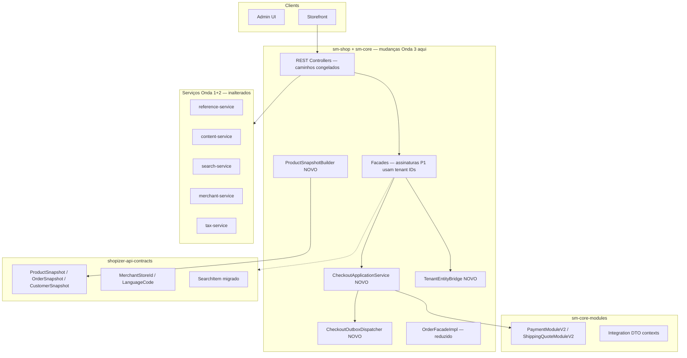

# TechSpec: Onda 3 — Contracts DTO + Checkout Application Service

**PRD:** [_prd.md](_prd.md)  
**TLC autoritativo (COMO):** `.specs/features/onda-3-contracts-dto/design.md`  
**Slug da feature:** `onda-3-contracts-dto`  
**Data:** 2026-07-26  
**Status:** Pronto para `cy-create-tasks`

---

## Resumo executivo

A Onda 3 é uma **onda de refatoração apenas no monólito** (ADR-001): sem novas apps Spring Boot, sem serviços Docker, sem URLs HTTP Strangler. Entrega **contratos DTO** cross-cutting em `shopizer-api-contracts`, **módulo de integração V2** em `sm-core-modules`, um **CheckoutApplicationService** extraído de `OrderFacadeImpl` e um **outbox transacional local** para `processOrder` (ADR-005).

**Trade-off principal:** Aceitar camadas bridge temporárias (hidratação de entidade, interfaces PaymentModule duplas, ProductIndexPayload + ProductSnapshot) para evitar rewrites big-bang enquanto fecha blockers B-001 (parcial), B-002 e evolução AD-009.

**Pré-requisito rígido:** Execute da Onda 2 completo (gate verde `onda-2-content-search-merchant`).

---

## Arquitetura do sistema

### Visão dos componentes (topologia de implantação inalterada)



| Componente | Módulo | Responsabilidade |
| ---------- | ------ | ---------------- |
| DTOs snapshot | `shopizer-api-contracts` | Projeções serializáveis cross-boundary |
| Builders snapshot | `sm-core`, `sm-shop` | Mapeamento JPA → DTO (MapStruct/manual) |
| Value types tenant | `shopizer-api-contracts` | Identificadores store/lang |
| `TenantEntityBridge` | `sm-shop` | Código → `MerchantStore`/`Language` para serviços in-process |
| DTOs + V2 integração | `sm-core-modules` | Contratos de plugin sem JPA |
| Bridges legacy | `sm-core` | Plugins V1 via adapters de entidade |
| `CheckoutApplicationService` | `sm-core/.../checkout` | Orquestração place-order |
| `CheckoutOutbox` | `sm-core` + script Flyway/Liquibase | Eventos checkout em estágios |
| Interfaces facade | `sm-shop-model` | Assinaturas P1 migradas |

### Princípios (herdados + Onda 3)

1. **Contracts = apenas DTOs** — L-002; sem JPA em `shopizer-api-contracts`.
2. **Caminhos REST congelados** — sem mudanças de URL de checkout.
3. **Feature flags** para switches comportamentais (`checkout.outbox.enabled`).
4. **Paridade comportamental** — testes de integração são o gate.
5. **Sem novos padrões de HTTP client** — Strangler Ondas 1–2 inalterado.
6. **DB compartilhado** — AD-003; tabela outbox em `SALESMANAGER`.

---

## Design de implementação

### Interfaces principais

```java
// shopizer-api-contracts
package com.salesmanager.contracts.tenant;

public final class MerchantStoreId implements Serializable {
  private final String code;
  // factory, validation, getters
}

public final class LanguageCode implements Serializable {
  private final String code;
}
```

```java
// shopizer-api-contracts
package com.salesmanager.contracts.catalog;

public class ProductSnapshot implements Serializable {
  private int schemaVersion = 1;
  private Long productId;
  private String storeCode;
  private String sku;
  private String defaultLanguage;
  // localized fields, pricing, inventory summaries, categories, images
}
```

```java
// shopizer-api-contracts
package com.salesmanager.contracts.order;

public class OrderSnapshot implements Serializable { /* checkout-relevant order state */ }
public class CustomerSnapshot implements Serializable { /* id, email, billing/delivery DTO refs */ }
```

```java
// sm-core-modules
package com.salesmanager.core.modules.integration.payment.model;

public interface PaymentModuleV2 {
  void validateModuleConfiguration(IntegrationConfiguration cfg, IntegrationStoreContext store)
      throws IntegrationException;
  TransactionResult authorize(PaymentRequestContext ctx) throws IntegrationException;
  TransactionResult capture(PaymentCaptureContext ctx) throws IntegrationException;
  // refund, initTransaction equivalents
}
```

```java
// sm-core
package com.salesmanager.core.business.services.checkout;

public interface CheckoutApplicationService {
  Order placeOrder(CheckoutCommand command) throws ServiceException;
}

public class CheckoutCommand {
  private MerchantStoreId storeId;
  private LanguageCode language;
  private CustomerSnapshot customer;
  private List<ShoppingCartItem> items; // internal entities until Wave 6
  private Payment payment;
  private OrderTotalSummary summary;
}
```

```java
// sm-core
package com.salesmanager.core.business.services.checkout.outbox;

public interface CheckoutOutboxRepository {
  void append(CheckoutOutboxEvent event);
  List<CheckoutOutboxEvent> findPending(int limit);
}
```

### Modelos de dados

| DTO | Package | Notas |
| --- | ------- | ----- |
| `ProductSnapshot` | `contracts.catalog` | Substitui semântica de payload (ADR-002) |
| `OrderSnapshot` | `contracts.order` | Status, totais, line items como DTOs aninhados |
| `CustomerSnapshot` | `contracts.customer` | Sem coleções lazy |
| `SearchItem` | `contracts.search` | Migrado de `modules.commons.search` |
| `PaymentRequestContext` | `modules.integration.payment.dto` | Amount, line items como `PaymentLineItemDto` |
| `ShippingQuoteRequestContext` | `modules.integration.shipping.dto` | Delivery/origin como DTOs de address |
| `IntegrationStoreContext` | `modules.integration.common` | Store code, currency, locale |

### Evolução ProductIndexPayload

```
Product (JPA)
    → ProductSnapshotBuilder.build()
    → ProductSnapshot
    → ProductIndexPayloadMapper.toPayload()  // schemaVersion 2
    → SearchIndexClient.index()
```

Handler de índice `search-service`: aceita v1 e v2; normaliza para modelo interno de documento.

### Fluxo checkout (após extração)

```
OrderApi / OrderPaymentApi
    → OrderFacadeImpl (validação, mapeamento DTO)
    → CheckoutApplicationService.placeOrder(CheckoutCommand)
        → estágio PAYMENT_REQUESTED (outbox se habilitado)
        → PaymentService (caminho V2 quando disponível)
        → estágio PAYMENT_CONFIRMED
        → CustomerService / OrderService.create
        → estágio ORDER_PERSISTED
        → Decremento de inventário
        → estágio INVENTORY_DECREMENTED
    → Mapeamento ReadableOrder (inalterado)
```

### Migração facade (Fase 1)

| Facade | Mudança |
| ------ | ------- |
| `OrderFacade` | `MerchantStore` → `MerchantStoreId`, `Language` → `LanguageCode` |
| `ShoppingCartFacade` | Idem |
| `SearchFacade` | Idem |
| `ShippingFacade` | Idem |
| `CategoryFacade` | Apenas métodos de leitura |
| `ProductCommonFacade` | Leitura + caminhos `getProduct` |

Implementações (`*FacadeImpl`) chamam `TenantEntityBridge` na entrada do método.

### Correção ReferencesApi (B-002)

| Endpoint | Antes | Depois |
| -------- | ----- | ------ |
| `GET .../languages` | entidade `List<Language>` | `List<ReadableLanguage>` |
| `GET .../currencies` | entidade `List<Currency>` | `List<ReadableCurrency>` |

Usar populators/mappers existentes do caminho strangler reference da Onda 1.

### Database

```sql
CREATE TABLE CHECKOUT_OUTBOX (
  ID BIGINT AUTO_INCREMENT PRIMARY KEY,
  AGGREGATE_ID VARCHAR(64) NOT NULL,
  EVENT_TYPE VARCHAR(64) NOT NULL,
  PAYLOAD JSON NOT NULL,
  STATUS VARCHAR(16) NOT NULL,
  CREATED_AT TIMESTAMP NOT NULL,
  PROCESSED_AT TIMESTAMP NULL,
  UNIQUE KEY UK_OUTBOX_AGG_TYPE (AGGREGATE_ID, EVENT_TYPE)
);
```

Entregar como `sm-core/src/main/resources/db/migration/` ou padrão de script de schema Shopizer existente.

### Configuração

```properties
# application.properties (sm-shop / sm-core)
checkout.outbox.enabled=false
checkout.outbox.dispatcher.interval-ms=5000
```

Sem URLs `wave3.*`.

---

## Ordem de construção

1. **Base contracts** — tipos tenant, shells DTO snapshot, testes Jackson (T1–T6).
2. **Builder ProductSnapshot** + mapper payload (T7–T12).
3. **Snapshots Order/Customer** (T13–T16).
4. **Migração SearchItem** (T17–T20) — depende de estabilidade DTO search.
5. **DTOs integração + interfaces V2** (T21–T26).
6. **Bridges plugin legacy** em serviços Payment/Shipping (T27–T29).
7. **Migração facade P1** (T30–T36).
8. **Correção DTO ReferencesApi** (T37–T38).
9. **Extração CheckoutApplicationService** (T39–T43).
10. **Outbox + processOrder em estágios** (T44–T47).
11. **Gate** — Pact, ArchUnit, `./mvnw clean install`, STATE.md (T48).

Tracks paralelas após T6:
- **Track A:** ProductSnapshot + SearchItem (T7–T20)
- **Track B:** Módulos integração (T21–T29)
- **Track C:** Facades + References (T30–T38)
- **Convergência:** Checkout + outbox (T39–T47) → gate (T48)

---

## Estratégia de testes

| Camada | Escopo |
| ------ | ------ |
| Unit | Serializers snapshot, validação tipos tenant, adapters DTO→entidade |
| Integração | `CheckoutApplicationServicePlaceOrderTest` — flag on/off |
| Integração | Linhas outbox escritas por estágio quando habilitado |
| Pact | Atualizar consumer/provider search para `SearchItem` em contracts |
| ArchUnit | `no_core_model_in_contracts`, `facades_no_new_entity_params` |
| Regressão | `OrderTest`, testes `PaymentService` existentes verdes |

Gate: `./mvnw clean install`

---

## Riscos e mitigações

| Risco | Mitigação |
| ----- | --------- |
| Diff grande no monólito | Feature flags; facades faseadas |
| Regressão checkout | Copiar fluxo existente em CAS verbatim primeiro; depois refatorar estágios |
| Bugs adapter plugin | Teste golden-path com MoneyOrderPayment (plugin mais simples) |
| Drift Pact em move SearchItem | Coordenar search-service + consumer sm-shop em um slice de PR |
| Tabela outbox em DB compartilhado | Migração idempotente; flag off em profile de produção até Onda 6 |

---

## Mapeamento TLC

| Task Compozy | TLC tasks | Requirements |
| ------------ | --------- | ------------ |
| task_01 | T1–T6 | CTR, TNT |
| task_02 | T7–T12 | SNP |
| task_03 | T13–T16 | SNP |
| task_04 | T17–T20 | SRCH |
| task_05 | T21–T24 | INT |
| task_06 | T25–T29 | INT |
| task_07 | T30–T34 | FAC |
| task_08 | T35–T38 | FAC, REF |
| task_09 | T39–T43 | CHK |
| task_10 | T44–T48 | SAG, GAT |

---

## Referências

- ADRs: `adrs/adr-001.md` … `adr-005.md`
- TLC: `.specs/features/onda-3-contracts-dto/`
- Plano mestre: `docs/decomposition/MIGRATION-MASTER-PLAN.md` § Onda 3
- Fontes principais:
  - `sm-shop/.../order/facade/OrderFacadeImpl.java`
  - `sm-core/.../order/OrderServiceImpl.java`
  - `sm-core-modules/.../PaymentModule.java`
  - `shopizer-api-contracts/.../search/ProductIndexPayload.java`
