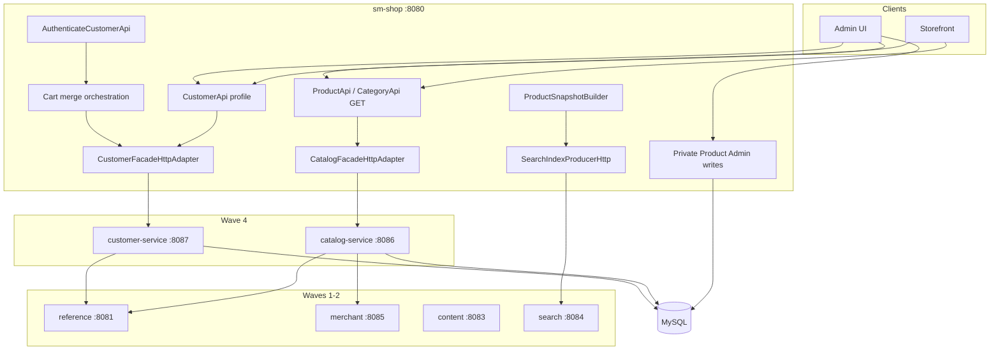

# TechSpec: Onda 4 — Catalog + Customer

**PRD:** [_prd.md](_prd.md)
**Design TLC autoritativo:** `.specs/features/onda-4-catalog-customer/design.md`
**Slug da feature:** `onda-4-catalog-customer`
**Data:** 2026-07-26
**Status:** Pronto para `cy-create-tasks` / Execute (bloqueado na Onda 3)

---

## Resumo executivo

A Onda 4 extrai **dois serviços Spring Boot** — `catalog-service` (:8086) e `customer-service` (:8087) — enquanto `sm-shop` permanece o **Strangler BFF**. O schema MySQL compartilhado continua (AD-003/AD-022). DTOs estendem `shopizer-api-contracts` com `ProductSnapshot` v2 e `CustomerSnapshot` v1. Thin cores `sm-catalog-core` e `sm-customer-core` concentram lógica de domínio de leitura de catálogo e customer respectivamente.

**Trade-off principal:** Catálogo **read-only** na fronteira do serviço (ADR-002, AD-006) para respeitar acoplamento aferente 10/10, aceitando caminhos dual write/read até onda posterior. **Merge de carrinho** permanece orquestrado no monólito com HTTP `CustomerSnapshot` (ADR-005) em vez de extrair shopping cart.

**Pré-requisito rígido:** Onda 3 completa — `ProductSnapshot`, `CustomerSnapshot`, `LanguageCode`, `MerchantStoreId` nos contratos.

---

## Arquitetura do sistema

### Diagrama de componentes



| Componente | Responsabilidade | Fronteira |
| --------- | -------------- | -------- |
| `shopizer-api-contracts` | Snapshots, DTOs catalog/customer, clients | Sem JPA |
| `sm-catalog-core` | Serviços de leitura de catálogo + repos + mappers | Sem writes admin |
| `catalog-service` | REST GET público + ProductSnapshot interno | Porta 8086 |
| `sm-customer-core` | Serviços customer, optin, attribute | Sem txn order-create |
| `customer-service` | REST profile + CustomerSnapshot interno | Porta 8087; JWT private |
| Adaptadores Strangler | Delegação HTTP somente read/profile | `wave4.strangler.enabled` |
| Writes monólito | Admin product CRUD + producer de busca | AD-006 |

### Princípios

1. Caminhos REST congelados (STR-04)
2. Sem JPA no JSON; DTOs nos contratos
3. Mappers nos serviços/cores (L-002)
4. RestTemplate + `wave4.*.base-url` (AD-005)
5. JWT em rotas private de customer
6. Fronteira read-only de catálogo no serviço (ADR-002)
7. ProductSnapshot v2 canônico (ADR-003)
8. CustomerSnapshot para merge (ADR-005)
9. LanguageCode / MerchantStoreId no HTTP (Onda 3)

---

## Design de implementação

### Interfaces principais

```java
// shopizer-api-contracts
public interface CatalogServiceClient {
  ReadableProduct getProduct(String storeCode, String langCode, Long productId);
  ReadableProductList getProducts(String storeCode, String langCode, ProductSearchCriteria criteria);
  ProductSnapshot getProductSnapshot(String storeCode, String langCode, Long productId);
  ReadableCategory getCategory(String storeCode, String langCode, Long categoryId);
}
```

```java
public interface CustomerServiceClient {
  ReadableCustomer getProfile(String storeCode, String customerId);
  CustomerSnapshot getSnapshot(String storeCode, Long customerId);
  void updateProfile(String storeCode, Long customerId, PersistableCustomer customer);
}
```

```java
// sm-core — refatoração de merge
public interface ShoppingCartService {
  ShoppingCart mergeShoppingCarts(ShoppingCart sessionCart, ShoppingCart userCart,
      CustomerSnapshot customer, MerchantStoreId store);
}
```

### Modelos de dados

#### ProductSnapshot v2 (contracts)

| Field | Type | Notes |
| ----- | ---- | ----- |
| `schemaVersion` | int | default `2` |
| `id` | Long | product id |
| `storeCode` | String | |
| `language` | String | |
| `sku`, `name`, `description`, `link`, `image` | String | |
| `reviews`, `brand`, `category` | String | |
| `attributes` | Map | |
| `variants`, `inventory` | List | |
| `addToCart` | Boolean | |
| `visible` | Boolean | |

#### CustomerSnapshot v1

| Field | Type | Notes |
| ----- | ---- | ----- |
| `schemaVersion` | int | default `1` |
| `id` | Long | |
| `storeCode` | String | |
| `email`, `firstName`, `lastName` | String | |
| `billingAddressId`, `deliveryAddressId` | Long | optional |

### Endpoints de API

#### catalog-service (:8086)

| Área | Paths | Auth |
| ---- | ----- | ---- |
| Products | Espelha `ProductApi` **GET** | public |
| Categories | Espelha `CategoryApi` GET | public |
| Manufacturers | Rotas GET | public |
| Inventory/Price | Rotas GET | public/JWT |
| Internal | `GET /internal/v1/products/{id}/snapshot` | network |

**Não roteado:** POST/PUT/DELETE privado de produto.

#### customer-service (:8087)

| Área | Paths | Auth |
| ---- | ----- | ---- |
| Profile | profile GET/PUT de customer | JWT |
| Addresses | CRUD de endereços | JWT |
| Opt-in | endpoints newsletter | per monolith |
| Internal | `GET /internal/v1/customers/{id}/snapshot` | network |

**Não roteado:** `AuthenticateCustomerApi`.

### Configuração Strangler

```properties
wave4.strangler.enabled=true
wave4.catalog-service.base-url=http://catalog-service:8086
wave4.customer-service.base-url=http://customer-service:8087
wave4.http.client.timeout-ms=5000
wave4.catalog-service.cache.ttl-seconds=30
wave4.customer-service.cache.ttl-seconds=60
```

Adaptadores: `@ConditionalOnProperty(name="wave4.strangler.enabled", havingValue="true")` em `CatalogFacadeHttpAdapter`, `CustomerFacadeHttpAdapter`. Métodos de write em facades **devem** chamar delegate `InProcessCatalogFacade` (padrão composite) ou beans separados.

---

## Matriz de integração

| De | Para | Propósito | Falha |
| ---- | -- | ------- | ------- |
| catalog | reference | LanguageCode | 503 |
| catalog | merchant | validação de loja | 503 |
| customer | reference | geo/lang | 503 |
| monolith | catalog | strangler read | 503 |
| monolith | customer | profile + snapshot | 503 |
| monolith | search | índice ProductSnapshot | log |
| monolith | content | imagens de produto P2 | 503 |

---

## Análise de impacto

| Componente | Impacto |
| --------- | ------ |
| `shopizer-api-contracts` | +pacotes catalog/customer |
| `sm-catalog-core`, `catalog-service` | novos |
| `sm-customer-core`, `customer-service` | novos |
| `sm-core` | delega reads; assinatura merge |
| `sm-shop` | config Wave4 + adaptadores |
| `search-service` | intake ProductSnapshot v2 |
| `content-service` | endpoints product file P2 |

---

## Testes

- Unit: snapshot builders, mappers, merge com snapshot
- Integração: cada serviço Testcontainers MySQL; testes de adaptador
- Pact: `CatalogProviderPactTest`, `CustomerProviderPactTest`, `Wave4ConsumerPactTest`
- Gate: `./mvnw clean install`

### Gaps documentados

GAP-CAT-01: drift facade V1/V2
GAP-CAT-02: índice stale só de preço
GAP-CUS-01: customer criado em order no txn monólito
GAP-CUS-02: caminho de write de review faseado

---

## Ordem de construção (resumo)

1. Gate Onda 3
2. Contratos T1–T4 (Compozy task_01)
3. Paralelo: sm-catalog-core + catalog-service (task_02–03) | sm-customer-core + customer-service (task_04–05)
4. Checkpoint task_10
5. Migração ProductSnapshot + merge de carrinho (task_06–07)
6. Strangler (task_09, task_14)
7. Observabilidade + pact + compose (task_11–15)

Marcos: **CAT-ready** após leitura pública de catálogo + snapshot; **CUS-ready** após profile de customer + snapshot.

---

## Índice de ADRs

- [ADR-001](adrs/adr-001.md) — Um workflow
- [ADR-002](adrs/adr-002.md) — Catálogo read-first
- [ADR-003](adrs/adr-003.md) — ProductSnapshot canônico
- [ADR-004](adrs/adr-004.md) — Thin cores
- [ADR-005](adrs/adr-005.md) — Merge via snapshot
- [ADR-006](adrs/adr-006.md) — Writes admin no monólito
- [ADR-007](adrs/adr-007.md) — Imagens de produto → content

**Próximo passo:** Executar tasks Compozy `task_01`…`task_15` após gate da Onda 3. TLC `tasks.md` T1–T38 é referência granular.
