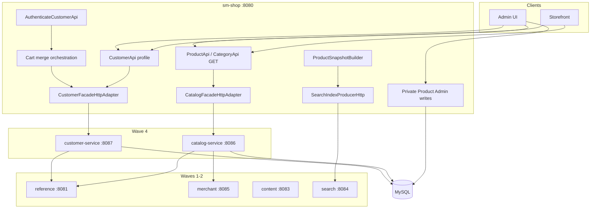

# TechSpec: Onda 4 — Catalog + Customer

**PRD:** [_prd.md](_prd.md)
**Authoritative TLC design:** `.specs/features/onda-4-catalog-customer/design.md`
**Feature slug:** `onda-4-catalog-customer`
**Date:** 2026-07-26
**Status:** Ready for `cy-create-tasks` / Execute (blocked on Onda 3)

---

## Executive summary

Wave 4 extracts **two Spring Boot services** — `catalog-service` (:8086) and `customer-service` (:8087) — while `sm-shop` remains the **Strangler BFF**. Shared MySQL schema continues (AD-003/AD-022). DTOs extend `shopizer-api-contracts` with `ProductSnapshot` v2 and `CustomerSnapshot` v1. Thin cores `sm-catalog-core` and `sm-customer-core` hold read/catalog and customer domain logic respectively.

**Primary trade-off:** Catalog **read-only** at the service boundary (ADR-002, AD-006) to respect afferent coupling 10/10, accepting dual write/read paths until a later wave. **Cart merge** stays monolith-orchestrated with `CustomerSnapshot` HTTP (ADR-005) rather than extracting shopping cart.

**Hard prerequisite:** Onda 3 complete — `ProductSnapshot`, `CustomerSnapshot`, `LanguageCode`, `MerchantStoreId` in contracts.

---

## System architecture

### Component diagram



| Component | Responsibility | Boundary |
| --------- | -------------- | -------- |
| `shopizer-api-contracts` | Snapshots, catalog/customer DTOs, clients | No JPA |
| `sm-catalog-core` | Read catalog services + repos + mappers | No admin writes |
| `catalog-service` | Public GET REST + internal ProductSnapshot | Port 8086 |
| `sm-customer-core` | Customer, optin, attribute services | No order-create txn |
| `customer-service` | Profile REST + internal CustomerSnapshot | Port 8087; JWT private |
| Strangler adapters | HTTP delegation read/profile only | `wave4.strangler.enabled` |
| Monolith writes | Admin product CRUD + search producer | AD-006 |

### Principles

1. Frozen REST paths (STR-04)
2. No JPA in JSON; DTOs in contracts
3. Mappers in services/cores (L-002)
4. RestTemplate + `wave4.*.base-url` (AD-005)
5. JWT on private customer routes
6. Catalog read-only service boundary (ADR-002)
7. ProductSnapshot v2 canonical (ADR-003)
8. CustomerSnapshot for merge (ADR-005)
9. LanguageCode / MerchantStoreId on HTTP (Wave 3)

---

## Implementation design

### Key interfaces

```java
// shopizer-api-contracts
public interface CatalogServiceClient {
  ReadableProduct getProduct(String storeCode, String langCode, Long productId);
  ReadableProductList getProducts(String storeCode, String langCode, ProductSearchCriteria criteria);
  ProductSnapshot getProductSnapshot(String storeCode, String langCode, Long productId);
  ReadableCategory getCategory(String storeCode, String langCode, Long categoryId);
}
```

```java
public interface CustomerServiceClient {
  ReadableCustomer getProfile(String storeCode, String customerId);
  CustomerSnapshot getSnapshot(String storeCode, Long customerId);
  void updateProfile(String storeCode, Long customerId, PersistableCustomer customer);
}
```

```java
// sm-core — merge refactor
public interface ShoppingCartService {
  ShoppingCart mergeShoppingCarts(ShoppingCart sessionCart, ShoppingCart userCart,
      CustomerSnapshot customer, MerchantStoreId store);
}
```

### Data models

#### ProductSnapshot v2 (contracts)

| Field | Type | Notes |
| ----- | ---- | ----- |
| `schemaVersion` | int | default `2` |
| `id` | Long | product id |
| `storeCode` | String | |
| `language` | String | |
| `sku`, `name`, `description`, `link`, `image` | String | |
| `reviews`, `brand`, `category` | String | |
| `attributes` | Map | |
| `variants`, `inventory` | List | |
| `addToCart` | Boolean | |
| `visible` | Boolean | |

#### CustomerSnapshot v1

| Field | Type | Notes |
| ----- | ---- | ----- |
| `schemaVersion` | int | default `1` |
| `id` | Long | |
| `storeCode` | String | |
| `email`, `firstName`, `lastName` | String | |
| `billingAddressId`, `deliveryAddressId` | Long | optional |

### API endpoints

#### catalog-service (:8086)

| Area | Paths | Auth |
| ---- | ----- | ---- |
| Products | Mirror `ProductApi` **GET** | public |
| Categories | Mirror `CategoryApi` GET | public |
| Manufacturers | GET routes | public |
| Inventory/Price | GET routes | public/JWT |
| Internal | `GET /internal/v1/products/{id}/snapshot` | network |

**Not routed:** private product POST/PUT/DELETE.

#### customer-service (:8087)

| Area | Paths | Auth |
| ---- | ----- | ---- |
| Profile | customer profile GET/PUT | JWT |
| Addresses | address CRUD | JWT |
| Opt-in | newsletter endpoints | per monolith |
| Internal | `GET /internal/v1/customers/{id}/snapshot` | network |

**Not routed:** `AuthenticateCustomerApi`.

### Strangler configuration

```properties
wave4.strangler.enabled=true
wave4.catalog-service.base-url=http://catalog-service:8086
wave4.customer-service.base-url=http://customer-service:8087
wave4.http.client.timeout-ms=5000
wave4.catalog-service.cache.ttl-seconds=30
wave4.customer-service.cache.ttl-seconds=60
```

Adapters: `@ConditionalOnProperty(name="wave4.strangler.enabled", havingValue="true")` on `CatalogFacadeHttpAdapter`, `CustomerFacadeHttpAdapter`. Write methods on facades **must** call `InProcessCatalogFacade` delegate (composite pattern) or separate beans.

---

## Integration matrix

| From | To | Purpose | Failure |
| ---- | -- | ------- | ------- |
| catalog | reference | LanguageCode | 503 |
| catalog | merchant | store validation | 503 |
| customer | reference | geo/lang | 503 |
| monolith | catalog | read strangler | 503 |
| monolith | customer | profile + snapshot | 503 |
| monolith | search | ProductSnapshot index | log |
| monolith | content | product images P2 | 503 |

---

## Impact analysis

| Component | Impact |
| --------- | ------ |
| `shopizer-api-contracts` | +catalog/customer packages |
| `sm-catalog-core`, `catalog-service` | new |
| `sm-customer-core`, `customer-service` | new |
| `sm-core` | delegate reads; merge signature |
| `sm-shop` | Wave4 config + adapters |
| `search-service` | ProductSnapshot v2 intake |
| `content-service` | product file endpoints P2 |

---

## Testing

- Unit: snapshot builders, mappers, merge with snapshot
- Integration: each service Testcontainers MySQL; adapter tests
- Pact: `CatalogProviderPactTest`, `CustomerProviderPactTest`, `Wave4ConsumerPactTest`
- Gate: `./mvnw clean install`

### Documented gaps

GAP-CAT-01: V1/V2 facade drift
GAP-CAT-02: price-only stale index
GAP-CUS-01: order-created customer in monolith txn
GAP-CUS-02: review write path phased

---

## Build order (summary)

1. Onda 3 gate
2. Contracts T1–T4 (Compozy task_01)
3. Parallel: sm-catalog-core + catalog-service (task_02–03) | sm-customer-core + customer-service (task_04–05)
4. Checkpoint task_10
5. ProductSnapshot migration + cart merge (task_06–07)
6. Strangler (task_09, task_14)
7. Observability + pact + compose (task_11–15)

Milestones: **CAT-ready** after catalog public read + snapshot; **CUS-ready** after customer profile + snapshot.

---

## ADR index

- [ADR-001](adrs/adr-001.md) — One workflow
- [ADR-002](adrs/adr-002.md) — Catalog read-first
- [ADR-003](adrs/adr-003.md) — ProductSnapshot canonical
- [ADR-004](adrs/adr-004.md) — Thin cores
- [ADR-005](adrs/adr-005.md) — Cart merge snapshot
- [ADR-006](adrs/adr-006.md) — Admin writes monolith
- [ADR-007](adrs/adr-007.md) — Product images → content

**Next step:** Execute Compozy tasks `task_01`…`task_15` after Onda 3 gate. TLC `tasks.md` T1–T38 is granular reference.
