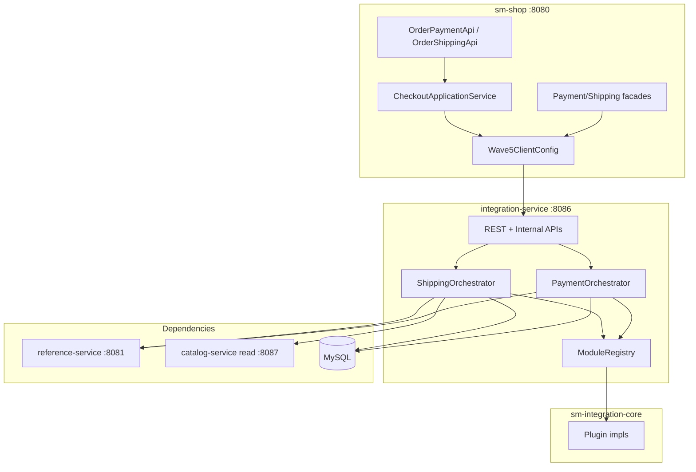

# TechSpec: Onda 5 — Integration Service

**PRD:** [_prd.md](_prd.md)
**Authoritative TLC (HOW):** `.specs/features/onda-5-integration-service/design.md`
**Feature slug:** `onda-5-integration-service`
**Date:** 2026-07-26
**Status:** Ready for `cy-create-tasks`

---

## Executive summary

Wave 5 extracts **one Spring Boot service** — `integration-service` (:8086) — plus thin core `sm-integration-core`, owning payment/shipping **orchestration** and the **in-process plugin registry**, while `sm-shop` remains the Strangler BFF. Checkout application service (Onda 3) performs order mutations; integration returns `TransactionResult` and quote DTOs only.

**Primary trade-off:** Accept shared MySQL for `MERCHANT_CONFIGURATION` and `TRANSACTION` tables (AD-003) in exchange for not blocking on database split. Second trade-off: V2 module adapter bridge (AD-017) until all plugins natively implement DTO contracts from Onda 3.

**Prerequisites:** Onda 3 Execute (DTO contracts, checkout saga); Onda 4 partial (`ProductSnapshot` shipping fields); Onda 1–2 patterns (RestTemplate, JWT, Pact, correlation).

---

## System architecture

### Component overview



| Component | Responsibility | Boundary |
| --------- | -------------- | -------- |
| `shopizer-api-contracts` | Integration DTOs + `IntegrationServiceClient` | No JPA |
| `sm-core-modules` | `PaymentModuleV2`, `ShippingQuoteModuleV2` (Onda 3) | Publishable contracts |
| `sm-integration-core` | Orchestrators, plugins, encryption, packaging | No Spring MVC |
| `integration-service` | REST, JWT, actuator, internal token filter | Port 8086 |
| `sm-shop` strangler | HTTP adapters, checkout wiring | Feature flag |
| `reference-service` | Country/language | Wave 1 |
| `catalog-service` | Product/shipping snapshots | Wave 4 partial |

### Principles

1. Frozen REST paths — BFF keeps controllers (STR-06).
2. DTO-only JSON — no JPA in responses.
3. RestTemplate + `wave5.*.base-url`.
4. JWT on `/private/**`.
5. **No Order table writes** from integration-service (ADR-002).
6. Plugins as Spring beans in integration-service (ADR-005).
7. Catalog weights via HTTP (ADR-007).

---

## Implementation design

### Key interfaces

```java
// shopizer-api-contracts
package com.salesmanager.contracts.client;

public interface IntegrationServiceClient {
  TransactionResult processPayment(PaymentProcessRequest request);
  TransactionResult capturePayment(PaymentCaptureRequest request);
  TransactionResult refundPayment(PaymentRefundRequest request);
  TransactionResult initPayment(PaymentInitRequest request);
  ShippingQuoteResponse getShippingQuote(ShippingQuoteRequest request);
  ShippingSummaryDto getShippingSummary(ShippingSummaryRequest request);
}
```

```java
// sm-integration-core
package com.salesmanager.integration.services;

public interface PaymentOrchestrator {
  TransactionResult process(PaymentProcessRequest request);
  TransactionResult capture(PaymentCaptureRequest request);
  TransactionResult refund(PaymentRefundRequest request);
  List<IntegrationModuleDto> getPaymentModules(String storeCode);
  void saveModuleConfiguration(String storeCode, String moduleCode, IntegrationConfigDto config);
}
```

```java
// sm-integration-core
public interface ShippingOrchestrator {
  ShippingQuoteResponse getQuote(ShippingQuoteRequest request);
  ShippingSummaryDto getSummary(ShippingSummaryRequest request);
  boolean requiresShipping(List<CartLineSnapshot> items, String storeCode);
}
```

Error convention: strangler remote failure → **503** `{ error, correlationId }`; validation → **400**; gateway failure → **502** or `TransactionResult.success=false`; invalid internal token → **401**; no silent in-process fallback when `wave5.strangler.enabled=true`.

### Data models

See design.md for `PaymentProcessRequest`, `TransactionResult`, `ShippingQuoteRequest` field tables.

Persistence:
- `MERCHANT_CONFIGURATION` — read/write by integration-service
- `TRANSACTION` — write by integration-service on payment operations
- `ORDERS` — **no writes** from integration-service

### API endpoints

#### integration-service (:8086)

| Area | Paths | Auth |
| ---- | ----- | ---- |
| Payment admin | `/api/v1/private/modules/payment*` | JWT |
| Payment public | `/api/v1/payment/*` | store context |
| Shipping admin | `/api/v1/private/modules/shipping*`, `/api/v1/private/shipping/*` | JWT |
| Ship countries | `/api/v1/shipping/countries` | public |
| Internal payment | `/internal/v1/payments/*` | `X-Internal-Token` |
| Internal shipping | `/internal/v1/shipping/*` | token |

#### Strangler properties (`sm-shop`)

```properties
wave5.strangler.enabled=true
wave5.integration-service.base-url=http://integration-service:8086
wave5.integration-service.internal-token=${INTEGRATION_INTERNAL_TOKEN}
wave5.catalog-service.base-url=http://catalog-service:8087
wave5.http.client.timeout-ms=10000
```

Adapter matrix: `PaymentConfigurationFacade`, `ShippingFacade`, `ShippingConfigurationFacade` — in-process vs HTTP via `@ConditionalOnProperty(wave5.strangler.enabled)`.

---

## Integration points

| From | To | Purpose | Failure |
| ---- | -- | ------- | ------- |
| integration | reference-service | countries, languages | 503 |
| integration | catalog-service | `ShippingProductSnapshot` | 503 / GAP-INT-01 fallback |
| sm-shop | integration | strangler + checkout client | 503 |
| plugins | Stripe/PayPal/UPS/USPS | gateway calls | 502 |
| checkout saga | integration | payment after order draft | compensate on saga fail |

---

## Impact analysis

| Component | Impact | Action |
| --------- | ------ | ------ |
| `shopizer-api-contracts` | modified | Integration package + client |
| `sm-integration-core` | **new** | Extract orchestration + plugins |
| `integration-service` | **new** | Boot 8086 |
| `sm-core` | modified | Remove/trim Payment/Shipping services |
| `sm-shop` | modified | Wave5 adapters, checkout wiring |
| `pom.xml` | modified | Register modules |
| `docker-compose-wave5.yml` | **new** | Local topology |

---

## Testing approach

### Unit

- `PaymentOrchestratorImpl` with mock `PaymentModuleV2`
- `ShippingOrchestratorImpl` with mock catalog client
- `PaymentModuleV2Adapter` bridge tests
- Encryption round-trip for module config

### Integration

- integration-service: MockMvc admin config; internal payment without Order bean
- sm-shop: `Wave5ClientConfig`; facade HTTP adapters; checkout payment E2E mock
- Pact: `IntegrationProviderPactTest`; `Wave5ConsumerPactTest`

### Gates

```bash
./mvnw -pl sm-integration-core,integration-service -am test
./mvnw -pl sm-shop,integration-service -am test \
  -Dtest=Wave5ConsumerPactTest,IntegrationProviderPactTest -DfailIfNoTests=false
./mvnw clean install  # before merge across modules
```

### Known gaps (document only)

GAP-INT-01..05 per design.md — no scope expansion.

---

## Build order

1. Gate: Onda 3 contracts + Onda 4 catalog read partial
2. `shopizer-api-contracts` integration DTOs + Wave5 config (task_01)
3. Extract `sm-integration-core` payment track (task_02, task_03)
4. Extract shipping track (task_04)
5. `integration-service` Boot + REST (task_05, task_06)
6. Stateless boundary + trim sm-core (task_07)
7. Strangler + checkout wiring (task_08, task_09)
8. Observability (task_10)
9. Pact (task_11)
10. Compose + gate (task_12)

---

## Compozy task mapping

| Task | TLC range | Title |
| ---- | --------- | ----- |
| task_01 | T1–T5 | Contracts + Wave5 Strangler config |
| task_02 | T6–T8 | Payment plugins + orchestrator extract |
| task_03 | T9–T11 | Stateless payment ops + P-ready |
| task_04 | T12–T16 | Shipping plugins + orchestrator + catalog client |
| task_05 | T17–T19 | integration-service Boot + admin REST |
| task_06 | T20–T22 | Public + internal REST APIs |
| task_07 | T23–T24 | Trim sm-core + stateless monolith boundary |
| task_08 | T25–T26 | Strangler facades |
| task_09 | T27–T28 | Checkout + OrderShipping wiring |
| task_10 | T29 | Correlation + health |
| task_11 | T30–T32 | Pact provider/consumer + client impl |
| task_12 | T33–T38 | Compose, integration gate, STATE |

---

## References

- `.specs/features/onda-5-integration-service/spec.md`
- `.specs/features/onda-5-integration-service/design.md`
- `docs/decomposition/MIGRATION-MASTER-PLAN.md` § Onda 5
- `sm-core/.../services/payments/PaymentServiceImpl.java`
- `sm-core/.../services/shipping/ShippingServiceImpl.java`
- `sm-core-modules/.../PaymentModule.java`, `ShippingQuoteModule.java`
