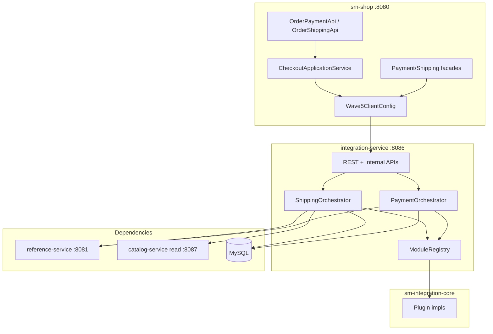

# TechSpec: Onda 5 — Integration Service

**PRD:** [_prd.md](_prd.md)
**TLC autoritativo (COMO):** `.specs/features/onda-5-integration-service/design.md`
**Slug da feature:** `onda-5-integration-service`
**Data:** 2026-07-26
**Status:** Pronto para `cy-create-tasks`

---

## Resumo executivo

A Onda 5 extrai **um serviço Spring Boot** — `integration-service` (:8086) — mais o core thin `sm-integration-core`, dono da **orquestração** de pagamento/frete e do **registry de plugins in-process**, enquanto `sm-shop` permanece o Strangler BFF. O application service de checkout (Onda 3) executa mutações de pedido; integration retorna apenas `TransactionResult` e DTOs de cotação.

**Trade-off principal:** Aceitar MySQL compartilhado para tabelas `MERCHANT_CONFIGURATION` e `TRANSACTION` (AD-003) em troca de não bloquear no split de banco. Segundo trade-off: ponte adaptadora de módulos V2 (AD-017) até todos os plugins implementarem nativamente contratos DTO da Onda 3.

**Pré-requisitos:** Execute Onda 3 (contratos DTO, saga checkout); Onda 4 parcial (campos de frete em `ProductSnapshot`); padrões Ondas 1–2 (RestTemplate, JWT, Pact, correlation).

---

## Arquitetura do sistema

### Visão geral dos componentes



| Componente | Responsabilidade | Fronteira |
| --------- | -------------- | -------- |
| `shopizer-api-contracts` | DTOs de integration + `IntegrationServiceClient` | Sem JPA |
| `sm-core-modules` | `PaymentModuleV2`, `ShippingQuoteModuleV2` (Onda 3) | Contratos publicáveis |
| `sm-integration-core` | Orquestradores, plugins, criptografia, empacotamento | Sem Spring MVC |
| `integration-service` | REST, JWT, actuator, filtro de token interno | Porta 8086 |
| `sm-shop` strangler | Adaptadores HTTP, wiring de checkout | Feature flag |
| `reference-service` | País/idioma | Onda 1 |
| `catalog-service` | Snapshots de produto/frete | Onda 4 parcial |

### Princípios

1. Caminhos REST congelados — BFF mantém controllers (STR-06).
2. JSON somente DTO — sem JPA nas respostas.
3. RestTemplate + `wave5.*.base-url`.
4. JWT em `/private/**`.
5. **Sem writes na tabela Order** a partir de integration-service (ADR-002).
6. Plugins como beans Spring em integration-service (ADR-005).
7. Pesos de catálogo via HTTP (ADR-007).

---

## Design de implementação

### Interfaces principais

```java
// shopizer-api-contracts
package com.salesmanager.contracts.client;

public interface IntegrationServiceClient {
  TransactionResult processPayment(PaymentProcessRequest request);
  TransactionResult capturePayment(PaymentCaptureRequest request);
  TransactionResult refundPayment(PaymentRefundRequest request);
  TransactionResult initPayment(PaymentInitRequest request);
  ShippingQuoteResponse getShippingQuote(ShippingQuoteRequest request);
  ShippingSummaryDto getShippingSummary(ShippingSummaryRequest request);
}
```

```java
// sm-integration-core
package com.salesmanager.integration.services;

public interface PaymentOrchestrator {
  TransactionResult process(PaymentProcessRequest request);
  TransactionResult capture(PaymentCaptureRequest request);
  TransactionResult refund(PaymentRefundRequest request);
  List<IntegrationModuleDto> getPaymentModules(String storeCode);
  void saveModuleConfiguration(String storeCode, String moduleCode, IntegrationConfigDto config);
}
```

```java
// sm-integration-core
public interface ShippingOrchestrator {
  ShippingQuoteResponse getQuote(ShippingQuoteRequest request);
  ShippingSummaryDto getSummary(ShippingSummaryRequest request);
  boolean requiresShipping(List<CartLineSnapshot> items, String storeCode);
}
```

Convenção de erro: falha remota strangler → **503** `{ error, correlationId }`; validação → **400**; falha de gateway → **502** ou `TransactionResult.success=false`; token interno inválido → **401**; sem fallback in-process silencioso quando `wave5.strangler.enabled=true`.

### Modelos de dados

Ver design.md para tabelas de campos de `PaymentProcessRequest`, `TransactionResult`, `ShippingQuoteRequest`.

Persistência:
- `MERCHANT_CONFIGURATION` — leitura/escrita por integration-service
- `TRANSACTION` — escrita por integration-service em operações de pagamento
- `ORDERS` — **sem writes** a partir de integration-service

### Endpoints de API

#### integration-service (:8086)

| Área | Caminhos | Auth |
| ---- | ----- | ---- |
| Admin pagamento | `/api/v1/private/modules/payment*` | JWT |
| Pagamento público | `/api/v1/payment/*` | contexto de loja |
| Admin frete | `/api/v1/private/modules/shipping*`, `/api/v1/private/shipping/*` | JWT |
| Países de entrega | `/api/v1/shipping/countries` | público |
| Pagamento interno | `/internal/v1/payments/*` | `X-Internal-Token` |
| Frete interno | `/internal/v1/shipping/*` | token |

#### Properties Strangler (`sm-shop`)

```properties
wave5.strangler.enabled=true
wave5.integration-service.base-url=http://integration-service:8086
wave5.integration-service.internal-token=${INTEGRATION_INTERNAL_TOKEN}
wave5.catalog-service.base-url=http://catalog-service:8087
wave5.http.client.timeout-ms=10000
```

Matriz de adaptadores: `PaymentConfigurationFacade`, `ShippingFacade`, `ShippingConfigurationFacade` — in-process vs HTTP via `@ConditionalOnProperty(wave5.strangler.enabled)`.

---

## Pontos de integração

| De | Para | Propósito | Falha |
| ---- | -- | ------- | ------- |
| integration | reference-service | países, idiomas | 503 |
| integration | catalog-service | `ShippingProductSnapshot` | 503 / fallback GAP-INT-01 |
| sm-shop | integration | strangler + client checkout | 503 |
| plugins | Stripe/PayPal/UPS/USPS | chamadas gateway | 502 |
| saga checkout | integration | pagamento após rascunho de pedido | compensar em falha de saga |

---

## Análise de impacto

| Componente | Impacto | Ação |
| --------- | ------ | ------ |
| `shopizer-api-contracts` | modificado | Pacote integration + client |
| `sm-integration-core` | **novo** | Extrair orquestração + plugins |
| `integration-service` | **novo** | Boot 8086 |
| `sm-core` | modificado | Remover/trim serviços Payment/Shipping |
| `sm-shop` | modificado | Adaptadores Wave5, wiring checkout |
| `pom.xml` | modificado | Registrar módulos |
| `docker-compose-wave5.yml` | **novo** | Topologia local |

---

## Abordagem de testes

### Unitários

- `PaymentOrchestratorImpl` com mock `PaymentModuleV2`
- `ShippingOrchestratorImpl` com mock de client de catálogo
- Testes da ponte `PaymentModuleV2Adapter`
- Round-trip de criptografia para config de módulo

### Integração

- integration-service: MockMvc admin config; pagamento interno sem bean Order
- sm-shop: `Wave5ClientConfig`; adaptadores HTTP de facade; E2E mock de pagamento checkout
- Pact: `IntegrationProviderPactTest`; `Wave5ConsumerPactTest`

### Gates

```bash
./mvnw -pl sm-integration-core,integration-service -am test
./mvnw -pl sm-shop,integration-service -am test \
  -Dtest=Wave5ConsumerPactTest,IntegrationProviderPactTest -DfailIfNoTests=false
./mvnw clean install  # antes de merge entre módulos
```

### Lacunas conhecidas (apenas documentar)

GAP-INT-01..05 conforme design.md — sem expansão de escopo.

---

## Ordem de construção

1. Gate: contratos Onda 3 + leitura parcial catálogo Onda 4
2. DTOs integration em `shopizer-api-contracts` + config Wave5 (task_01)
3. Extrair trilha pagamento `sm-integration-core` (task_02, task_03)
4. Extrair trilha frete (task_04)
5. Boot `integration-service` + REST (task_05, task_06)
6. Fronteira stateless + trim sm-core (task_07)
7. Strangler + wiring checkout (task_08, task_09)
8. Observabilidade (task_10)
9. Pact (task_11)
10. Compose + gate (task_12)

---

## Mapeamento de tasks Compozy

| Task | Faixa TLC | Título |
| ---- | --------- | ----- |
| task_01 | T1–T5 | Contratos + config Strangler Wave5 |
| task_02 | T6–T8 | Plugins pagamento + extração PaymentOrchestrator |
| task_03 | T9–T11 | Ops pagamento stateless + P-ready |
| task_04 | T12–T16 | Plugins frete + orquestrador + client catálogo |
| task_05 | T17–T19 | Boot integration-service + REST admin |
| task_06 | T20–T22 | APIs REST públicas + internas |
| task_07 | T23–T24 | Trim sm-core + fronteira stateless monólito |
| task_08 | T25–T26 | Facades Strangler |
| task_09 | T27–T28 | Wiring checkout + OrderShipping |
| task_10 | T29 | Correlation + health |
| task_11 | T30–T32 | Pact provider/consumer + impl client |
| task_12 | T33–T38 | Compose, gate integração, STATE |

---

## Referências

- `.specs/features/onda-5-integration-service/spec.md`
- `.specs/features/onda-5-integration-service/design.md`
- `docs/decomposition/MIGRATION-MASTER-PLAN.md` § Onda 5
- `sm-core/.../services/payments/PaymentServiceImpl.java`
- `sm-core/.../services/shipping/ShippingServiceImpl.java`
- `sm-core-modules/.../PaymentModule.java`, `ShippingQuoteModule.java`
