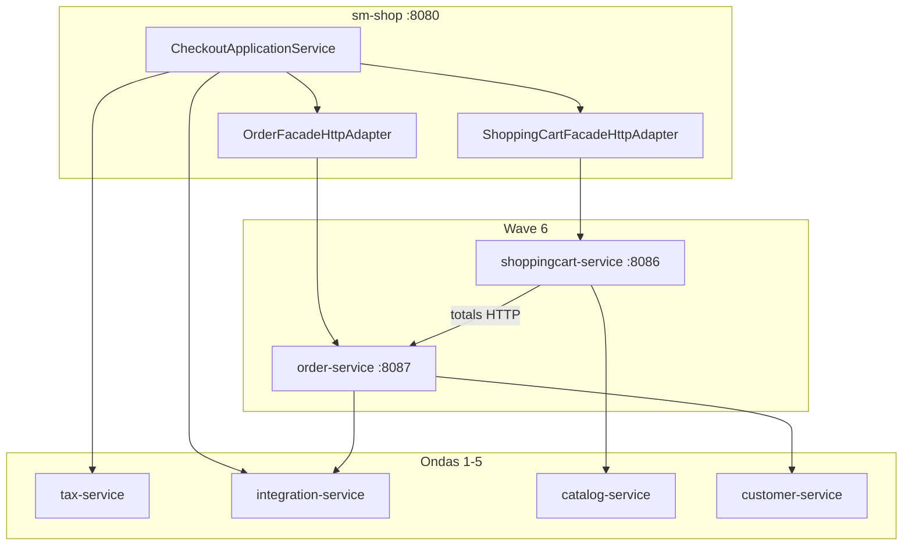

# TechSpec: Onda 6 — ShoppingCart + Order

**PRD:** [_prd.md](_prd.md)
**Authoritative TLC design:** `.specs/features/onda-6-shoppingcart-order/design.md`
**Slug:** `onda-6-shoppingcart-order`
**Date:** 2026-07-26
**Status:** Ready for `cy-create-tasks`

---

## Executive summary

Onda 6 extracts **two Spring Boot services** — `shoppingcart-service` (:8086) and `order-service` (:8087) — while `sm-shop` retains **Checkout Application Service** as the checkout orchestration boundary. The cart↔order cycle breaks via `POST /internal/v1/orders/totals`. `processOrder` becomes **saga choreography + transactional outbox** (Onda 3). Tax stays at BFF calling `tax-service` (ADR-006). Hub `OrderFacadeImpl` (12 services) decomposes into thin delegation.

**Primary trade-off:** Accept shared MySQL and BFF-hosted checkout orchestration to avoid a third deployable during the highest-risk wave — upgrade path documented for post-Wave 6.

**Prerequisite:** Ondas 3, 4, 5 Execute complete (snapshots, saga PoC, catalog-service, customer-service, integration-service).

---

## System architecture



| Component | Responsibility | Boundary |
|-----------|----------------|----------|
| `shopizer-api-contracts` | Cart/order/checkout DTOs + clients | No JPA |
| `sm-shoppingcart-core` | Cart repos + ShoppingCartService | No OrderService |
| `shoppingcart-service` | Cart REST + internal clear | :8086 |
| `sm-order-core` | Order repos, totals, saga commit, outbox | No PaymentService on commit |
| `order-service` | Order REST + internal APIs + outbox relay | :8087 |
| `CheckoutApplicationService` | Checkout saga orchestration | sm-shop only |
| Wave6 strangler adapters | HTTP facades + flags | sm-shop |

---

## Implementation design

### Key interfaces

```java
// shopizer-api-contracts
public interface CartTotalsClient {
  CartTotalsResponse calculateTotals(CartTotalsRequest request);
}

public interface CheckoutCommitClient {
  CheckoutCommitResponse commit(CheckoutCommitRequest request, String idempotencyKey);
}

public interface ShoppingCartServiceClient {
  ReadableShoppingCart getCart(String storeCode, String cartCode);
  void clearAfterCheckout(String cartId);
}
```

```java
// sm-shop — checkout boundary
@Service
public class CheckoutApplicationService {
  CheckoutCommitResponse placeOrder(PlaceOrderCommand cmd);
  CartTotalsResponse calculateTotals(CartTotalsRequest req);
  void processPayment(PaymentCommand cmd);
}
```

### Saga steps (reference)

1. Validate cart + catalog inventory (HTTP)
2. Tax at BFF (tax-service) + shipping quote (integration-service)
3. `order-service` commit + outbox `OrderPlaced`
4. Payment via integration-service
5. Update payment status on order + outbox `OrderPaid`
6. Clear cart via shoppingcart-service
7. Outbox relay → email/inventory

### Configuration

```properties
wave6.shoppingcart-service.base-url=http://localhost:8086
wave6.order-service.base-url=http://localhost:8087
wave6.shoppingcart.strangler.enabled=false
wave6.order.strangler.enabled=false
wave6.checkout.saga.enabled=false
wave6.totals.http.enabled=false
wave6.order-service.internal-token=${WAVE6_ORDER_INTERNAL_TOKEN:dev-token}
```

Profile: `strangler-wave6`

### Build order

1. Gate script (Ondas 3–5)
2. Contracts T1–T5 (TLC)
3. Totals API T6 (`TOT-ready`)
4. Parallel: cart track T7–T14 (`SC-ready`) | order core T15–T21 (`OR-read-ready`)
5. Saga T22–T27
6. CheckoutApplicationService T28–T32 (`CHK-ready`)
7. Hub T33–T38
8. Pact + Docker T39–T45

### Testing gates

```bash
./mvnw -pl sm-shop,shoppingcart-service,order-service -am test \
  -Dtest=Wave6ConsumerPactTest,ShoppingCartProviderPactTest,OrderProviderPactTest \
  -DfailIfNoTests=false
```

---

## Security

- JWT on `/private/**` (wave1 pattern)
- `X-Internal-Token` on `/internal/v1/**`
- `X-Correlation-Id` propagated on all wave6 RestTemplate calls
- Idempotency-Key on checkout commit (24h dedup)

---

## Observability

- Actuator health: DB, catalog, customer, integration dependencies
- Metrics: outbox depth, saga step duration, strangler adapter error rate
- Runbooks: `docs/runbooks/wave6-{cart,checkout}-cutover.md`

---

## Related ADRs

| ADR | Topic |
|-----|-------|
| 001 | Single workflow |
| 002 | Checkout boundary |
| 003 | Saga choreography |
| 004 | Transactional outbox |
| 005 | Hub decomposition |
| 006 | Tax at BFF |
| 007 | Cart before order |
| 008 | Flags + rollback |

---

## TLC traceability

62 TLC tasks (T1–T62) in `.specs/features/onda-6-shoppingcart-order/tasks.md` map to 16 Compozy tasks in `_tasks.md`.
