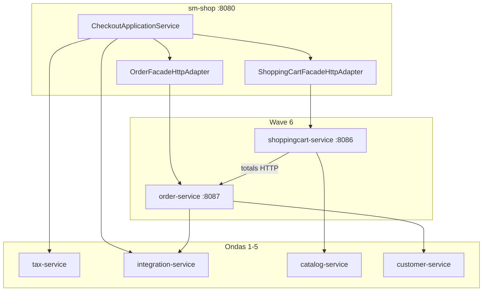

# TechSpec: Onda 6 — ShoppingCart + Order

**PRD:** [_prd.md](_prd.md)
**Design TLC autoritativo:** `.specs/features/onda-6-shoppingcart-order/design.md`
**Slug da feature:** `onda-6-shoppingcart-order`
**Data:** 2026-07-26
**Status:** Pronto para `cy-create-tasks`

---

## Resumo executivo

A Onda 6 extrai **dois serviços Spring Boot** — `shoppingcart-service` (:8086) e `order-service` (:8087) — enquanto `sm-shop` mantém **Checkout Application Service** como fronteira de orquestração de checkout. O ciclo cart↔order quebra via `POST /internal/v1/orders/totals`. `processOrder` torna-se **saga choreography + transactional outbox** (Onda 3). Tax permanece no BFF chamando `tax-service` (ADR-006). Hub `OrderFacadeImpl` (12 serviços) decompõe-se em delegação fina.

**Trade-off principal:** Aceitar MySQL compartilhado e orquestração de checkout hospedada no BFF para evitar um terceiro deployable na onda de maior risco — caminho de upgrade documentado para pós-Onda 6.

**Pré-requisito:** Execute das Ondas 3, 4, 5 completo (snapshots, PoC saga, catalog-service, customer-service, integration-service).

---

## Arquitetura do sistema



| Componente | Responsabilidade | Fronteira |
|-----------|----------------|----------|
| `shopizer-api-contracts` | DTOs cart/order/checkout + clients | Sem JPA |
| `sm-shoppingcart-core` | Repos cart + ShoppingCartService | Sem OrderService |
| `shoppingcart-service` | REST cart + internal clear | :8086 |
| `sm-order-core` | Repos order, totals, saga commit, outbox | Sem PaymentService no commit |
| `order-service` | REST order + APIs internas + relay outbox | :8087 |
| `CheckoutApplicationService` | Orquestração saga checkout | somente sm-shop |
| Adaptadores Strangler Wave6 | Facades HTTP + flags | sm-shop |

---

## Design de implementação

### Interfaces principais

```java
// shopizer-api-contracts
public interface CartTotalsClient {
  CartTotalsResponse calculateTotals(CartTotalsRequest request);
}

public interface CheckoutCommitClient {
  CheckoutCommitResponse commit(CheckoutCommitRequest request, String idempotencyKey);
}

public interface ShoppingCartServiceClient {
  ReadableShoppingCart getCart(String storeCode, String cartCode);
  void clearAfterCheckout(String cartId);
}
```

```java
// sm-shop — fronteira checkout
@Service
public class CheckoutApplicationService {
  CheckoutCommitResponse placeOrder(PlaceOrderCommand cmd);
  CartTotalsResponse calculateTotals(CartTotalsRequest req);
  void processPayment(PaymentCommand cmd);
}
```

### Passos da saga (referência)

1. Validar cart + inventário catalog (HTTP)
2. Tax no BFF (tax-service) + cotação de frete (integration-service)
3. `order-service` commit + outbox `OrderPlaced`
4. Pagamento via integration-service
5. Atualizar status de pagamento no pedido + outbox `OrderPaid`
6. Limpar carrinho via shoppingcart-service
7. Relay outbox → email/inventário

### Configuração

```properties
wave6.shoppingcart-service.base-url=http://localhost:8086
wave6.order-service.base-url=http://localhost:8087
wave6.shoppingcart.strangler.enabled=false
wave6.order.strangler.enabled=false
wave6.checkout.saga.enabled=false
wave6.totals.http.enabled=false
wave6.order-service.internal-token=${WAVE6_ORDER_INTERNAL_TOKEN:dev-token}
```

Profile: `strangler-wave6`

### Ordem de construção

1. Script de gate (Ondas 3–5)
2. Contratos T1–T5 (TLC)
3. API Totals T6 (`TOT-ready`)
4. Paralelo: trilha cart T7–T14 (`SC-ready`) | order core T15–T21 (`OR-read-ready`)
5. Saga T22–T27
6. CheckoutApplicationService T28–T32 (`CHK-ready`)
7. Hub T33–T38
8. Pact + Docker T39–T45

### Gates de teste

```bash
./mvnw -pl sm-shop,shoppingcart-service,order-service -am test \
  -Dtest=Wave6ConsumerPactTest,ShoppingCartProviderPactTest,OrderProviderPactTest \
  -DfailIfNoTests=false
```

---

## Segurança

- JWT em `/private/**` (padrão wave1)
- `X-Internal-Token` em `/internal/v1/**`
- `X-Correlation-Id` propagado em todas as chamadas RestTemplate wave6
- Idempotency-Key no checkout commit (dedup 24h)

---

## Observabilidade

- Health actuator: deps DB, catalog, customer, integration
- Métricas: profundidade outbox, duração passo saga, taxa de erro adaptador strangler
- Runbooks: `docs/runbooks/wave6-{cart,checkout}-cutover.md`

---

## ADRs relacionados

| ADR | Tópico |
|-----|-------|
| 001 | Workflow único |
| 002 | Fronteira checkout |
| 003 | Saga choreography |
| 004 | Transactional outbox |
| 005 | Decomposição do hub |
| 006 | Tax no BFF |
| 007 | Cart antes de order |
| 008 | Flags + rollback |

---

## Rastreabilidade TLC

62 tasks TLC (T1–T62) em `.specs/features/onda-6-shoppingcart-order/tasks.md` mapeiam para 16 tasks Compozy em `_tasks.md`.
