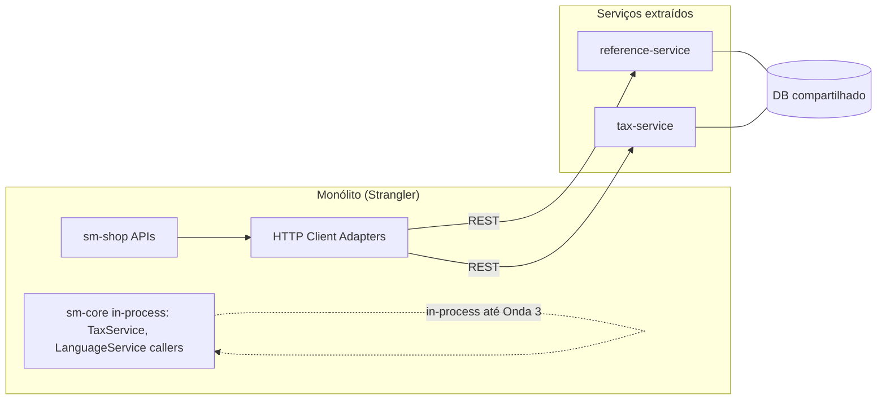

# Architecture

**Pattern:** Maven multi-módulo monolith com camadas API → Facade → Service → Repository → JPA
**Analyzed:** 2026-07-04 (brownfield mínimo — derivado de MIGRATION-MASTER-PLAN.md + exploração de código)

## High-Level Structure

```
sm-shop (REST, facades, mappers, populators)
    ↓
sm-core (domain services, repositories, integrations)
    ↓
sm-core-model (JPA entities)
    ↑
sm-shop-model (DTOs, facade interfaces)
sm-core-modules (plugin contracts — PaymentModule, ShippingQuoteModule)
```

**Dependência Maven:**

```
sm-shop → sm-core, sm-core-model, sm-shop-model
sm-shop-model → sm-core-model (34 arquivos importam core.model.*)
sm-core → sm-core-model, sm-core-modules
```

## Identified Patterns

### Facade + Mapper/Populator (API layer)

**Location:** `sm-shop/src/main/java/com/salesmanager/shop/`
**Purpose:** Traduzir HTTP ↔ DTO ↔ entidade JPA
**Implementation:** Facades em `store/controller/*/facade/` e `store/facade/`; mappers (V2) e populators (V1) coexistem
**Example:** `TaxFacadeImpl` usa mappers; `CountryFacadeImpl` usa populators

### Domain Services (core layer)

**Location:** `sm-core/src/main/java/com/salesmanager/core/business/services/{domain}/`
**Purpose:** Lógica de negócio e acesso a dados via repositories Spring Data JPA
**Implementation:** `*ServiceImpl` estendem `SalesManagerEntityServiceImpl`; cache manual + `@Cacheable` em reference
**Example:** `CountryServiceImpl`, `TaxClassServiceImpl`

### Plugin Registry (integrations)

**Location:** `sm-core-modules`, `sm-core/.../modules/integration/`
**Purpose:** Payment/shipping/CMS como plugins configuráveis
**Implementation:** `Map<String, PaymentModule>`; contratos recebem entidades JPA (MODEL coupling)
**Example:** `PaymentModule`, `ShippingQuoteModule`

### Global Transaction AOP

**Location:** `TransactionalAspectAwareService` em `shopizer-core-config.xml`
**Purpose:** Transações DB em mutações multi-domínio
**Impact:** Extrações precisam de boundaries transacionais explícitos

## Data Flow — Reference (Onda 1)

### Leitura pública

```
GET /api/v1/country
  → ReferencesApi
  → CountryFacadeImpl
  → CountryService.getCountries(Language)
  → CountryRepository (JPA + descriptions join)
  → ReadableCountryPopulator → ReadableCountry DTO
```

### Leitura admin tax

```
GET /api/v1/private/tax/rates (JWT AUTH)
  → TaxRatesApi
  → TaxFacadeImpl
  → TaxRateService.listByStore(MerchantStore, Language)
  → ReadableTaxRateMapper → ReadableTaxRate DTO
```

## Data Flow — Tax Calculation (fora Onda 1)

```
OrderFacadeImpl / OrderTotalApi
  → OrderServiceImpl.caculateOrder()
  → TaxService.calculateTax(OrderSummary, Customer, MerchantStore, Language)
  → TaxRateService (lookup geo + tax class)
  → OrderTotal lines (TAX)
```

## Code Organization

**Approach:** Domain folders dentro de camadas técnicas (services/reference, services/tax, model/reference, etc.)

**Module boundaries (sm-core domains):**

| Domínio | Services | Afferent coupling (inbound) |
|---------|----------|----------------------------|
| reference | 4 CRUD + init/loaders | Alto (~60+ LanguageService callers) |
| tax | 3 (2 CRUD + 1 calc) | Baixo (order, bootstrap, admin API) |
| order | 4+ | Hub central (9/10) |
| catalog | 22 | Maior upstream (10 inbound) |

## Onda 1 Target Architecture (Specify intent)



**Nota:** Diagrama representa intenção da Specify; detalhes de deploy em Design.
