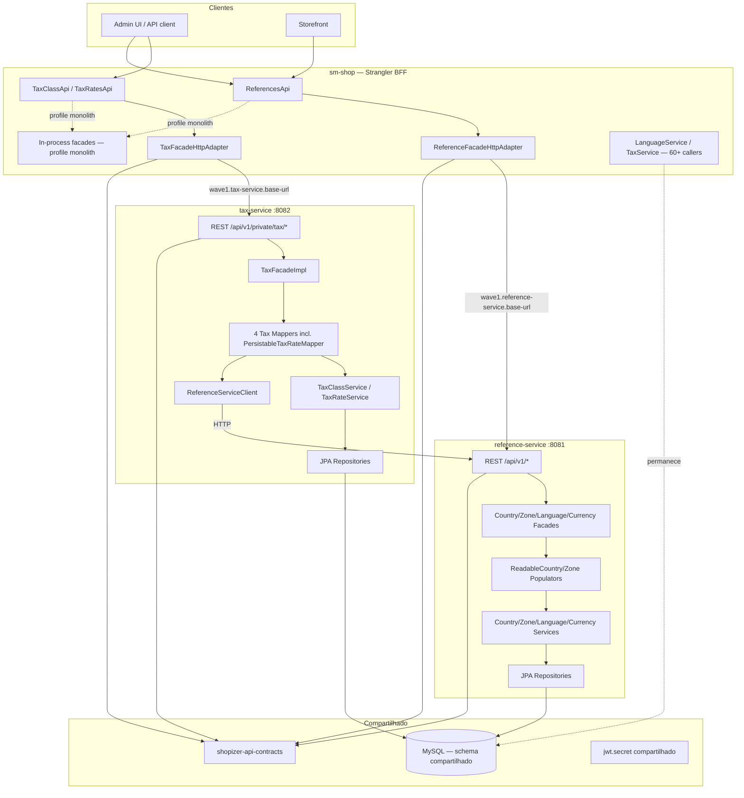
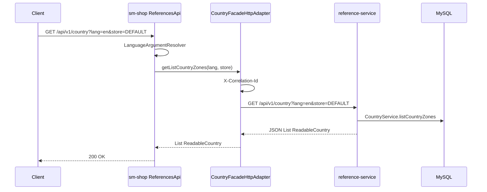
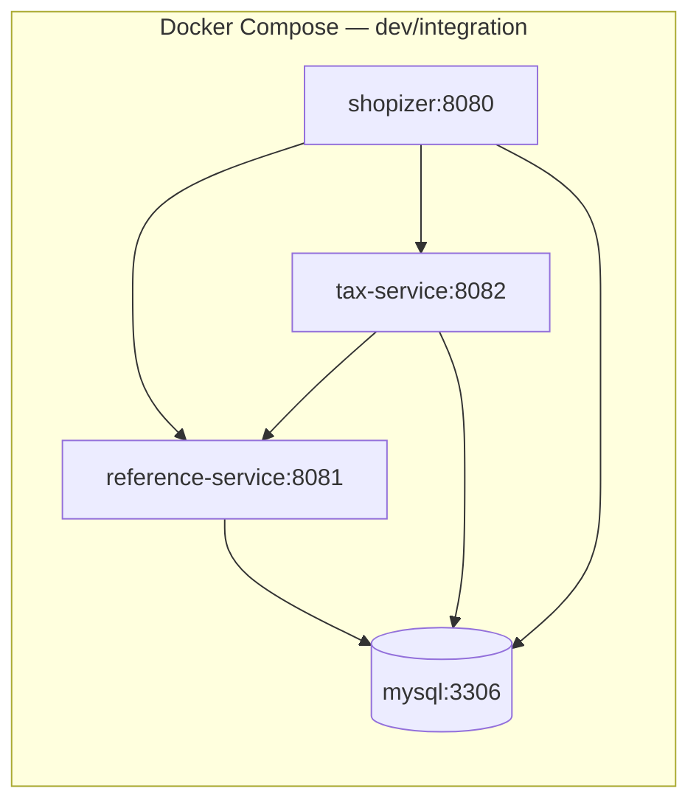

# Onda 1 — Reference + Tax Design

**Spec:** `.specs/features/onda-1-reference-tax/spec.md`
**Status:** Approved — Tasks geradas
**Decisões OQ:** OQ-01 a OQ-06 resolvidas (2026-07-04) — ver [Decisões de Design](#decisões-de-design-oq-01--oq-06)

---

## Architecture Overview

A Onda 1 extrai **runtime e API** de Reference e Tax admin para dois serviços Spring Boot independentes, mantendo **schema DB compartilhado** (AD-003). O monólito (`sm-shop`) atua como **BFF Strangler**: valida JWT nas rotas privadas, resolve `store`/`lang`, e delega via HTTP client configurável.



### Princípios

1. **Paths REST congelados** — clientes externos não mudam URLs (`STR-04`)
2. **DTOs sem JPA** nas respostas — `shopizer-api-contracts` sem dependência de `sm-core-model`
3. **Mappers/populators dentro dos serviços** — não no JAR de contratos (refinamento OQ-04)
4. **Auth tax no serviço** — JWT compartilhado + DB user/store (shared DB viabiliza)
5. **Reference público sem JWT** — mesmo comportamento atual

---

## Decisões de Design (OQ-01 – OQ-06)

| ID | Decisão | Escolha | Rationale |
|----|---------|---------|-----------|
| **OQ-01** | GeoZone no escopo? | **Excluir** | Sem service/repository; `Country.geoZone` populado só via JPA seed. Incluir em onda futura se necessário. |
| **OQ-02** | País inexistente em `/zones` | **Congelar: HTTP 200 + `[]`** | Comportamento atual verificado: `ZoneFacadeImpl` retorna `Collections.emptyList()`; 404 comentado na linha 33. Indistinguível de país sem zonas. |
| **OQ-03** | DELETE TaxClass com Products FK | **HTTP 409 Conflict** | Hoje `TaxClassServiceImpl.delete` não verifica FK; **novo guard** via `ProductRepository.countByTaxClassId` antes de delete. |
| **OQ-04** | Onde vivem DTOs vs mappers | **`shopizer-api-contracts` = DTOs only**; mappers/populators nos serviços | DTOs são JPA-free; mappers/populators dependem de entidades e services. |
| **OQ-05** | `PersistableTaxRateMapper` | **Move para `tax-service`** | Elimina injeção cross-domain no monólito; resolve country/zone via `ReferenceServiceClient` HTTP. |
| **OQ-06** | Service discovery | **Config URL (`wave1.*.base-url`)** | Sem Eureka/K8s DNS na Onda 1; discovery em Onda 2+. |

**AD-005 (nova):** HTTP client stack = **`RestTemplate`** com `@Bean` configurado — alinha com testes existentes (`TestRestTemplate`), sem adicionar Spring Cloud/OpenFeign.

**AD-006 (nova):** tax-service replica cadeia JWT completa (filter + `JWTAdminAuthenticationManager` + `MerchantStoreArgumentResolver`) — viável com shared DB e `jwt.secret` compartilhado.

---

## Maven Module Structure

### Novos módulos no root `pom.xml`

```xml
<modules>
    <!-- existentes -->
    <module>shopizer-api-contracts</module>   <!-- NEW — antes dos services -->
    <module>reference-service</module>        <!-- NEW -->
    <module>tax-service</module>              <!-- NEW -->
</modules>
```

### `shopizer-api-contracts`

| Atributo | Valor |
|----------|-------|
| **artifactId** | `shopizer-api-contracts` |
| **packaging** | `jar` |
| **parent** | `shopizer` 3.2.5 |
| **deps** | `jackson-annotations`, `validation-api`, `swagger-annotations` (opcional) |
| **SEM** | `sm-core-model`, Spring Boot starters |

**Conteúdo (packages):**

```
com.salesmanager.contracts.common     → Entity, ReadableEntityList, EntityExists, ReadableList
com.salesmanager.contracts.catalog    → NamedEntity (ou LocalizedNamedEntity slim)
com.salesmanager.contracts.reference  → ReadableCountry, ReadableZone, ReadableLanguage,
                                        ReadableCurrency (NEW), SizeReferences, enums
com.salesmanager.contracts.tax        → Persistable/Readable TaxClass/TaxRate DTOs
com.salesmanager.contracts.client     → ReferenceServiceClient, TaxServiceClient (interfaces)
```

**Migração:** Copiar DTOs de `sm-shop-model` para contracts; `sm-shop-model` re-exporta via dependency transitiva (compatibilidade) ou deprecar imports gradualmente.

### `reference-service`

| Atributo | Valor |
|----------|-------|
| **packaging** | `jar` (executable) |
| **mainClass** | `com.salesmanager.reference.ReferenceServiceApplication` |
| **port** | `8081` (default) |
| **finalName** | `reference-service` |

**Dependências:**

- `shopizer-api-contracts`
- `sm-core-model` (entidades JPA)
- Extrair subset de `sm-core`: services/repos reference apenas (ver [Extração de código](#extração-de-código-sm-core))
- `spring-boot-starter-web`, `spring-boot-starter-data-jpa`, `spring-boot-starter-actuator`
- `spring-boot-starter-cache` (Ehcache — preservar cache behavior)

**NÃO depende de:** `sm-shop`, `sm-shop-model` (usa contracts), `tax-service`

### `tax-service`

| Atributo | Valor |
|----------|-------|
| **packaging** | `jar` (executable) |
| **mainClass** | `com.salesmanager.tax.TaxServiceApplication` |
| **port** | `8082` (default) |
| **finalName** | `tax-service` |

**Dependências:**

- `shopizer-api-contracts`
- `sm-core-model`
- Subset `sm-core`: tax services/repos + security user lookup
- `spring-boot-starter-web`, `spring-boot-starter-data-jpa`, `spring-boot-starter-security`, `spring-boot-starter-actuator`
- `RestTemplate` (via `spring-boot-starter-web`) para `ReferenceServiceClient`

### Monólito (`sm-shop`) — alterações

- Nova dep: `shopizer-api-contracts`
- Novos packages: `com.salesmanager.shop.strangler.reference`, `...strangler.tax`
- Profile Spring: `monolith` (default dev) vs `strangler` (prod Onda 1)
- Properties: `wave1.strangler.enabled`, `wave1.reference-service.base-url`, `wave1.tax-service.base-url`

---

## Code Reuse Analysis

### Existing Components to Leverage

| Component | Location | How to Use |
| --------- | -------- | ---------- |
| Reference services | `sm-core/.../services/reference/` | Move ou dependência direta em reference-service |
| Reference repos | `sm-core/.../repositories/reference/` | Move com services |
| Tax services | `sm-core/.../services/tax/TaxClassService*`, `TaxRateService*` | Move para tax-service |
| Tax repos | `sm-core/.../repositories/tax/` | Move com services |
| `TaxFacadeImpl` | `sm-shop/.../facade/tax/TaxFacadeImpl.java` | Move para tax-service; monólito ganha HTTP adapter |
| Reference facades | `sm-shop/.../controller/{country,zone,language,currency}/facade/` | Move para reference-service |
| Reference populators | `sm-shop/.../populator/references/` | Move para reference-service |
| Tax mappers | `sm-shop/.../mapper/tax/` | Move para tax-service |
| `ReferencesApi` | `sm-shop/.../api/v1/references/ReferencesApi.java` | **Permanece no monólito** (Strangler); reference-service expõe endpoints espelhados |
| `TaxClassApi`, `TaxRatesApi` | `sm-shop/.../api/v1/tax/` | **Permanece no monólito** (Strangler) |
| JWT security chain | `sm-shop/.../security/`, `MultipleEntryPointsSecurityConfig` | Extrair mini-módulo ou copiar para tax-service |
| `sm-core-modules` pattern | publishable thin jar | Template para `shopizer-api-contracts` |
| `CaptchaRequestUtils` | `sm-shop/.../utils/CaptchaRequestUtils.java` | Precedente HttpClient imperativo (não usado — preferimos RestTemplate) |

### Integration Points

| System | Integration Method |
| ------ | ------------------ |
| MySQL (shared DB) | JPA datasource idêntico ao monólito; mesmas tabelas `COUNTRY`, `ZONE`, `LANGUAGE`, `CURRENCY`, `TAX_*` |
| reference-service ← tax-service | `ReferenceServiceClient` HTTP: `GET /api/v1/country`, `/zones`, resolve codes |
| monólito → services | `RestTemplate` + `ReferenceFacadeHttpAdapter`, `TaxFacadeHttpAdapter` |
| JWT auth | `jwt.secret` + `authentication.properties` compartilhados via env/config |
| Actuator | `/actuator/health` com indicator DB + HTTP (tax → reference) |

---

## Components

### 1. `shopizer-api-contracts`

- **Purpose:** DTOs compartilhados e interfaces de client HTTP — zero JPA
- **Location:** `/shopizer-api-contracts/src/main/java/com/salesmanager/contracts/`
- **Interfaces:**
  - DTOs serializáveis Jackson para todos os endpoints P1
  - `ReferenceServiceClient` — métodos espelhando facade reference
  - `TaxServiceClient` — métodos espelhando `TaxFacade`
- **Dependencies:** Jackson, validation-api
- **Reuses:** Cópia/adaptação de `sm-shop-model` reference/tax packages

#### Novo DTO: `ReadableCurrency`

```java
public class ReadableCurrency extends Entity {
    private Long id;
    private String code;      // ISO 4217
    private String name;
    private String symbol;    // from java.util.Currency.getSymbol()
    private boolean supported;
}
```

#### `ReadableLanguage` (existente — wire na API)

Campos expostos: `id`, `code`, `sortOrder` — excluir `stores`, `auditSection`.

---

### 2. `reference-service`

- **Purpose:** Servir dados de referência read-mostly via REST
- **Location:** `/reference-service/`
- **Interfaces (REST — espelham monólito):**

| Method | Path | Response |
|--------|------|----------|
| GET | `/api/v1/country` | `List<ReadableCountry>` |
| GET | `/api/v1/zones?code={iso}` | `List<ReadableZone>` |
| GET | `/api/v1/languages` | `List<ReadableLanguage>` |
| GET | `/api/v1/currency` | `List<ReadableCurrency>` |
| GET | `/api/v1/measures` | `SizeReferences` |

- **Query params preservados:** `lang`, `store` (store usado para default language via lógica portada de `LanguageUtils`)
- **Dependencies:** sm-core-model, extracted reference layer, Ehcache
- **Reuses:** `CountryServiceImpl`, `ZoneServiceImpl`, `LanguageServiceImpl`, `CurrencyServiceImpl`, populators

#### Internal: `ReferenceFacade` layer

Portar facades existentes; substituir retorno de entidades em `LanguageFacadeImpl`/`CurrencyFacadeImpl` por mappers internos → DTOs.

#### `LanguageService.toLocale` — REF-08

Novo overload no reference-service (interno ou endpoint futuro):

```java
Locale toLocale(Language language, String countryCode);
```

Desacopla de `MerchantStore`; monólito passa `store.getCountry().getIsoCode()` quando necessário.

#### GeoZone — excluído (OQ-01)

Entidades `GeoZone`/`GeoZoneDescription` permanecem em `sm-core-model` mas **sem API** na Onda 1. `Country.geoZone` continua lazy-loaded se monólito acessar via JPA.

#### Cache strategy

Preservar chaves existentes: `COUNTRIES_{lang}`, `ZONES_{country}_{lang}`, `LANGUAGES`. TTL ou invalidação explícita em mutações admin (futuro — Onda 1 é read-only para reference pública).

---

### 3. `tax-service`

- **Purpose:** CRUD admin de tax classes e rates
- **Location:** `/tax-service/`
- **Interfaces (REST — espelham monólito):**

| Method | Path | Auth |
|--------|------|------|
| POST | `/api/v1/private/tax/class` | JWT |
| GET/PUT/DELETE | `/api/v1/private/tax/class/{id\|code}` | JWT |
| GET | `/api/v1/private/tax/class/unique?code=` | JWT |
| POST/GET/PUT/DELETE | `/api/v1/private/tax/rate/*` | JWT |

- **Dependencies:** sm-core-model, tax services/repos, security chain, `ReferenceServiceClient`
- **Reuses:** `TaxFacadeImpl`, 4 mappers (incl. `PersistableTaxRateMapper`)

#### `ReferenceServiceClient` (tax → reference)

```java
public interface ReferenceServiceClient {
    ReadableCountry getCountryByCode(String isoCode, String langCode);
    ReadableZone getZoneByCode(String countryCode, String zoneCode, String langCode);
    ReadableLanguage getLanguageByCode(String code);
    // usado por PersistableTaxRateMapper para resolver FKs
}
```

Implementação: `RestTemplate` + `wave1.reference-service.base-url`.

#### DELETE TaxClass guard (OQ-03 — novo comportamento)

```java
// TaxClassServiceImpl.delete — antes de super.delete()
long productCount = productRepository.countByTaxClassId(taxClass.getId());
if (productCount > 0) {
    throw new TaxClassInUseException(taxClass.getId(), productCount);
}
```

Mapear para **HTTP 409** via `@ControllerAdvice`:

```json
{
  "error": "TAX_CLASS_IN_USE",
  "message": "Tax class [DEFAULT] is referenced by 12 products",
  "productCount": 12
}
```

#### Fix TAX-09: `existsTaxRate`

```java
// TaxFacadeImpl.existsTaxRate — substituir taxRateByCode por:
return taxRateService.getByCode(code, store) != null;
// sem throw
```

---

### 4. Strangler Adapters (monólito)

- **Purpose:** Delegar facades para HTTP quando `wave1.strangler.enabled=true`
- **Location:** `sm-shop/.../strangler/reference/`, `.../strangler/tax/`

#### Pattern: Interface segregation + `@ConditionalOnProperty`

```java
@ConditionalOnProperty(name = "wave1.strangler.enabled", havingValue = "false", matchIfMissing = true)
@Service
public class CountryFacadeImpl implements CountryFacade { /* in-process */ }

@ConditionalOnProperty(name = "wave1.strangler.enabled", havingValue = "true")
@Service
public class CountryFacadeHttpAdapter implements CountryFacade { /* RestTemplate */ }
```

**Interfaces de facade permanecem** com assinaturas atuais (`Language`, `MerchantStore`) no monólito — refatoração sistêmica é Onda 3 (B-001).

#### HTTP adapter behavior

| Concern | Behavior |
|---------|----------|
| Correlation ID | Propagar header `X-Correlation-Id` (gerar UUID se ausente) |
| Timeout | `wave1.http.client.timeout-ms=5000` |
| Error mapping | 503 se connection refused; propagar 4xx/5xx do serviço |
| JWT forwarding | Tax adapter repassa `Authorization` header para tax-service |
| Store/lang | Tax adapter repassa `?store=` e `?lang=` query params |

#### Sequência Strangler — GET /api/v1/country



---

### 5. Security — tax-service

Replicar cadeia do monólito (AD-006):

| Componente | Origem | Notas |
|------------|--------|-------|
| `MultipleEntryPointsSecurityConfig.UserApiConfigurationAdapter` | Copiar/adaptar | `/api/v*/private/**` → `hasRole("AUTH")` |
| `AuthenticationTokenFilter` | Copiar | Bearer JWT |
| `JWTAdminAuthenticationManager` + `JWTTokenUtil` | Copiar | `jwt.secret` via env |
| `JWTAdminServicesImpl` | Copiar | `UserService` — shared DB |
| `MerchantStoreArgumentResolver` | Copiar | `authorizeStore` logic |
| `LanguageArgumentResolver` | Copiar | `?lang=` param |

**Login permanece no monólito:** `POST /api/v1/private/login` — não mover.

**reference-service:** Sem security chain para endpoints públicos P1. Actuator pode exigir auth em prod (config).

---

## Data Models

### Tabelas owned (Onda 1 — shared DB)

**reference-service:**

| Tabela | Entidade |
|--------|----------|
| `COUNTRY` | `Country` |
| `COUNTRY_DESCRIPTION` | `CountryDescription` |
| `ZONE` | `Zone` |
| `ZONE_DESCRIPTION` | `ZoneDescription` |
| `LANGUAGE` | `Language` |
| `CURRENCY` | `Currency` |

**tax-service:**

| Tabela | Entidade |
|--------|----------|
| `TAX_CLASS` | `TaxClass` |
| `TAX_RATE` | `TaxRate` |
| `TAX_RATE_DESCRIPTION` | `TaxRateDescription` |

**FKs cross-domain (permanecem no DB, não removidas):**

- `TAX_RATE.COUNTRY_ID`, `ZONE_ID` → reference tables
- `TAX_CLASS.MERCHANT_ID` → `MERCHANT_STORE`
- `PRODUCT.TAX_CLASS_ID` → `TAX_CLASS` (catalog domain — guard 409 on delete)

### Configuration properties

```properties
# reference-service/application.properties
server.port=8081
spring.application.name=reference-service

# tax-service/application.properties
server.port=8082
spring.application.name=tax-service
wave1.reference-service.base-url=http://localhost:8081

# sm-shop (strangler profile)
wave1.strangler.enabled=true
wave1.reference-service.base-url=http://reference-service:8081
wave1.tax-service.base-url=http://tax-service:8082
wave1.http.client.timeout-ms=5000
```

Datasource: reutilizar `database.properties` pattern — mesma URL/credentials do monólito.

---

## Extração de código sm-core

Evitar dependência de `sm-core` inteiro (335 arquivos). Duas opções:

| Opção | Descrição | Recomendação |
|-------|-----------|--------------|
| **A. Thin extraction** | Novo módulo `sm-reference-core` / `sm-tax-core` com services+repos movidos | ✅ Preferida — boundaries claros |
| **B. Full sm-core dep** | Services dependem de `sm-core` jar inteiro | ❌ Puxa order, payments, etc. |

### `sm-reference-core` (novo módulo intermediário)

```
sm-reference-core/
├── services/reference/     (movidos de sm-core)
├── repositories/reference/ (movidos de sm-core)
└── depends on: sm-core-model
```

`reference-service` depende de `sm-reference-core`.

### `sm-tax-core` (novo módulo intermediário)

```
sm-tax-core/
├── services/tax/TaxClassService*, TaxRateService*  (NOT TaxService)
├── repositories/tax/
└── depends on: sm-core-model
```

`tax-service` depende de `sm-tax-core`. `TaxService`/`TaxServiceImpl` **permanecem em sm-core** no monólito.

---

## Error Handling Strategy

| Error Scenario | HTTP | Handling | User Impact |
| -------------- | ---- | -------- | ----------- |
| País inexistente `/zones?code=XX` | **200** | `[]` | Lista vazia (OQ-02 frozen) |
| Country/zone code inválido em tax rate POST | **400** | Validation error JSON | Mensagem "Invalid country code: XX" |
| Tax class delete com products FK | **409** | `TAX_CLASS_IN_USE` | "Cannot delete tax class in use" (OQ-03) |
| Tax class/rate not found | **404** | `ResourceNotFoundException` | Igual monólito |
| Store mismatch em mutação | **403** | `UnauthorizedException` | Igual monólito |
| reference-service down | **503** | Strangler adapter | Erro estruturado, sem fallback in-process |
| JWT inválido/expirado | **401** | JWT filter | Igual monólito |
| `existsTaxRate` código ausente | **200** | `{exists: false}` | Fix TAX-09 |
| Description ausente para lang | **200** | Fallback `descriptions.get(0)` ou code | Preservar comportamento frágil atual; melhorar em Onda 3 |

---

## Tech Decisions

| Decision | Choice | Rationale |
| -------- | ------ | --------- |
| HTTP client | `RestTemplate` + `@Bean` | AD-005; testes usam `TestRestTemplate`; sem Spring Cloud |
| Contracts lib | `shopizer-api-contracts` JPA-free | OQ-04; publicável como `sm-core-modules` |
| DB | Shared schema | AD-003; FKs intactas |
| API surface no monólito | BFF mantém controllers | Strangler transparente para clientes |
| GeoZone | Excluded | OQ-01 |
| Tax calculation | In-process monolith | AD-002 |
| Auth tax | Full JWT replication | AD-006; shared DB |
| Core extraction | `sm-reference-core` + `sm-tax-core` | Evita puxar sm-core inteiro |
| Cache reference | Ehcache local per instance | Match atual; distributed cache = deferred |
| Pact | Provider tests nos services; consumer no monólito | STR-02 |

---

## Requirement Traceability — Design Coverage

| Requirement ID | Design Section | Status |
| -------------- | -------------- | ------ |
| REF-01 | Maven `reference-service` | In Design |
| REF-02 | REST paths table | In Design |
| REF-03 | ReadableCountry/Zone populators | In Design |
| REF-04 | ReadableLanguage wiring | In Design |
| REF-05 | ReadableCurrency new DTO | In Design |
| REF-06 | Zero JPA in responses | In Design |
| REF-07 | Tabelas owned table | In Design |
| REF-08 | toLocale(countryCode) overload | In Design |
| REF-09 | CountryFacadeHttpAdapter et al. | In Design |
| REF-10 | /measures endpoint | In Design |
| TAX-01 | Maven `tax-service` | In Design |
| TAX-02 | Private tax paths table | In Design |
| TAX-03 | TaxClass CRUD + store scoping | In Design |
| TAX-04 | TaxRate CRUD + mappers moved | In Design |
| TAX-05 | Security replication AD-006 | In Design |
| TAX-06 | ReferenceServiceClient | In Design |
| TAX-07 | TaxService stays sm-core | Confirmed |
| TAX-09 | existsTaxRate fix spec | In Design |
| TAX-10 | TaxFacadeHttpAdapter | In Design |
| STR-01 | @ConditionalOnProperty | In Design |
| STR-03 | Shared DB | In Design |
| STR-04 | Paths frozen | In Design |
| TAX-08, STR-02, STR-05 | — | → Tasks phase |

---

## Deployment Topology (Onda 1)



**Ordem de startup:** MySQL → reference-service → tax-service → monólito (strangler profile).

**Greenfield:** Monólito deve rodar primeiro para seed (`InitializationDatabaseImpl` — AD-004).

---

## Risks & Mitigations (from CONCERNS.md)

| Concern | Mitigation in Design |
|---------|---------------------|
| B-001 Language/MerchantStore in facades | Adapters mantêm assinaturas; HTTP traduz internamente |
| B-002 Entity leak ReferencesApi | reference-service retorna DTOs; monólito proxy pass-through |
| B-003 TaxRateMapper → reference | ReferenceServiceClient HTTP |
| B-004 GeoZone | Excluded OQ-01 |
| Fragile descriptions.get(0) | Documented; preserve behavior |
| 60+ LanguageService callers | Out of scope; in-process until Onda 3 |

---

## Próxima fase: Execute

Ver [tasks.md](./tasks.md) — 30 tarefas (T1–T30). Iniciar por T1.
