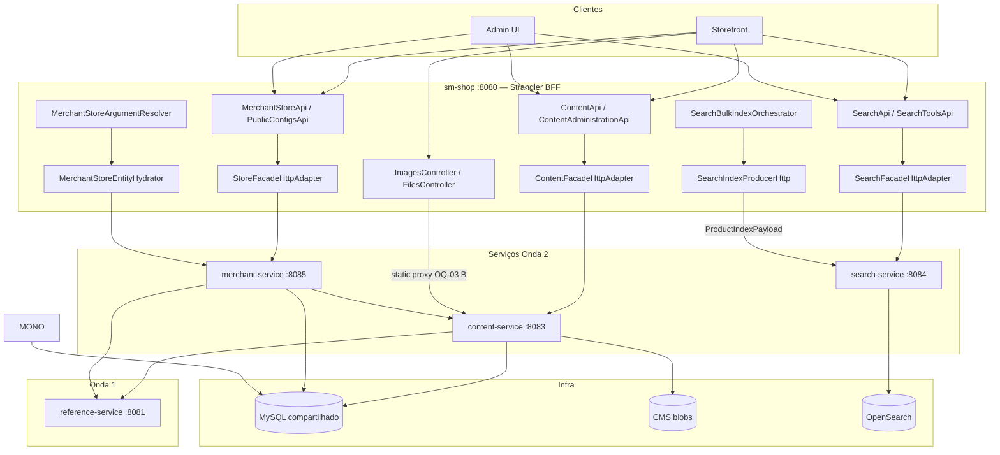
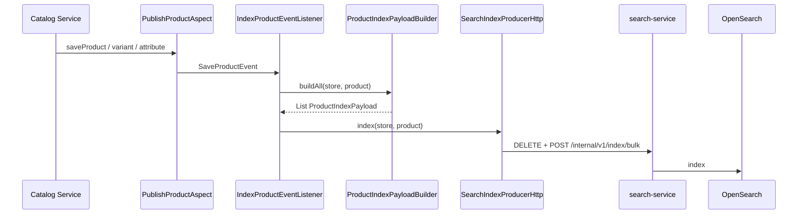
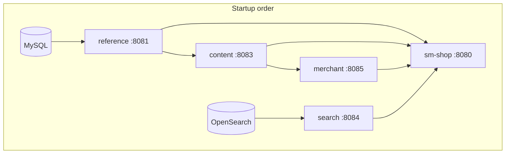

# Onda 2 — Content, Search, Merchant Design

**Spec:** `.specs/features/onda-2-content-search-merchant/spec.md`
**Context:** `.specs/features/onda-2-content-search-merchant/context.md` (OQ-01..06 confirmadas)
**Status:** Approved — Tasks geradas (T1–T54)
**Exploração Design:** Subagentes content, search, merchant (2026-07-04)

---

## Architecture Overview

A Onda 2 extrai **três serviços Spring Boot** mantendo **schema DB compartilhado** (AD-003) e o monólito como **BFF Strangler**. Cada serviço replica o padrão Onda 1: DTOs em `shopizer-api-contracts`, lógica de domínio em módulos thin (`sm-*-core`), adapters HTTP no `sm-shop`.



### Princípios (herdados Onda 1 + Onda 2)

1. **Paths REST congelados** — `STR-04`; BFF mantém controllers originais
2. **DTOs sem JPA** nas respostas — `shopizer-api-contracts` estendido
3. **Mappers/populators nos serviços** — não no JAR de contratos (L-002)
4. **RestTemplate** para HTTP clients — AD-005; properties `wave2.*.base-url`
5. **JWT replicado** nos serviços para rotas `/private/**` — AD-006 pattern
6. **Content co-localiza DB + blobs** — mitigação split-brain
7. **Search sem JPA** — indexação via `ProductIndexPayload` HTTP (OQ-01 A)
8. **Merchant sem ProductType** — MCH-06; logo via content HTTP (MCH-04)

---

## Decisões de Design (OQ-01 – OQ-06)

| ID | Decisão | Escolha | Rationale |
|----|---------|---------|-----------|
| **OQ-01** | Faseamento indexação Search | **HTTP producer + `ProductIndexPayload`** | search-service dono do OpenSearch; monólito monta payload via `ProductIndexPayloadBuilder` |
| **OQ-02** | Product images no content-service | **Só `contentFileManager`** | `productFileManager` permanece monólito até Onda 4 |
| **OQ-03** | Legacy `/static/files/**` | **Monólito thin proxy** | `StaticContentProxy` → content-service `/internal/v1/static/files/**` |
| **OQ-04** | Endpoints stub/deprecated | **Preservar byte-a-byte** | `null`, no-op, deprecated paths intactos para pact |
| **OQ-05** | Gaps de reindex | **Documentar** (GAP-SRCH-01..10) | Corrigir só se trivial; `schemaVersion` para evolução |
| **OQ-06** | `SearchItem` em commons | **Pact usa shopizer-commons** | Migração para api-contracts na Onda 3 |

**AD-011 (nova):** Módulos thin `sm-content-core`, `sm-merchant-core` extraem subset de `sm-core` sem puxar monólito inteiro.

**AD-012 (nova):** `search-service` **sem JPA** — único serviço Onda 2 stateless em relação ao DB.

**AD-013 (nova):** Internal APIs (`/internal/v1/**`) protegidas por network policy + `X-Internal-Token` (search) ou cluster-only (content/merchant).

**AD-014 (nova):** Logo upload — **blob primeiro, DB depois** com compensação se DB falhar (merchant-service).

---

## Maven Module Structure

### Root `pom.xml` (após Onda 1)

```xml
<modules>
    <!-- existentes -->
    <module>shopizer-api-contracts</module>
    <module>reference-service</module>
    <module>tax-service</module>
    <!-- Onda 2 NEW -->
    <module>sm-content-core</module>
    <module>content-service</module>
    <module>search-service</module>
    <module>sm-merchant-core</module>
    <module>merchant-service</module>
</modules>
```

### Portas e serviços

| Módulo | Port | JPA | OpenSearch | CMS blobs |
|--------|------|-----|------------|-----------|
| `content-service` | 8083 | ✅ | — | ✅ |
| `search-service` | 8084 | — | ✅ | — |
| `merchant-service` | 8085 | ✅ | — | — |

### `shopizer-api-contracts` — extensões Onda 2

```
com.salesmanager.contracts.content     → ReadableContent*, PersistableContent*, ContentFolder, ...
com.salesmanager.contracts.merchant    → ReadableMerchantStore, PersistableMerchantStore, Configs, MerchantStoreSnapshot
com.salesmanager.contracts.search      → ProductIndexPayload, ProductIndexBulkPayload, ValueList
com.salesmanager.contracts.client      → ContentServiceClient, MerchantServiceClient, SearchIndexClient
```

**Search query response:** `SearchItem` permanece em `shopizer-commons` (OQ-06 A).

### `sm-content-core`

Extrai de `sm-core`:

- `services/content/`, `repositories/content/`
- `modules/cms/content/` (exceto `product/`)
- Cache managers: `StaticContentCacheManagerImpl`, `Local`, `S3`, `GCP`

**Exclui:** `productFileManager`, `productDownloadsFileManager`.

### `sm-merchant-core`

Extrai de `sm-core`:

- `services/merchant/`, `services/system/MerchantConfiguration*`, `MerchantLog*`
- `repositories/merchant/`, `repositories/system/MerchantConfiguration*`, `MerchantLog*`

**Remove:** injeção morta `ProductTypeService` em `MerchantStoreServiceImpl`.

### `search-service`

**Deps:** `shopizer-api-contracts`, `shopizer-commons`, `shopizer-search-opensearch-spring-boot-starter`, Spring Web/Security/Actuator/Validation.

**Sem:** `sm-core`, `sm-core-model`, JPA.

---

## Service Designs

### 1. content-service (:8083)

#### CMS wiring

Novo `shopizer-content-cms.xml` — subset de `shopizer-core-cms.xml` com apenas `contentFileManager` + backends.

```java
@ImportResource("classpath:spring/shopizer-content-cms.xml")
@ComponentScan({
    "com.salesmanager.content",
    "com.salesmanager.core.business.modules.cms.content.gcp",
    "com.salesmanager.core.business.modules.cms.impl"
})
@SpringBootApplication
public class ContentServiceApplication { }
```

GCP beans via `@ComponentScan` (mix XML + `@Component` preservado).

#### Controllers (espelham monólito)

| Controller | Paths |
|------------|-------|
| `ContentPagesController` | `/api/v1/content/pages*`, `/private/content/page*` |
| `ContentBoxesController` | `/api/v1/content/boxes*` |
| `ContentFilesController` | `/private/file*`, `/content/images` |
| `ContentAdminController` | `/private/content/list`, `/folder`, `/images/*` |
| `StaticFilesInternalController` | `/internal/v1/static/files/**` |

#### Reference integration

`ReferenceServiceClientRestTemplateImpl` → `wave1.reference-service.base-url` para `getLanguageByCode()`.

#### Strangler (monólito)

```
com.salesmanager.shop.strangler.content/
  ContentFacadeHttpAdapter          @ConditionalOnProperty wave2.strangler.enabled=true
  StaticContentProxy                → ImagesController, FilesController
  ContentBlobClient                 → ProductOptionFacadeImpl, ProductVariantGroupFacadeImpl (P2)
```

#### Health

| Indicator | Check |
|-----------|-------|
| `db` | DataSource |
| `cms` | Infinispan dir / S3 headBucket / GCS metadata |
| `referenceService` | GET reference `/actuator/health` |

#### Co-location (split-brain)

- MySQL `CONTENT*` no mesmo cluster
- Blob volume/bucket **somente** no content-service pod
- Produção multi-replica: preferir `aws`/`gcp` CMS method; `default` (Infinispan) = single replica

---

### 2. search-service (:8084)

#### ProductIndexPayload

```java
// shopizer-api-contracts
public class ProductIndexPayload {
    int schemaVersion = 1;  // unsupported → HTTP 422
    Long id;
    String store;           // lowercase
    String language;
    String name;
    String description;
    String link;
    String image;
    String reviews;
    String brand;
    String category;
    Map<String, String> attributes;
    List<Map<String, String>> variants;
    List<Map<String, String>> inventory;  // keys: SKU, QTY, PRICE, DISCOUNT
    Boolean addToCart = false;
}
```

#### Internal API

| Method | Path | Auth |
|--------|------|------|
| POST | `/internal/v1/index` | `X-Internal-Token` |
| POST | `/internal/v1/index/bulk` | same; max batch 50 |
| DELETE | `/internal/v1/index/{productId}?store=&languages=` | same |

#### Public API (espelhada)

| Method | Path | Response |
|--------|------|----------|
| POST | `/api/v1/search` | `List<SearchItem>` (commons) |
| POST | `/api/v1/search/autocomplete` | `ValueList` |
| POST | `/api/v1/private/system/search/index` | **501** — orchestrado pelo monólito |

#### Monólito — index pipeline



**Classes (monólito / sm-core):**

| Class | Location | Role |
|-------|----------|------|
| `ProductIndexPayloadBuilder` | `sm-core/.../search/index/` | Extrai lógica de `SearchServiceImpl` |
| `SearchIndexProducer` | interface | `index()` / `deleteDocument()` |
| `SearchIndexProducerInProcess` | `wave2.strangler.enabled=false` | Delega `SearchService` legado |
| `SearchIndexProducerHttp` | `sm-shop/strangler/search/` | HTTP ao search-service |
| `SearchBulkIndexOrchestrator` | `sm-shop/strangler/search/` | `ProductService.listByStore` + producer |
| `SearchFacadeHttpAdapter` | `sm-shop/strangler/search/` | Query/autocomplete HTTP |

#### OpenSearch migration

Move de `sm-core` → `search-service`:

- `ApplicationSearchConfiguration`
- `search/MAPPINGS.json`, `SETTINGS_*.json`
- `SearchModuleBootstrap` (`@PostConstruct` configure)
- Dependency `shopizer-search-opensearch-spring-boot-starter`

Monólito em strangler: **não** conecta ao OpenSearch.

#### Known gaps (OQ-05 A)

| ID | Gap | Onda 2 |
|----|-----|--------|
| GAP-SRCH-01 | `ProductService.update()` sem evento | Documentar |
| GAP-SRCH-02 | Inventory/price-only sem reindex | Documentar |
| GAP-SRCH-03 | Delete image listener no-op | Documentar |
| GAP-SRCH-04 | Reviews stale | Documentar |
| GAP-SRCH-05 | NPE manufacturer/category missing lang | Documentar; fix trivial opcional |
| GAP-SRCH-06 | Bulk reindex sem rate limit | `wave2.search.index.reindex-delay-ms` |
| GAP-SRCH-07 | HTTP index failure sem outbox | Documentar |
| GAP-SRCH-08 | `addToCart` unused | Incluir no schema |
| GAP-SRCH-09 | Category facets null | Out of scope |
| GAP-SRCH-10 | SearchItem em commons | Onda 3 migration |

---

### 3. merchant-service (:8085)

#### Facade split

**Move para merchant-service:** `StoreFacadeImpl`, `MerchantConfigurationFacadeImpl`, populators.

**Permanece monólito:** `MerchantStoreApi`, `PublicConfigsApi`, `StoreFacade` interface, auth via `UserFacade`.

#### Logo orchestration (AD-014)

```
Upload:  POST blob → content-service → ON OK UPDATE storeLogo → ON DB fail DELETE blob
Delete:  CLEAR storeLogo → DELETE blob (orphan blob acceptable on content fail)
```

`ContentServiceClient` → `wave2.content-service.base-url` + `/internal/v1/content/logo`.

#### Resolver (MCH-07)

`MerchantStoreArgumentResolver` permanece no monólito:

```java
MerchantStore store = merchantStoreClient.getStoreEntity(code);
// MerchantStoreEntityHydrator: snapshot → detached MerchantStore (id, code, retailer, parent stub)
```

`GET /internal/v1/store/{code}` → `MerchantStoreSnapshot` (contracts).

Cache opcional: `wave2.merchant-service.cache.ttl-seconds=60`.

#### Reference integration

`PersistableMerchantStorePopulator` usa `ReferenceServiceClient` para country/zone/language/currency — JPA FK via `getReference(id)`.

#### Endpoints espelhados

Todos os paths de `MerchantStoreApi` + `GET /api/v1/config`.

**Excluído:** qualquer rota `ProductType`.

#### Health

`db` + `referenceService` + `contentService` indicators.

---

## Strangler Configuration (unified)

```properties
# sm-shop — profile strangler-wave2
wave2.strangler.enabled=true
wave2.content-service.base-url=http://content-service:8083
wave2.search-service.base-url=http://search-service:8084
wave2.search-service.internal-token=${SEARCH_INTERNAL_TOKEN}
wave2.merchant-service.base-url=http://merchant-service:8085
wave2.http.client.timeout-ms=5000

# Coexists with Onda 1
wave1.strangler.enabled=true
wave1.reference-service.base-url=http://reference-service:8081
wave1.tax-service.base-url=http://tax-service:8082

# Feature flags (search)
INDEX_PRODUCTS=true
search.noindex=false
```

### Adapter beans

| Interface | In-process bean | HTTP adapter |
|-----------|-----------------|--------------|
| `ContentFacade` | `ContentFacadeImpl` | `ContentFacadeHttpAdapter` |
| `SearchFacade` | `SearchFacadeImpl` | `SearchFacadeHttpAdapter` |
| `StoreFacade` | `StoreFacadeImpl` | `StoreFacadeHttpAdapter` |
| `MerchantConfigurationFacade` | `MerchantConfigurationFacadeImpl` | `MerchantConfigurationFacadeHttpAdapter` |

Pattern: `@ConditionalOnProperty(wave2.strangler.enabled)` — `matchIfMissing=true` para in-process.

---

## Code Reuse Analysis

| Component | Location | Onda 2 use |
|-----------|----------|------------|
| `ContentServiceImpl` | sm-core | → sm-content-core |
| `ContentFacadeImpl` | sm-shop | → content-service |
| `SearchServiceImpl` | sm-core | Split: query → search-service; build → ProductIndexPayloadBuilder |
| `SearchFacadeImpl` | sm-shop | Adapter + orchestrator no monólito |
| `StoreFacadeImpl` | sm-shop | → merchant-service |
| `PersistableMerchantStorePopulator` | sm-shop | → merchant-service (HTTP refs) |
| JWT security chain | sm-shop / tax-service | Copy para content + merchant services |
| `ReferenceServiceClient` | Onda 1 pattern | content + merchant services |
| `shopizer-core-cms.xml` | sm-core | Split → shopizer-content-cms.xml |
| Pact layout | Onda 1 T25–T27 | Replicar por serviço |

### CONCERNS.md mitigations

| Concern | Mitigation |
|---------|------------|
| MODEL coupling facades | HTTP adapters traduzem `MerchantStore`/`Language` → codes |
| Split-brain content | Co-localize; monólito para de escrever blobs |
| LanguageService afferent | Só content facade → reference HTTP nesta onda |
| Mapper vs Populator | Move as-is; sem nova abstração Onda 2 |

---

## Error Handling Strategy

| Scenario | HTTP | Behavior |
|----------|------|----------|
| Remote service down (strangler) | 503 | `{ error, correlationId }`; sem fallback in-process |
| reference-service down | 503 | content/merchant populators falham |
| OpenSearch down | 503 | search query; index internal API |
| Invalid ProductIndexPayload | 400 | Field validation errors |
| Unsupported schemaVersion | 422 | `UNSUPPORTED_SCHEMA_VERSION` |
| Logo upload: content OK, DB fail | 500 | Compensate delete blob |
| Logo delete: content fail | 200 | DB cleared; WARN log orphan blob |
| JWT invalid | 401 | Replicated em cada serviço |
| DELETE DEFAULT store | 403/400 | Preserved message |

---

## Deployment Topology



**Docker Compose dev (Onda 2 completa):**

| Service | Depends on |
|---------|------------|
| mysql | — |
| opensearch | — |
| reference-service | mysql |
| content-service | mysql, reference-service |
| merchant-service | mysql, reference-service, content-service |
| search-service | opensearch |
| sm-shop | all above |

**Volumes:** CMS blob dir montado **apenas** em content-service.

---

## Pact / Contract Tests (STR-02)

| Consumer | Provider | Interactions |
|----------|----------|--------------|
| sm-shop | content-service | Content CRUD + file upload |
| sm-shop | search-service | POST /search, /autocomplete |
| sm-shop | search-service | POST /internal/v1/index (provider test) |
| sm-shop | merchant-service | Store CRUD, GET /config |

**Schemas:** commons `SearchItem` para query; `ProductIndexPayload` em api-contracts para index.

---

## Requirement Traceability (Design status)

| ID | Design section | Status |
|----|----------------|--------|
| CNT-01..09 | § content-service | In Design ✅ |
| SRCH-01..08 | § search-service | In Design ✅ |
| SRCH-09 | Out of scope | Confirmed |
| MCH-01..08 | § merchant-service | In Design ✅ |
| MCH-06 | Out of scope | Confirmed |
| STR-01..06 | § Strangler, Deployment | In Design ✅ |

**Coverage:** 28 total, 28 mapped to tasks ✅ — ver [tasks.md](./tasks.md)

---

**Próxima fase:** Execute — iniciar T1. **Código bloqueado** até aprovação explícita.
