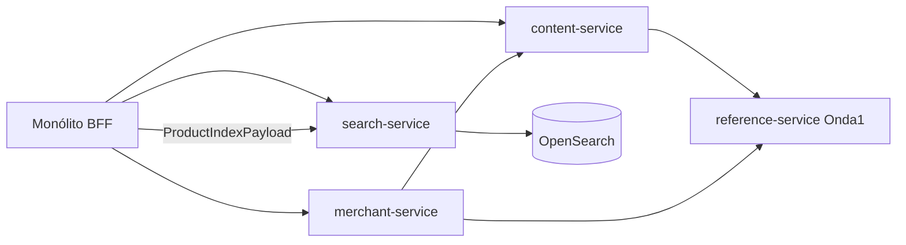

# Onda 2 — Content, Search, Merchant Specification

**Feature ID:** `onda-2-content-search-merchant`
**Phase:** Tasks (aprovadas — pronto para Execute)
**Complexity:** Large (3 serviços deployáveis + Strangler)
**Source:** [MIGRATION-MASTER-PLAN.md](../../../docs/decomposition/MIGRATION-MASTER-PLAN.md) § Onda 2
**Exploração:** Subagentes Content, Search e Merchant (2026-07-04)

---

## Problem Statement

Após validar o padrão Strangler na Onda 1 (Reference + Tax), a Onda 2 extrai três domínios de **risco médio-baixo** que compartilham características favoráveis: sem ciclos de serviço críticos (diferente de order↔payments), volatilidade baixa a média, e superfícies REST já definidas. Porém cada domínio traz bloqueadores distintos:

- **Content:** arquitetura split-brain — metadados JPA (`CONTENT`/`CONTENT_DESCRIPTION`) e blobs (Infinispan/local/S3/GCP) sem transação unificada; logo da loja espalhado entre `MerchantStore.storeLogo` e CMS.
- **Search:** indexação acoplada ao grafo JPA `Product` + `ProductInventoryService`/`PricingService`; eventos in-process (AOP + `IndexProductEventListener`) não sobrevivem a split de runtime.
- **Merchant:** `MerchantStore` é contexto de tenant em ~450 arquivos; `ProductTypeService` documentado como bloqueador mas **não usado** em `MerchantStoreServiceImpl` — o acoplamento real é FK de catalog e resolvers HTTP.

Sem especificação formal, a Onda 2 repete erros da Fase 3 original (extração por intuição) ou adia Search indefinidamente por dependência de `ProductSnapshot` (planejado na Onda 3). Esta spec define **o que** extrair, **o que** permanece no monólito, e **como** fasear indexação vs contratos.

---

## Goals

- [ ] `content-service`, `search-service` e `merchant-service` deployáveis como aplicações Spring Boot independentes
- [ ] Monólito consome os três serviços via HTTP Strangler nas fronteiras REST já existentes
- [ ] Zero entidades JPA nas respostas REST dos endpoints migrados (mesmo critério Onda 1)
- [ ] Content: DB + blob storage co-localizados no `content-service` (mitigação split-brain)
- [ ] Search: `search-service` dono do cluster OpenSearch, mappings e APIs de query; pipeline de indexação desacoplado de `Product` JPA
- [ ] Merchant: CRUD de loja + configuração pública **sem** `ProductTypeApi` / seed de product types
- [ ] Testes de contrato (Pact) cobrindo endpoints P1 — padrão Onda 1
- [ ] Reutilizar `shopizer-api-contracts` (Onda 1) para DTOs compartilhados novos

---

## Out of Scope

| Feature | Reason |
| --------- | ------ |
| `ProductTypeApi` / `ProductTypeService` | Catalog domain; FK `PRODUCT_TYPE.MERCHANT_ID` permanece; mitigação plano mestre |
| `productFileManager` / imagens de produto (`/static/products/**`) | Pipeline CMS separado em `shopizer-core-cms.xml`; escopo catalog — ver OQ-02 |
| `ProductSnapshot` completo (Onda 3) | Contratos sistêmicos `OrderSnapshot`, `CustomerSnapshot`, `LanguageCode` |
| `MerchantStoreArgumentResolver` refatoração sistêmica | ~450 referências; resolver permanece no monólito chamando `merchant-service` |
| `InitializationDatabaseImpl` / bootstrap greenfield | AD-004 herdado — serviços assumem DB populado |
| `ConfigurationsApi` payment/shipping stubs | Retornam `null`; não implementados |
| `MarketPlaceApi` signup stubs | Incompletos; defer |
| `TaxService`, checkout, order, catalog CRUD | Ondas 4–6 |
| Database split por serviço | AD-003 herdado — schema compartilhado na extração runtime |
| Saga/outbox para dual-write content metadata+blob | Complexidade Onda 6+; Onda 2 usa co-localização + APIs idempotentes |
| Correção de gaps de reindex (reviews, inventory-only) | Documentado como P2/P3 — ver SRCH edge cases |
| Quick wins Fase 1 (Mapper/Populator) | Paralelo, não bloqueante |

---

## User Stories

### P1: Content Service — páginas, boxes e gestão de arquivos ⭐ MVP

**User Story**: Como administrador de loja, quero gerenciar páginas CMS, boxes e arquivos estáticos (imagens, CSS) via APIs existentes, para personalizar a loja sem depender do runtime monolítico para metadados e blobs.

**Why P1**: Content tem score 2/10 de isolamento de serviço (zero deps cross-domain em `ContentServiceImpl` para JPA); é candidato natural pós-Onda 1. Split-brain exige que **ambos** JPA e CMS backends migrem juntos.

**Acceptance Criteria**:

1. WHEN `GET /api/v1/content/pages` ou `/private/content/pages` THEN `content-service` SHALL retornar lista paginada de `ReadableContentPage` — SHALL NOT expor entidade `Content`
2. WHEN `GET /api/v1/content/boxes` ou variantes por `{code}` THEN `content-service` SHALL retornar `ReadableContentBox` localizado por `lang`
3. WHEN `POST /api/v1/private/content/page` ou `/box` com `PersistableContentPage`/`PersistableContentBox` THEN `content-service` SHALL persistir `Content` + `ContentDescription` com validação de código único por loja
4. WHEN `DELETE /api/v1/private/content/page/{id}` ou `/box/{id}` THEN `content-service` SHALL remover apenas metadados JPA — comportamento atual preservado (blobs órfãos possíveis); documentar em Design
5. WHEN `POST /api/v1/private/file` ou `/private/files` THEN `content-service` SHALL gravar blob via backend configurado (`config.cms.method`: infinispan/httpd/aws/gcp) keyed por `merchantStoreCode`
6. WHEN `GET /api/v1/private/content/list` ou `/folder` THEN `content-service` SHALL listar arquivos/pastas do file-manager (ng-file-man)
7. WHEN `POST /api/v1/private/content/images/add`, `rename`, `remove` THEN `content-service` SHALL mutar blobs com `FileContentType` apropriado
8. WHEN `LanguageService` é necessário para resolver `lang` THEN `content-service` SHALL chamar `reference-service` HTTP (padrão Onda 1) — SHALL NOT injetar `LanguageService` in-process
9. WHEN tenant é identificado THEN `content-service` SHALL aceitar `store` code via header/query equivalente ao monólito — sem entidade `MerchantStore` na API pública

**Independent Test**: Deploy `content-service` + `reference-service`; CRUD página com 2 idiomas; upload imagem `IMAGE`; listar via `/content/images`; verificar blob no backend configurado e row em `CONTENT`.

**Componentes fonte:**

| Papel | Caminho |
|-------|---------|
| Entidades | `sm-core-model/.../content/` |
| Service | `sm-core/.../services/content/ContentServiceImpl.java` |
| CMS wiring | `sm-core/src/main/resources/spring/shopizer-core-cms.xml` |
| Blob managers | `sm-core/.../modules/cms/content/{infinispan,local,aws,gcp}/` |
| APIs | `sm-shop/.../api/v1/content/ContentApi.java`, `ContentAdministrationApi.java` |
| Facade | `sm-shop/.../facade/content/ContentFacadeImpl.java` |
| DTOs | `sm-shop-model/.../model/content/` |

**Explicitamente FORA desta story:** `productFileManager`, `FilesController` downloads `PRODUCT_DIGITAL`, endpoints deprecated que retornam `null` (manter comportamento ou remover em Design — OQ-04).

---

### P1: Search Service — query, autocomplete e propriedade do índice ⭐ MVP

**User Story**: Como visitante da loja, quero buscar produtos e obter sugestões de autocomplete via `/api/v1/search`, para encontrar produtos sem depender do runtime monolítico para consultas OpenSearch.

**Why P1**: Search é domínio pequeno (~14 arquivos) com integração OpenSearch já externalizada (`shopizer-search-opensearch-spring-boot-starter`). Extração do **read path** valida padrão Onda 1 com menor superfície que catalog.

**Acceptance Criteria**:

1. WHEN `POST /api/v1/search` com `SearchProductRequest` e headers `store`/`lang` THEN `search-service` SHALL retornar `List<SearchItem>` idêntico em schema ao monólito atual
2. WHEN `POST /api/v1/search/autocomplete` THEN `search-service` SHALL retornar `ValueList` com sugestões para query parcial
3. WHEN `search-service` inicia THEN SHALL carregar `MAPPINGS.json`, `SETTINGS_DEFAULT.json`, `SETTINGS_en.json` e configurar índices por idioma via `SearchModule`
4. WHEN `INDEX_PRODUCTS=false` ou `search.noindex=true` THEN `search-service` SHALL no-op em indexação — feature flags preservados
5. WHEN `POST /api/v1/private/system/search/index` com JWT admin THEN `search-service` SHALL aceitar trigger de reindex — implementação MAY delegar callback ao monólito na fase inicial (OQ-01)
6. WHEN OpenSearch indisponível THEN `search-service` SHALL retornar HTTP 503 — SHALL NOT fallback silencioso para DB catalog
7. WHEN `search-service` expõe API interna de indexação `POST /internal/v1/index` com payload `ProductIndexPayload` (DTO) THEN SHALL indexar sem importar `sm-core-model` — contrato mínimo definido nesta onda

**Independent Test**: Índice populado manualmente ou via payload de teste; `POST /search` retorna resultados; autocomplete retorna valores; health reporta OpenSearch UP.

**Componentes fonte:**

| Papel | Caminho |
|-------|---------|
| Service | `sm-core/.../services/search/SearchServiceImpl.java` |
| Listener | `sm-core/.../events/products/listeners/IndexProductEventListener.java` |
| AOP | `sm-core/.../events/products/PublishProductAspect.java` |
| Config | `sm-core/.../configuration/ApplicationSearchConfiguration.java` |
| Mappings | `sm-core/src/main/resources/search/*.json` |
| APIs | `sm-shop/.../api/v1/search/SearchApi.java`, `SearchToolsApi.java` |
| Facade | `sm-shop/.../search/facade/SearchFacadeImpl.java` |

**Nota de faseamento:** Indexação via eventos catalog (`IndexProductEventListener`) **migra para monólito como producer HTTP** na Onda 2, enviando `ProductIndexPayload` ao `search-service`. Snapshot completo (`ProductSnapshot`) evolui na Onda 3 sem bloquear query extraction.

---

### P1: Merchant Service — lojas, configuração e hierarquia retailer ⭐ MVP

**User Story**: Como superadmin ou admin de retailer, quero criar e gerenciar lojas, idiomas suportados e configuração pública da loja, para operar multi-tenant sem runtime monolítico no domínio merchant.

**Why P1**: `MerchantStoreServiceImpl` não usa `ProductTypeService` (injeção morta). APIs REST em `MerchantStoreApi` + `PublicConfigsApi` são coesas. Score 5/10 — mitigação "sem product types" é viável.

**Acceptance Criteria**:

1. WHEN `GET /api/v1/store/{code}` THEN `merchant-service` SHALL retornar `ReadableMerchantStore` (resumo público)
2. WHEN `GET /api/v1/private/store/{code}` com JWT autorizado THEN SHALL retornar detalhes completos
3. WHEN `POST /api/v1/private/store` com `PersistableMerchantStore` THEN `merchant-service` SHALL criar loja resolvendo country/zone/language/currency via `reference-service` HTTP
4. WHEN `PUT /api/v1/private/store/{code}` ou `DELETE` THEN SHALL mutar somente com autorização de loja/grupo equivalente ao monólito
5. WHEN `GET /api/v1/private/stores` ou `/merchant/{code}/stores` ou `/children` THEN SHALL retornar listas paginadas com critérios retailer
6. WHEN `GET /api/v1/store/languages?store=` THEN SHALL retornar idiomas suportados como DTOs — SHALL NOT retornar entidade `Language`
7. WHEN `GET /api/v1/config?store=&lang=` THEN `merchant-service` SHALL retornar `Configs` (flags públicas + social) via `MerchantConfigurationService`
8. WHEN `POST/DELETE /api/v1/private/store/{code}/marketing/logo` THEN `merchant-service` SHALL orquestrar upload/remoção via `content-service` HTTP e persistir `storeLogo` filename em `MerchantStore`
9. WHEN `GET /api/v1/store/unique?code=` THEN SHALL retornar `EntityExists` — semântica preservada
10. WHEN loja `DEFAULT` é alvo de DELETE THEN SHALL retornar HTTP 403/400 — proteção preservada

**Independent Test**: Criar loja `TEST`; atualizar endereço; ler `/config`; upload logo; verificar chamada a content-service; listar children de retailer.

**Componentes fonte:**

| Papel | Caminho |
|-------|---------|
| Entidades | `sm-core-model/.../merchant/`, `.../system/MerchantConfiguration.java` |
| Services | `sm-core/.../services/merchant/`, `.../system/MerchantConfigurationServiceImpl.java` |
| APIs | `sm-shop/.../api/v1/store/MerchantStoreApi.java`, `PublicConfigsApi.java` |
| Facade | `sm-shop/.../store/facade/StoreFacadeImpl.java` |
| DTOs | `sm-shop-model/.../model/store/` |
| Resolver | `sm-shop/.../MerchantStoreArgumentResolver.java` (permanece monólito) |

---

### P1: Strangler Fig — monólito como BFF para Onda 2 ⭐ MVP

**User Story**: Como equipe de plataforma, quero adapters HTTP configuráveis para Content, Search e Merchant, para validar extração sem reescrever de uma vez resolvers e ~450 referências a `MerchantStore`.

**Why P1**: Mesmo padrão comprovado Onda 1; escopo fechado nas fronteiras REST-shaped.

**Acceptance Criteria**:

1. WHEN `shopizer.content.service.url` configurado THEN `ContentFacadeImpl` SHALL delegar via HTTP ao `content-service`
2. WHEN `shopizer.search.service.url` configurado THEN `SearchFacadeImpl` SHALL delegar query/autocomplete/reindex ao `search-service`
3. WHEN `shopizer.merchant.service.url` configurado THEN `StoreFacadeImpl` e `MerchantConfigurationFacadeImpl` SHALL delegar ao `merchant-service`
4. WHEN URLs NÃO configuradas (profile `monolith`) THEN SHALL usar implementação in-process legada
5. WHEN `IndexProductEventListener` detecta evento de produto E search URL configurado THEN monólito SHALL montar `ProductIndexPayload` e POST ao `search-service` — SHALL NOT chamar `SearchServiceImpl` in-process
6. WHEN serviço remoto indisponível THEN HTTP 503 com correlation id — sem fallback silencioso
7. WHEN produção Onda 2 ativa THEN profile padrão SHALL usar HTTP adapters

**Fronteiras Strangler Onda 2 (escopo fechado):**

| Adapter substitui | Permanece in-process |
|-------------------|---------------------|
| `ContentFacadeImpl` → HTTP | `ProductOptionFacadeImpl` blob calls → migrar para content HTTP client direto (Design) |
| `SearchFacadeImpl` → HTTP | `PublishProductAspect` (permanece; vira producer) |
| `StoreFacadeImpl` / `MerchantConfigurationFacadeImpl` → HTTP | `MerchantStoreArgumentResolver` (chama merchant-service) |
| `IndexProductEventListener` → HTTP producer | `CategoryService` facetas comentadas em SearchFacade |

---

### P2: Servir arquivos estáticos e integração cross-service

**User Story**: Como visitante, quero acessar logos e imagens estáticas via URLs existentes, para não quebrar storefronts após extração de content.

**Why P2**: `ImagesController` e `FilesController` são MVC legado fora de `/api/v1`; decisão de roteamento é gray area (OQ-03).

**Acceptance Criteria**:

1. WHEN `GET /static/files/{storeCode}/{imageType}/{imageName}.{ext}` THEN sistema SHALL servir blob do `content-service` (gateway ou controller migrado)
2. WHEN logo é solicitado THEN URL SHALL resolver via `config.cms.contentUrl` / `LocationImageConfig` semantics preservadas
3. WHEN `ProductOptionFacadeImpl` chama `addOptionImage` THEN monólito SHALL usar `content-service` HTTP client (tipo `PROPERTY`)
4. WHEN `ProductVariantGroupFacadeImpl` chama `addContentFile` THEN monólito SHALL usar content HTTP (tipo `VARIANT`)

**Independent Test**: Upload logo; acessar URL estática; imagem de option value renderiza no storefront.

---

### P2: Testes de contrato (Pact) — Onda 2

**User Story**: Como desenvolvedor, quero pact tests para content, search e merchant, para detectar breaking changes antes de deploy.

**Acceptance Criteria**:

1. WHEN DTO de qualquer serviço Onda 2 muda breaking THEN CI SHALL falhar consumer pact
2. WHEN gate Full executa THEN SHALL incluir pact para todos endpoints P1 content, search, merchant
3. WHEN `ProductIndexPayload` evolui THEN SHALL versionar campo `schemaVersion` no payload

---

### P2: `ProductIndexPayload` — contrato mínimo de indexação

**User Story**: Como arquiteto, quero um DTO de indexação desacoplado de JPA, para permitir `search-service` sem dependência de `sm-core-model` e preparar `ProductSnapshot` da Onda 3.

**Why P2**: Ponte entre Onda 2 (search extraction) e Onda 3 (contratos sistêmicos).

**Acceptance Criteria**:

1. WHEN `ProductIndexPayload` é serializado THEN SHALL conter campos equivalentes a `IndexItem` atual: `id`, `store`, `language`, `name`, `description`, `link`, `image`, `reviews`, `brand`, `category`, `attributes`, `variants`, `inventory`
2. WHEN monólito monta payload THEN builder SHALL viver em `sm-shop` ou `sm-core` (catalog side) — `search-service` só deserializa
3. WHEN payload inválido THEN `search-service` SHALL retornar HTTP 400 com detalhes de validação
4. WHEN `schemaVersion` não suportado THEN SHALL retornar HTTP 422

**Independent Test**: POST payload fixture; documento aparece no índice; query retorna item.

---

### P3: Observabilidade — Onda 2

**User Story**: Como operador, quero health checks nos três serviços com dependências externas visíveis.

**Acceptance Criteria**:

1. WHEN `GET /actuator/health` THEN cada serviço SHALL reportar: DB, OpenSearch (search), blob backend (content), HTTP deps (reference, content cross-call)
2. WHEN logs processam requisição THEN SHALL propagar `X-Correlation-Id`
3. WHEN content blob backend é S3/GCP THEN health MAY reportar bucket reachability (best-effort)

---

## Edge Cases

### Content

- WHEN página deletada com imagens referenciadas no HTML THEN blobs permanecem (comportamento atual) — SHALL NOT introduzir cascade delete sem OQ explícita
- WHEN `renameFile` falha mid-operation (delete ok, add falha) THEN SHALL retornar erro; estado pode ser inconsistente — documentar idempotência em Design
- WHEN `config.cms.method=gcp` THEN beans `@Component` GCP SHALL ser configurados no `content-service` (hoje mix XML + scan)
- WHEN `ContentApi.addFolder` (stub vazio) é chamado THEN SHALL retornar comportamento definido em OQ-04 (implementar ou 501)

### Search

- WHEN produto atualizado via `ProductService.update()` (não `saveProduct`) THEN indexação MAY ficar stale — documentar; fix opcional P3
- WHEN apenas inventory/preço muda THEN reindex MAY não disparar — aceitar stale até evento catalog explícito ou P3
- WHEN `DeleteProductImageEvent` THEN listener atual é no-op — SHALL documentar; fix em P3 se OQ-05 aprovar
- WHEN bulk reindex executa THEN MAY sobrecarregar OpenSearch — rate limit configurável em Design
- WHEN `SearchItem` vem de `shopizer-commons` THEN contrato pact usa schema commons até migração para `shopizer-api-contracts`

### Merchant

- WHEN `storeLogo` atualizado THEN `MerchantStore.storeLogo` e blob MUST estar consistentes — falha em content-service SHALL rollback DB ou compensar (Design)
- WHEN retailer hierarchy com `PARENT_ID` THEN delete parent SHALL respeitar cascade rules JPA atuais
- WHEN `PersistableMerchantStorePopulator` resolvia refs in-process THEN `merchant-service` usa reference HTTP — timeout propagado
- WHEN `MerchantStoreArgumentResolver` chama merchant-service THEN cache local MAY ser adicionado (TTL) para evitar N+1

### Cross-cutting

- WHEN `reference-service` down e content/merchant precisam de language/country THEN SHALL 503 — sem fallback entidade local
- WHEN schema DB compartilhado (AD-003) THEN migrations Flyway/Liquibase (se existirem) SHALL ser coordenadas — documentar em Design

---

## Requirement Traceability

| Requirement ID | Story | Descrição resumida | Phase | Status |
| -------------- | ----- | ------------------ | ----- | ------ |
| CNT-01 | P1: Content | `content-service` deployável Spring Boot | Design | In Design ✅ |
| CNT-02 | P1: Content | CRUD pages/boxes espelha paths monólito | Design | In Design ✅ |
| CNT-03 | P1: Content | File upload/list/rename/remove | Design | In Design ✅ |
| CNT-04 | P1: Content | CMS backends (infinispan/local/aws/gcp) migrados | Design | In Design ✅ |
| CNT-05 | P1: Content | JPA `Content`/`ContentDescription` no serviço | Design | In Design ✅ |
| CNT-06 | P1: Content | Zero entidade JPA em responses | Design | In Design ✅ |
| CNT-07 | P1: Content | `reference-service` HTTP para Language | Design | In Design ✅ |
| CNT-08 | P2: Static | Rotas `/static/files/**` resolvidas | Design | In Design ✅ |
| CNT-09 | P1: Strangler | HTTP adapter `ContentFacadeImpl` | Design | In Design ✅ |
| SRCH-01 | P1: Search | `search-service` deployável | Design | In Design ✅ |
| SRCH-02 | P1: Search | `POST /search` + `/autocomplete` preservados | Design | In Design ✅ |
| SRCH-03 | P1: Search | OpenSearch mappings/settings no serviço | Design | In Design ✅ |
| SRCH-04 | P1: Search | `POST /internal/v1/index` com `ProductIndexPayload` | Design | In Design ✅ |
| SRCH-05 | P1: Strangler | `SearchFacadeImpl` HTTP adapter | Design | In Design ✅ |
| SRCH-06 | P1: Strangler | `IndexProductEventListener` → HTTP producer | Design | In Design ✅ |
| SRCH-07 | P2: Payload | `ProductIndexPayload` em `shopizer-api-contracts` | Design | In Design ✅ |
| SRCH-08 | P1: Search | Admin reindex API preservada | Design | In Design ✅ |
| SRCH-09 | Out of Scope | `ProductSnapshot` completo → Onda 3 | — | Confirmed |
| MCH-01 | P1: Merchant | `merchant-service` deployável | Design | In Design ✅ |
| MCH-02 | P1: Merchant | Store CRUD + hierarchy APIs | Design | In Design ✅ |
| MCH-03 | P1: Merchant | `GET /config` público | Design | In Design ✅ |
| MCH-04 | P1: Merchant | Logo via `content-service` HTTP | Design | In Design ✅ |
| MCH-05 | P1: Merchant | `reference-service` HTTP para refs | Design | In Design ✅ |
| MCH-06 | P1: Merchant | Zero `ProductType` APIs | — | Confirmed |
| MCH-07 | P1: Merchant | `MerchantStoreArgumentResolver` no monólito | Design | In Design ✅ |
| MCH-08 | P1: Strangler | HTTP adapters Store + Config facades | Design | In Design ✅ |
| STR-01 | P1: Strangler | Feature flag `monolith` vs HTTP (Onda 2 URLs) | Design | In Design ✅ |
| STR-02 | P2: Pact | Contract tests 3 serviços | Tasks | Mapped → T49–T50 |
| STR-03 | AD-003 | DB compartilhado herdado | Design | In Design ✅ |
| STR-04 | P1 | Paths REST sem breaking change | Design | In Design ✅ |
| STR-05 | P3 | Actuator health + correlation id | Tasks | Mapped → T47–T48 |
| STR-06 | P1 | Cross-service: merchant→content, content→reference | Design | In Design ✅ |

**Coverage:** 28 total, 28 mapped to tasks (T1–T54) ✅

---

## Open Questions — Resolvidas ✅

Decisões em [context.md](./context.md) e [design.md](./design.md).

| ID | Decisão |
|----|---------|
| OQ-01 | HTTP producer + `ProductIndexPayload` (AD-009 confirmado) |
| OQ-02 | Só `contentFileManager` — product images Onda 4 |
| OQ-03 | Monólito thin proxy `StaticContentProxy` |
| OQ-04 | Preservar stubs byte-a-byte |
| OQ-05 | Documentar GAP-SRCH-01..10 |
| OQ-06 | Pact com `SearchItem` commons; migração Onda 3 |

---

## Success Criteria

- [ ] Três serviços passam health check e respondem a todos os endpoints P1 em integração
- [ ] Monólito Strangler produz respostas equivalentes ao in-process (pact verdes)
- [ ] Nenhum endpoint migrado retorna entidade JPA no JSON
- [ ] Content: upload + leitura de blob funciona em pelo menos 2 backends CMS (local + um cloud)
- [ ] Search: query funciona com índice populado via `ProductIndexPayload`
- [ ] Merchant: CRUD loja + logo + `/config` sem regressão em `MerchantStoreArgumentResolver`
- [ ] Padrão documentado em STATE.md replicável para Onda 3
- [ ] p95 endpoints públicos ≤ 2× baseline monólito

---

## Appendix A — Scores e bloqueadores (plano mestre)

| Serviço | Dificuldade | Bloqueador documentado | Evidência código |
|---------|-------------|------------------------|------------------|
| content-service | 2–6/10 | Split-brain JPA+blob | `ContentServiceImpl.delete()` sem blob cleanup |
| search-service | 5/10 | Indexa `Product` inteiro | `SearchServiceImpl` 15+ imports catalog |
| merchant-service | 5/10 | `ProductTypeService` | Injeção morta em `MerchantStoreServiceImpl` |

---

## Appendix B — Dependências entre serviços Onda 2

---

## Appendix C — Endpoints migrados (inventário)

### Content (~25 endpoints ativos)

`ContentApi`, `ContentAdministrationApi` — ver relatório subagente Content.

### Search (3 endpoints)

| Method | Path |
|--------|------|
| POST | `/api/v1/search` |
| POST | `/api/v1/search/autocomplete` |
| POST | `/api/v1/private/system/search/index` |

### Merchant (~18 endpoints ativos)

`MerchantStoreApi`, `PublicConfigsApi`, `CacheApi` — ver relatório subagente Merchant.

---

**Próxima fase:** Execute — iniciar T1 (após Onda 1 T32). Ver [tasks.md](./tasks.md).
