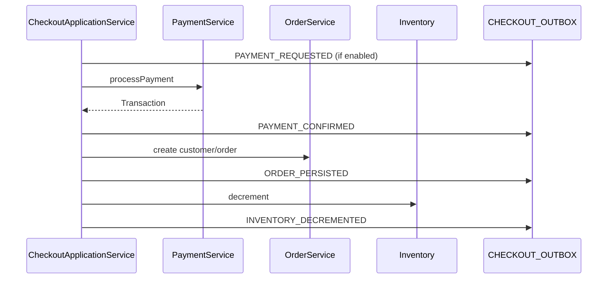

# Wave 3 — Contracts DTO + Checkout Application Service Design

**Spec:** `.specs/features/onda-3-contracts-dto/spec.md`  
**Context:** `.specs/features/onda-3-contracts-dto/context.md`  
**Status:** Approved for Tasks — Execute blocked until tasks.md approved  
**Compozy:** `.compozy/tasks/onda-3-contracts-dto/`

---

## Architecture Overview

Wave 3 modifies **existing Maven modules only** — no new deployables. Deployment topology from Waves 1–2 is unchanged.


### Principles

1. **No new services** — AD-W3-001
2. **Contracts = DTOs only** — L-002
3. **Frozen REST paths** — checkout/reference unchanged
4. **Feature flags** — `checkout.outbox.enabled` default false
5. **Phased facade migration** — 6 facades Wave 3; plan for rest
6. **Behavioral parity** — integration tests gate refactors
7. **Shared DB** — AD-003; outbox in SALESMANAGER

---

## Design Decisions (OQ-01 – OQ-06)

| ID | Decision | Choice | Rationale |
|----|----------|--------|-----------|
| OQ-01 | ProductIndexPayload | **Snapshot canonical + mapper** | AD-002; avoids Pact break |
| OQ-02 | Facade scope | **P1 six facades** | B-001 partial; manageable diff |
| OQ-03 | Broker | **None** | YAGNI until Wave 6 consumer |
| OQ-04 | Plugin compat | **V2 parallel + bridge** | AD-004 |
| OQ-05 | CAS package | **sm-core/checkout** | Domain orchestration |
| OQ-06 | SearchItem | **api-contracts** | Close Wave 2 debt |

---

## Module Changes

| Module | Changes |
| ------ | ------- |
| `shopizer-api-contracts` | Snapshots, tenant types, SearchItem |
| `sm-core-modules` | Integration DTOs, V2 interfaces |
| `sm-core` | Builders, CAS, outbox, payment/shipping routing |
| `sm-shop-model` | P1 facade interface signatures |
| `sm-shop` | Facade impls, bridge, ReferencesApi, ArchUnit |
| `search-service` | Import SearchItem from contracts; index v2 |
| `shopizer-commons` | Deprecated SearchItem aliases (optional) |

**No changes:** `reference-service`, `content-service`, `merchant-service`, `tax-service` runtime (except search-service contract imports).

---

## Package Layout (new)

```
shopizer-api-contracts/
  com.salesmanager.contracts.tenant/
    MerchantStoreId.java
    LanguageCode.java
  com.salesmanager.contracts.catalog/
    ProductSnapshot.java
    ProductSnapshotVariant.java
    ...
  com.salesmanager.contracts.order/
    OrderSnapshot.java
    OrderLineSnapshot.java
  com.salesmanager.contracts.customer/
    CustomerSnapshot.java
    AddressSnapshot.java
  com.salesmanager.contracts.search/
    SearchItem.java          # migrated
    SearchProductRequest.java

sm-core-modules/
  com.salesmanager.core.modules.integration.common.dto/
    IntegrationStoreContext.java
  com.salesmanager.core.modules.integration.payment/
    model/PaymentModuleV2.java
    dto/PaymentRequestContext.java
  com.salesmanager.core.modules.integration.shipping/
    model/ShippingQuoteModuleV2.java
    dto/ShippingQuoteRequestContext.java

sm-core/
  com.salesmanager.core.business.services.checkout/
    CheckoutApplicationService.java
    CheckoutApplicationServiceImpl.java
    CheckoutCommand.java
    outbox/CheckoutOutboxEvent.java
    outbox/CheckoutOutboxRepository.java
  com.salesmanager.core.business.catalog/
    ProductSnapshotBuilder.java
  com.salesmanager.core.business.order/
    OrderSnapshotBuilder.java

sm-shop/
  com.salesmanager.shop.tenant/
    TenantEntityBridge.java
    TenantEntityBridgeImpl.java
  com.salesmanager.shop.search/
    ProductIndexPayloadMapper.java
```

---

## CheckoutApplicationService

### Responsibility boundary

| Layer | Owns |
| ----- | ---- |
| `OrderApi` / `OrderPaymentApi` | HTTP, binding, status codes |
| `OrderFacadeImpl` | DTO↔entity mapping, validation assembly |
| `CheckoutApplicationService` | Place-order orchestration, stage coordination |
| `OrderServiceImpl` | Persistence primitives (`create`, `processOrder` internals) |
| `PaymentServiceImpl` | Payment module invocation |

### CheckoutCommand (conceptual)

- `MerchantStoreId storeId`
- `LanguageCode language`
- `CustomerSnapshot customer` (or entity during transition — prefer snapshot)
- `List<ShoppingCartItem> items` (entities until Wave 6)
- `Payment payment`
- `OrderTotalSummary summary`
- Optional `Transaction` for pre-auth flows

### Extraction strategy

1. Copy existing `OrderFacadeImpl` place-order block into `CheckoutApplicationServiceImpl` verbatim.
2. Wire facade to delegate.
3. Run parity tests.
4. Introduce outbox hooks per stage (task T44–T47).

---

## processOrder Staging



When `checkout.outbox.enabled=false`, stages run without outbox writes (legacy path).

---

## Integration Module V2

### Registry behavior

```
resolvePaymentModule(code):
  if bean implements PaymentModuleV2 → use DTO path
  else if bean implements PaymentModule → LegacyPaymentModuleBridge.asV2(bean)
```

### Entity → DTO mapping (centralized)

| Entity | DTO field |
| ------ | --------- |
| `MerchantStore` | `IntegrationStoreContext.storeCode` |
| `ShoppingCartItem` | `PaymentLineItemDto` (sku, qty, price) |
| `Order` | `PaymentCaptureContext.orderId`, amounts |
| `Delivery` | `ShippingAddressDto` |

---

## Facade Migration (Phase 1)

| Facade | Methods affected | Wave |
| ------ | ---------------- | ---- |
| OrderFacade | All store/lang params | 3 |
| ShoppingCartFacade | All | 3 |
| SearchFacade | search, autocomplete | 3 |
| ShippingFacade | quote, config | 3 |
| CategoryFacade | Read hierarchy | 3 |
| ProductCommonFacade | getProduct*, list | 3 |
| CustomerFacade | — | 4 |
| ProductFacade* | — | 4 |
| ContentFacade | — | Done Wave 2 HTTP |
| Remaining ~60 | — | 4–6 per FACADE-MIGRATION-PLAN |

### Controller pattern

```java
// OrderApi — resolver still gives MerchantStore entity
public void placeOrder(@Store MerchantStore store, @Language Language lang, ...) {
  orderFacade.processOrder(
      MerchantStoreId.of(store.getCode()),
      LanguageCode.of(lang.getCode()),
      ...);
}
```

---

## ProductSnapshot → Index Pipeline

```
IndexProductEventListener (monolith)
  → ProductSnapshotBuilder.build(product, storeId, lang)
  → ProductIndexPayloadMapper.toPayload(snapshot)  // schemaVersion=2
  → SearchIndexClient.index(payload)
```

search-service normalizes v1/v2 to internal OpenSearch document.

---

## ReferencesApi (B-002)

| Endpoint | Response type |
| -------- | ------------- |
| `GET /api/v1/languages` | `List<ReadableLanguage>` |
| `GET /api/v1/currency` | `List<ReadableCurrency>` |

Reuse `ReadableLanguagePopulator` / reference strangler mappers from Wave 1.

---

## Testing & Fitness

| Test | Module | Purpose |
| ---- | ------ | ------- |
| `ContractsMustNotDependOnCoreModel` | shopizer-api-contracts | CTR-01 |
| `FacadesNoNewEntityParams` | sm-shop-model | TNT-05 |
| `CheckoutApplicationServicePlaceOrderTest` | sm-core | CHK-04 |
| `CheckoutOutboxIntegrationTest` | sm-core | SAG-03 |
| Wave2 Pact suite | sm-shop, search-service | GAT-02 |
| `./mvnw clean install` | reactor | GAT-01 |

---

## Build Order

See TechSpec and `tasks.md` — 48 TLC tasks in 4 phases:

1. **T1–T6:** Contracts foundation
2. **T7–T38:** Parallel tracks (snapshots, integration, facades)
3. **T39–T47:** Checkout + outbox convergence
4. **T48:** Reactor gate

Compozy mapping: 10 tasks (`task_01`..`task_10`).

---

## Risks

| Risk | Mitigation |
| ---- | ---------- |
| OrderFacadeImpl regression | Copy-then-refactor; parity tests |
| Large compile blast radius | Phased facades; continuous compile |
| Pact drift on SearchItem | Single PR slice for contracts + search-service |
| Outbox schema in prod | Flag off default until Wave 6 |

---

## Handoff to Wave 4

When Wave 3 gate is green:

- `ProductSnapshot` available for catalog-read APIs
- `CustomerSnapshot` for customer-service boundary
- P1 facades demonstrate tenant ID pattern
- B-002 closed; B-001 partially closed with migration plan
- Checkout stages observable via outbox

Wave 4 Specify: `onda-4-catalog-customer` (not in this workflow).
