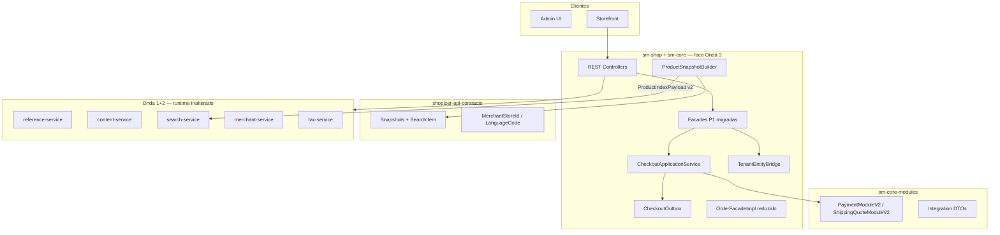

# Onda 3 — Contracts DTO + Checkout Application Service Design

**Spec:** `.specs/features/onda-3-contracts-dto/spec.md`  
**Context:** `.specs/features/onda-3-contracts-dto/context.md`  
**Status:** Aprovado para Tasks — Execute bloqueado até tasks.md aprovado  
**Compozy:** `.compozy/tasks/onda-3-contracts-dto/`

---

## Visão geral da arquitetura

A Onda 3 modifica **apenas módulos Maven existentes** — sem novos deployables. Topologia de implantação das Ondas 1–2 inalterada.



### Princípios

1. **Sem novos serviços** — AD-W3-001
2. **Contracts = apenas DTOs** — L-002
3. **Caminhos REST congelados** — checkout/reference inalterados
4. **Feature flags** — `checkout.outbox.enabled` default false
5. **Migração facade faseada** — 6 facades Onda 3; plano para o restante
6. **Paridade comportamental** — testes integração gate refactors
7. **DB compartilhado** — AD-003; outbox em SALESMANAGER

---

## Decisões de design (OQ-01 – OQ-06)

| ID | Decisão | Escolha | Justificativa |
|----|---------|---------|-----------|
| OQ-01 | ProductIndexPayload | **Snapshot canônico + mapper** | AD-002; evita quebra Pact |
| OQ-02 | Escopo facade | **Seis facades P1** | B-001 parcial; diff gerenciável |
| OQ-03 | Broker | **Nenhum** | YAGNI até consumidor Onda 6 |
| OQ-04 | Compat plugin | **V2 paralelo + bridge** | AD-004 |
| OQ-05 | Pacote CAS | **sm-core/checkout** | Orquestração de domínio |
| OQ-06 | SearchItem | **api-contracts** | Fecha débito Onda 2 |

---

## Mudanças por módulo

| Módulo | Mudanças |
| ------ | -------- |
| `shopizer-api-contracts` | Snapshots, tipos tenant, SearchItem |
| `sm-core-modules` | DTOs integração, interfaces V2 |
| `sm-core` | Builders, CAS, outbox, roteamento payment/shipping |
| `sm-shop-model` | Assinaturas interface facade P1 |
| `sm-shop` | Impls facade, bridge, ReferencesApi, ArchUnit |
| `search-service` | Import SearchItem de contracts; índice v2 |
| `shopizer-commons` | Aliases SearchItem deprecados (opcional) |

**Sem mudanças:** runtime `reference-service`, `content-service`, `merchant-service`, `tax-service` (exceto imports contrato search-service).

---

## Layout de packages (novos)

```
shopizer-api-contracts/
  com.salesmanager.contracts.tenant/
    MerchantStoreId.java
    LanguageCode.java
  com.salesmanager.contracts.catalog/
    ProductSnapshot.java
    ProductSnapshotVariant.java
    ...
  com.salesmanager.contracts.order/
    OrderSnapshot.java
    OrderLineSnapshot.java
  com.salesmanager.contracts.customer/
    CustomerSnapshot.java
    AddressSnapshot.java
  com.salesmanager.contracts.search/
    SearchItem.java          # migrado
    SearchProductRequest.java

sm-core-modules/
  com.salesmanager.core.modules.integration.common.dto/
    IntegrationStoreContext.java
  com.salesmanager.core.modules.integration.payment/
    model/PaymentModuleV2.java
    dto/PaymentRequestContext.java
  com.salesmanager.core.modules.integration.shipping/
    model/ShippingQuoteModuleV2.java
    dto/ShippingQuoteRequestContext.java

sm-core/
  com.salesmanager.core.business.services.checkout/
    CheckoutApplicationService.java
    CheckoutApplicationServiceImpl.java
    CheckoutCommand.java
    outbox/CheckoutOutboxEvent.java
    outbox/CheckoutOutboxRepository.java
  com.salesmanager.core.business.catalog/
    ProductSnapshotBuilder.java
  com.salesmanager.core.business.order/
    OrderSnapshotBuilder.java

sm-shop/
  com.salesmanager.shop.tenant/
    TenantEntityBridge.java
    TenantEntityBridgeImpl.java
  com.salesmanager.shop.search/
    ProductIndexPayloadMapper.java
```

---

## CheckoutApplicationService

### Fronteira de responsabilidade

| Camada | Dono de |
| ------ | ------- |
| `OrderApi` / `OrderPaymentApi` | HTTP, binding, status codes |
| `OrderFacadeImpl` | Mapeamento DTO↔entidade, montagem validação |
| `CheckoutApplicationService` | Orquestração place-order, coordenação estágios |
| `OrderServiceImpl` | Primitivas persistência (`create`, internals `processOrder`) |
| `PaymentServiceImpl` | Invocação módulo payment |

### CheckoutCommand (conceitual)

- `MerchantStoreId storeId`
- `LanguageCode language`
- `CustomerSnapshot customer` (ou entidade durante transição — preferir snapshot)
- `List<ShoppingCartItem> items` (entidades até Onda 6)
- `Payment payment`
- `OrderTotalSummary summary`
- `Transaction` opcional para fluxos pré-auth

### Estratégia de extração

1. Copiar bloco place-order existente de `OrderFacadeImpl` em `CheckoutApplicationServiceImpl` verbatim.
2. Conectar facade para delegar.
3. Executar testes paridade.
4. Introduzir hooks outbox por estágio (tasks T44–T47).

---

## Estágios processOrder


Quando `checkout.outbox.enabled=false`, estágios rodam sem escritas outbox (caminho legacy).

---

## Módulo integração V2

### Comportamento registry

```
resolvePaymentModule(code):
  if bean implements PaymentModuleV2 → use caminho DTO
  else if bean implements PaymentModule → LegacyPaymentModuleBridge.asV2(bean)
```

### Mapeamento entidade → DTO (centralizado)

| Entidade | Campo DTO |
| -------- | ----------- |
| `MerchantStore` | `IntegrationStoreContext.storeCode` |
| `ShoppingCartItem` | `PaymentLineItemDto` (sku, qty, price) |
| `Order` | `PaymentCaptureContext.orderId`, amounts |
| `Delivery` | `ShippingAddressDto` |

---

## Migração facade (Fase 1)

| Facade | Métodos afetados | Onda |
| ------ | ---------------- | ---- |
| OrderFacade | Todos params store/lang | 3 |
| ShoppingCartFacade | Todos | 3 |
| SearchFacade | search, autocomplete | 3 |
| ShippingFacade | quote, config | 3 |
| CategoryFacade | Leitura hierarquia | 3 |
| ProductCommonFacade | getProduct*, list | 3 |
| CustomerFacade | — | 4 |
| ProductFacade* | — | 4 |
| ContentFacade | — | HTTP Onda 2 |
| ~60 restantes | — | 4–6 conforme FACADE-MIGRATION-PLAN |

### Padrão controller

```java
// OrderApi — resolver ainda fornece entidade MerchantStore
public void placeOrder(@Store MerchantStore store, @Language Language lang, ...) {
  orderFacade.processOrder(
      MerchantStoreId.of(store.getCode()),
      LanguageCode.of(lang.getCode()),
      ...);
}
```

---

## Pipeline ProductSnapshot → Índice

```
IndexProductEventListener (monólito)
  → ProductSnapshotBuilder.build(product, storeId, lang)
  → ProductIndexPayloadMapper.toPayload(snapshot)  // schemaVersion=2
  → SearchIndexClient.index(payload)
```

search-service normaliza v1/v2 para documento OpenSearch interno.

---

## ReferencesApi (B-002)

| Endpoint | Tipo resposta |
| -------- | ------------- |
| `GET /api/v1/languages` | `List<ReadableLanguage>` |
| `GET /api/v1/currency` | `List<ReadableCurrency>` |

Reutilizar `ReadableLanguagePopulator` / mappers strangler reference da Onda 1.

---

## Testes & fitness

| Teste | Módulo | Objetivo |
| ----- | ------ | -------- |
| `ContractsMustNotDependOnCoreModel` | shopizer-api-contracts | CTR-01 |
| `FacadesNoNewEntityParams` | sm-shop-model | TNT-05 |
| `CheckoutApplicationServicePlaceOrderTest` | sm-core | CHK-04 |
| `CheckoutOutboxIntegrationTest` | sm-core | SAG-03 |
| Suite Pact Onda 2 | sm-shop, search-service | GAT-02 |
| `./mvnw clean install` | reactor | GAT-01 |

---

## Ordem de construção

Ver TechSpec e `tasks.md` — 48 tasks TLC em 4 fases:

1. **T1–T6:** Base contracts
2. **T7–T38:** Tracks paralelas (snapshots, integração, facades)
3. **T39–T47:** Convergência checkout + outbox
4. **T48:** Gate reactor

Mapeamento Compozy: 10 tasks (`task_01`..`task_10`).

---

## Riscos

| Risco | Mitigação |
| ----- | --------- |
| Regressão OrderFacadeImpl | Copy-then-refactor; testes paridade |
| Raio blast compile grande | Facades faseadas; compile contínuo |
| Drift Pact SearchItem | Slice PR único contracts + search-service |
| Schema outbox em prod | Flag off default até Onda 6 |

---

## Handoff para Onda 4

Quando gate Onda 3 estiver verde:

- `ProductSnapshot` disponível para APIs catalog-read
- `CustomerSnapshot` para fronteira customer-service
- Facades P1 demonstram padrão tenant ID
- B-002 fechado; B-001 parcialmente fechado com plano migração
- Estágios checkout observáveis via outbox

Specify Onda 4: `onda-4-catalog-customer` (fora deste workflow).
