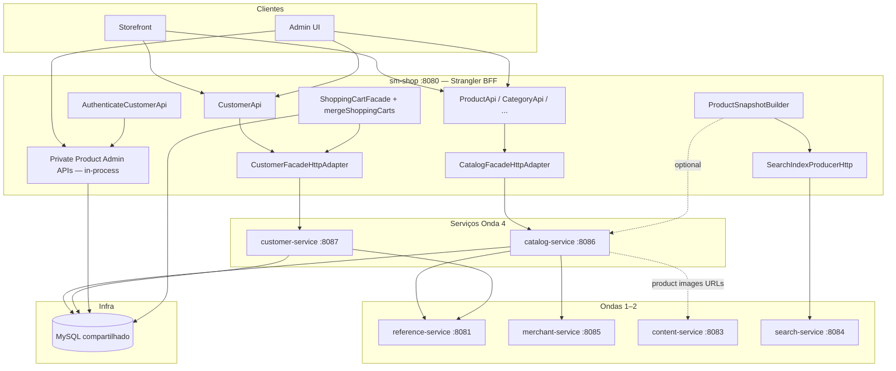
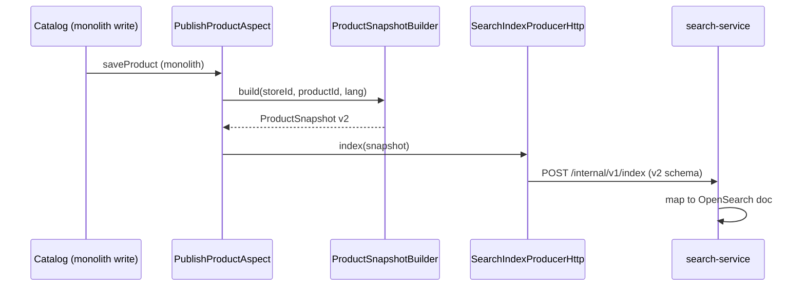
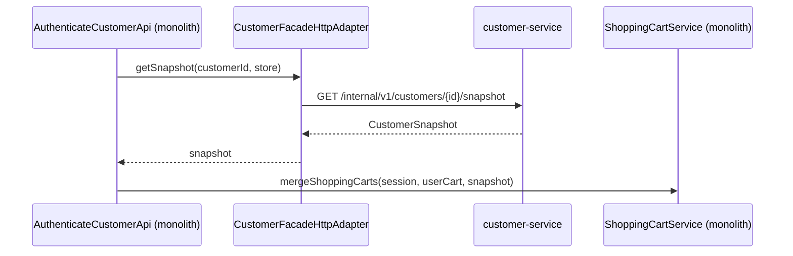

# Onda 4 — Catalog + Customer Design

**Spec:** `.specs/features/onda-4-catalog-customer/spec.md`
**Context:** `.specs/features/onda-4-catalog-customer/context.md` (OQ-01..06)
**Status:** Aprovado — Execute bloqueado até gate Onda 3 verde
**Pré-requisito:** Contratos Onda 3 (`ProductSnapshot`, `CustomerSnapshot`, `LanguageCode`, `MerchantStoreId`)

---

## Visão geral da arquitetura

A Onda 4 extrai **dois serviços Spring Boot** mantendo **schema MySQL compartilhado** (AD-003/AD-022) e o monólito como **BFF Strangler**. Catalog é **somente leitura** na fronteira do serviço; escritas admin permanecem in-process. O customer-service dona a persistência de perfil; **merge de carrinho permanece no monólito** usando `CustomerSnapshot`.



### Princípios (Ondas 1–3 + Onda 4)

1. **Paths REST congelados** — STR-04; BFF mantém controllers originais
2. **DTOs sem JPA** — `shopizer-api-contracts` estendido com snapshots + DTOs catalog/customer
3. **Mappers nos serviços** — não no JAR de contratos (L-002)
4. **RestTemplate** — AD-005; properties `wave4.*.base-url`
5. **JWT replicado** nas rotas `/private/**` do customer
6. **Catalog somente leitura na fronteira do serviço** — AD-020; extração CQRS faseada
7. **ProductSnapshot canônico** — substitui `ProductIndexPayload` para indexação (OQ-02)
8. **CustomerSnapshot para integração** — merge de carrinho sem serviço remoto de carrinho (OQ-03)
9. **LanguageCode / MerchantStoreId** — sem entidades `Language` ou `MerchantStore` nas fronteiras HTTP (Onda 3)

---

## Decisões de Design (OQ-01 – OQ-06)

| ID | Decisão | Escolha | Justificativa |
|----|---------|---------|-----------|
| **OQ-01** | Faseamento catalog | **APIs de leitura primeiro** | Acoplamento aferente 10/10; mover escritas puxa side effects de inventário/precificação/pedido |
| **OQ-02** | Contrato de produto | **`ProductSnapshot` v2** | Entregável Onda 3; unifica search + leituras cross-service |
| **OQ-03** | Merge de carrinho | **Monólito orquestra** | Evita transação distribuída carrinho+customer; snapshot carrega ids |
| **OQ-04** | Imagens de produto | **content-service** | Completa deferimento OQ-02 da Onda 2; catalog-service não dona blobs |
| **OQ-05** | Paths de facade | **Strangler V1 primeiro** | `ProductApi` + `CategoryApi` são contrato storefront; V2 delega ao mesmo adapter |
| **OQ-06** | Auth de customer | **Permanece monólito** | Autoridade de login inalterada; customer-service é domínio de perfil |

**AD-015:** Workflow único `onda-4-catalog-customer` (catalog + customer na mesma janela de calendário).

**AD-016:** `sm-catalog-core` — serviços de leitura, repositórios, mappers de snapshot; **exclui** orquestração de escrita usada apenas por APIs admin que permanecem no monólito.

**AD-017:** `sm-customer-core` — serviços customer, optin, attribute; **exclui** fluxos customer em order-created.

**AD-018:** API interna de snapshot no catalog-service para construção centralizada opcional de snapshot.

**AD-019:** `CustomerSnapshot` + `CustomerServiceClient.getSnapshot(customerId, storeCode)` para path de merge.

**AD-020:** POST/PUT/DELETE privados de produto **nunca** roteados ao catalog-service na Onda 4.

**AD-021:** Todos os novos clients usam value types `LanguageCode` / `MerchantStoreId` dos contratos.

**AD-022:** DB compartilhado continua; catalog-service e customer-service usam JPA nas tabelas existentes.

---

## Maven Module Structure

### Root `pom.xml` (após Ondas 1–3)

```xml
<modules>
    <!-- Ondas 1–3 -->
    <module>shopizer-api-contracts</module>
    <module>reference-service</module>
    <module>tax-service</module>
    <module>sm-content-core</module>
    <module>content-service</module>
    <module>search-service</module>
    <module>sm-merchant-core</module>
    <module>merchant-service</module>
    <!-- Onda 4 NEW -->
    <module>sm-catalog-core</module>
    <module>catalog-service</module>
    <module>sm-customer-core</module>
    <module>customer-service</module>
</modules>
```

### Portas e serviços

| Módulo | Port | JPA | Leitura | Escrita na fronteira |
|--------|------|-----|---------|----------------------|
| `catalog-service` | 8086 | ✅ | Product, category, manufacturer, inventory, price | **Sem escritas admin** |
| `customer-service` | 8087 | ✅ | Profile, addresses, optin, reviews (leitura) | Escritas profile/address/optin |

### `shopizer-api-contracts` — extensões Onda 4

```
com.salesmanager.contracts.catalog     → ReadableProduct*, ReadableCategory*, ProductSnapshot, ...
com.salesmanager.contracts.customer    → ReadableCustomer*, CustomerSnapshot, Address, ...
com.salesmanager.contracts.common      → LanguageCode, MerchantStoreId (Onda 3)
com.salesmanager.contracts.client      → CatalogServiceClient, CustomerServiceClient
```

**Depreciação:** `ProductIndexPayload` permanece deserializável no search-service até tarefa de migração completar; producer migra para `ProductSnapshot` com `schemaVersion=2`.

### `sm-catalog-core`

Extrai de `sm-core` (subset leitura):

- `services/catalog/product/` (métodos leitura), `category/`, `manufacturer/`, `inventory/`, `pricing/` (leitura)
- Repositórios correspondentes
- **Exclui** do thin core: fluxos admin somente escrita, `PublishProductAspect` (permanece monólito), file managers de produto digital (content)

### `sm-customer-core`

Extrai de `sm-core`:

- `services/customer/`, `optin/`, `attribute/` (não usados por paths somente order inicialmente)
- Repositórios em `repositories/customer/`
- **Exclui:** lógica invocada apenas de criação customer em `OrderServiceImpl` — permanece monólito até Onda 6

---

## API Surfaces

### catalog-service (:8086)

| Área | Paths | Auth | Notas |
| ---- | ----- | ---- | ----- |
| Products | Espelha rotas **GET** de `ProductApi` | public / JWT onde hoje | Sem POST/PUT/DELETE privados |
| Categories | Espelha GET de `CategoryApi` | public | Tree + by id |
| Manufacturers | GET de `ProductManufacturerApi` | public | |
| Inventory | GET de `ProductInventoryApi` | public/JWT | Quantidades leitura |
| Prices | GET de `ProductPriceApi` | public | |
| Groups | GET de `ProductGroupApi` | public | |
| Internal | `GET /internal/v1/products/{id}/snapshot` | network | `ProductSnapshot` |
| Internal | `GET /internal/v1/products/sku/{sku}/snapshot` | network | opcional |

**Não exposto:** controllers `ProductApiV2` no catalog-service apenas se teste de paridade exige; BFF pode manter controller V2 delegando HTTP ao mesmo serviço.

### customer-service (:8087)

| Área | Paths | Auth |
| ---- | ----- | ---- |
| Profile | `GET/PUT /api/v1/customer/**` seções de perfil | JWT customer |
| Addresses | endpoints shipping/billing address | JWT |
| Opt-in | endpoints newsletter/optin | public/JWT conforme monólito |
| Reviews | `GET` listas de review; `POST` review PODE fase 2 | JWT |
| Internal | `GET /internal/v1/customers/{id}/snapshot?store=` | network |

**Não exposto:** `AuthenticateCustomerApi`, reset de senha — monólito.

### Strangler configuration (`sm-shop`)

```properties
wave4.strangler.enabled=true
wave4.catalog-service.base-url=http://catalog-service:8086
wave4.customer-service.base-url=http://customer-service:8087
wave4.http.client.timeout-ms=5000
wave4.catalog-service.cache.ttl-seconds=30
wave4.customer-service.cache.ttl-seconds=60
# coexist
wave1.strangler.enabled=true
wave2.strangler.enabled=true
wave3.strangler.enabled=false
```

Matriz de adapters:

| Facade | HTTP com wave4 on | Permanece in-process |
|--------|-------------------|----------------------|
| `ProductFacade` / `ProductCommonFacade` (leitura) | ✅ catalog-service | métodos escrita |
| `CategoryFacade` | ✅ | — |
| `CustomerFacade` (profile/address/optin) | ✅ customer-service | auth, orquestração merge |
| `ProductFacadeV2` (leitura) | ✅ mesmo client catalog | escrita |
| Private product admin controllers | — | ✅ escritas sm-core |

---

## Integration Points

| Integração | Propósito | Auth | Falha |
| ----------- | --------- | ---- | ----- |
| catalog → reference | resolução `LanguageCode` | client Onda 1 | 503 |
| catalog → merchant | validação store / `MerchantStoreId` | client Onda 2 | 503 |
| customer → reference | country/zone/language | client Onda 1 | 503 |
| monolith → catalog | facades leitura strangler | JWT forward + correlation | 503 |
| monolith → customer | profile + snapshot para merge | JWT | 503 |
| monolith → search | producer index `ProductSnapshot` | `X-Internal-Token` | log; GAP-SRCH |
| monolith → content | upload imagem produto (P2) | internal | 503 |

### Indexação ProductSnapshot (após Onda 3)



### Desacoplamento merge de carrinho



Assinatura de `mergeShoppingCarts` evolui para aceitar `CustomerSnapshot` ou ids primitivos — **sem chamada remota dentro** de `ShoppingCartService`.

---

## ProductSnapshot schema (v2)

| Campo | Tipo | Notas |
| ----- | ---- | ----- |
| `schemaVersion` | int | `2` (substitui ProductIndexPayload `1`) |
| `id` | Long | product id |
| `storeCode` | String | store code lowercase |
| `language` | String | código ISO |
| `sku`, `name`, `description`, `link`, `image` | String | |
| `reviews`, `brand`, `category` | String | |
| `attributes` | Map | |
| `variants` | List | |
| `inventory` | List | chaves SKU, QTY, PRICE, DISCOUNT |
| `addToCart` | Boolean | |
| `manufacturerCode` | String | opcional Onda 4 |
| `visible` | Boolean | |

search-service: aceita v1 e v2 na transição; v1 depreciado após gate Onda 4.

### CustomerSnapshot schema (v1)

| Campo | Tipo | Notas |
| ----- | ---- | ----- |
| `schemaVersion` | int | `1` |
| `id` | Long | customer id |
| `storeCode` | String | |
| `email` | String | |
| `firstName`, `lastName` | String | |
| `billingAddressId`, `deliveryAddressId` | Long | opcional |
| `customerGroup` | String | opcional |

---

## Impact Analysis

| Componente | Impacto | Ação |
| --------- | ------- | ---- |
| `shopizer-api-contracts` | modificado | Snapshots, DTOs catalog/customer, clients |
| `sm-catalog-core` | novo | Subset leitura catalog |
| `catalog-service` | novo | Boot 8086, JWT em leituras privadas se houver |
| `sm-customer-core` | novo | Subset customer |
| `customer-service` | novo | Boot 8087, JWT |
| `sm-core` | modificado | Delega paths leitura aos cores; assinatura merge |
| `sm-shop` | modificado | Adapters Wave4, migração builder |
| `search-service` | modificado | Aceita ProductSnapshot v2 |
| `content-service` | modificado (P2) | Endpoints product file manager |
| DB schema | nenhum | Tabelas compartilhadas |

---

## Testing Approach

### Unit

- `ProductSnapshotBuilder` / mappers com fixtures de produto
- `CatalogFacadeHttpAdapter` com RestTemplate mockado
- `CustomerSnapshotMapper`
- `ShoppingCartServiceImpl.mergeShoppingCarts` com ref customer somente snapshot
- Correlation + health indicators

### Integration

- catalog-service: lista produto, tree categoria, API interna snapshot
- customer-service: CRUD perfil, API interna snapshot
- sm-shop: Wave4ClientConfig; adapters; fluxo merge com Testcontainers MySQL
- Pact: `CatalogProviderPactTest`, `CustomerProviderPactTest`, `Wave4ConsumerPactTest`
- Gate: `./mvnw clean install`

### Gaps conhecidos (documentar apenas)

- GAP-CAT-01: deriva semântica facade V1/V2 até consolidação
- GAP-CAT-02: mudanças somente preço podem não reindexar search
- GAP-CUS-01: customer criado em order ainda em transação monólito
- GAP-CUS-02: path escrita review pode ficar atrás da extração leitura

---

## Deployment

`docker-compose-wave4.yml`:

- Estende topologia Onda 2 (mysql, opensearch, reference, content, merchant, search)
- Adiciona `catalog-service:8086`, `customer-service:8087`
- Startup: mysql → reference → merchant → content → catalog → customer → search → sm-shop
- Env: `WAVE4_CATALOG_BASE_URL`, `WAVE4_CUSTOMER_BASE_URL`

Pre-build:

```bash
./mvnw -pl reference-service,content-service,search-service,merchant-service,catalog-service,customer-service,sm-shop -am package -DskipTests
```

---

## Monitoring

| Sinal | Onde |
| ----- | ---- |
| `GET /actuator/health` | catalog, customer |
| catalog indicators | `db`, `referenceService`, `merchantService` |
| customer indicators | `db`, `referenceService` |
| `X-Correlation-Id` | Todos apps Onda 4 + interceptor RestTemplate |

---

## References

- `.specs/features/onda-4-catalog-customer/spec.md`
- `docs/decomposition/MIGRATION-MASTER-PLAN.md` § Onda 4
- `.specs/project/STATE.md` (após Execute)
- Feature contratos Onda 3 (pré-requisito)
