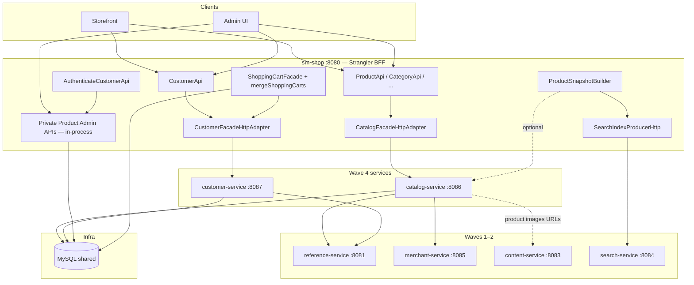
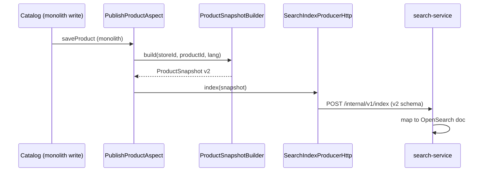
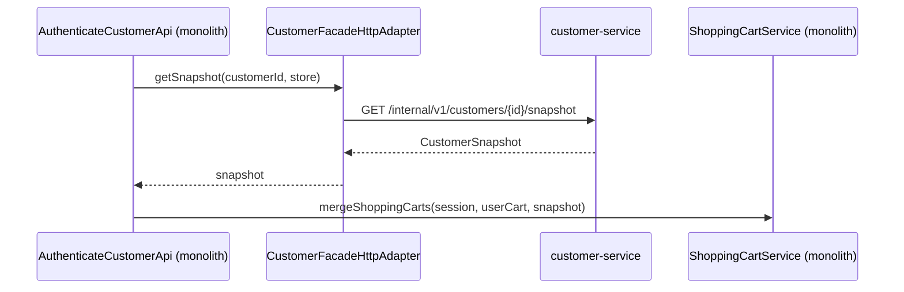

# Onda 4 — Catalog + Customer Design

**Spec:** `.specs/features/onda-4-catalog-customer/spec.md`
**Context:** `.specs/features/onda-4-catalog-customer/context.md` (OQ-01..06)
**Status:** Approved — Execute blocked until Onda 3 gate green
**Prerequisite:** Wave 3 contracts (`ProductSnapshot`, `CustomerSnapshot`, `LanguageCode`, `MerchantStoreId`)

---

## Architecture Overview

Wave 4 extracts **two Spring Boot services** while keeping **shared MySQL schema** (AD-003/AD-022) and the monolith as **Strangler BFF**. Catalog is **read-heavy only** at the service boundary; admin writes stay in-process. Customer service owns profile persistence; **cart merge stays monolith** using `CustomerSnapshot`.



### Principles (Waves 1–3 + Wave 4)

1. **Frozen REST paths** — STR-04; BFF keeps original controllers
2. **DTOs without JPA** — `shopizer-api-contracts` extended with snapshots + catalog/customer DTOs
3. **Mappers in services** — not in contracts JAR (L-002)
4. **RestTemplate** — AD-005; properties `wave4.*.base-url`
5. **JWT replicated** on `/private/**` customer routes
6. **Catalog read-only at service boundary** — AD-020; CQRS phased extraction
7. **ProductSnapshot canonical** — supersedes `ProductIndexPayload` for indexing (OQ-02)
8. **CustomerSnapshot for integration** — cart merge without remote cart service (OQ-03)
9. **LanguageCode / MerchantStoreId** — no `Language` or `MerchantStore` entities on HTTP boundaries (Wave 3)

---

## Design Decisions (OQ-01 – OQ-06)

| ID | Decision | Choice | Rationale |
|----|----------|--------|-----------|
| **OQ-01** | Catalog phasing | **Read APIs first** | Afferent coupling 10/10; moving writes pulls inventory/pricing/order side effects |
| **OQ-02** | Product contract | **`ProductSnapshot` v2** | Wave 3 deliverable; unifies search + cross-service reads |
| **OQ-03** | Cart merge | **Monolith orchestrates** | Avoids distributed transaction cart+customer; snapshot carries ids |
| **OQ-04** | Product images | **content-service** | Completes Onda 2 OQ-02 deferral; catalog-service does not own blobs |
| **OQ-05** | Facade paths | **V1 strangler first** | `ProductApi` + `CategoryApi` are storefront contract; V2 delegates same adapter |
| **OQ-06** | Customer auth | **Stays monolith** | Login authority unchanged; customer-service is profile domain |

**AD-015:** Single workflow `onda-4-catalog-customer` (catalog + customer same calendar window).

**AD-016:** `sm-catalog-core` — read services, repositories, snapshot mappers; **excludes** write orchestration used only by admin APIs staying in monolith.

**AD-017:** `sm-customer-core` — customer, optin, attribute services; **excludes** order-created customer flows.

**AD-018:** Internal snapshot API on catalog-service for optional centralized snapshot building.

**AD-019:** `CustomerSnapshot` + `CustomerServiceClient.getSnapshot(customerId, storeCode)` for merge path.

**AD-020:** Private product POST/PUT/DELETE **never** routed to catalog-service in Wave 4.

**AD-021:** All new clients use `LanguageCode` / `MerchantStoreId` value types from contracts.

**AD-022:** Shared DB continues; catalog-service and customer-service use JPA on existing tables.

---

## Maven Module Structure

### Root `pom.xml` (after Waves 1–3)

```xml
<modules>
    <!-- Waves 1–3 -->
    <module>shopizer-api-contracts</module>
    <module>reference-service</module>
    <module>tax-service</module>
    <module>sm-content-core</module>
    <module>content-service</module>
    <module>search-service</module>
    <module>sm-merchant-core</module>
    <module>merchant-service</module>
    <!-- Wave 4 NEW -->
    <module>sm-catalog-core</module>
    <module>catalog-service</module>
    <module>sm-customer-core</module>
    <module>customer-service</module>
</modules>
```

### Ports and services

| Module | Port | JPA | Read | Write at boundary |
|--------|------|-----|------|-------------------|
| `catalog-service` | 8086 | ✅ | Product, category, manufacturer, inventory, price | **No admin writes** |
| `customer-service` | 8087 | ✅ | Profile, addresses, optin, reviews (read) | Profile/address/optin writes |

### `shopizer-api-contracts` — Wave 4 extensions

```
com.salesmanager.contracts.catalog     → ReadableProduct*, ReadableCategory*, ProductSnapshot, ...
com.salesmanager.contracts.customer    → ReadableCustomer*, CustomerSnapshot, Address, ...
com.salesmanager.contracts.common      → LanguageCode, MerchantStoreId (Wave 3)
com.salesmanager.contracts.client      → CatalogServiceClient, CustomerServiceClient
```

**Deprecation:** `ProductIndexPayload` remains deserializable in search-service until migration task completes; producer switches to `ProductSnapshot` with `schemaVersion=2`.

### `sm-catalog-core`

Extract from `sm-core` (read subset):

- `services/catalog/product/` (read methods), `category/`, `manufacturer/`, `inventory/`, `pricing/` (read)
- Matching repositories
- **Exclude** from thin core: write-only admin flows, `PublishProductAspect` (stays monolith), digital product file managers (content)

### `sm-customer-core`

Extract from `sm-core`:

- `services/customer/`, `optin/`, `attribute/` (not used by order-only paths initially)
- Repositories under `repositories/customer/`
- **Exclude:** logic only invoked from `OrderServiceImpl` customer creation — stays monolith until Onda 6

---

## API Surfaces

### catalog-service (:8086)

| Area | Paths | Auth | Notes |
| ---- | ----- | ---- | ----- |
| Products | Mirror `ProductApi` **GET** routes | public / JWT where today | No private POST/PUT/DELETE |
| Categories | Mirror `CategoryApi` GET | public | Tree + by id |
| Manufacturers | `ProductManufacturerApi` GET | public | |
| Inventory | `ProductInventoryApi` GET | public/JWT | Read quantities |
| Prices | `ProductPriceApi` GET | public | |
| Groups | `ProductGroupApi` GET | public | |
| Internal | `GET /internal/v1/products/{id}/snapshot` | network | `ProductSnapshot` |
| Internal | `GET /internal/v1/products/sku/{sku}/snapshot` | network | optional |

**Not exposed:** `ProductApiV2` controllers live in catalog-service only if parity test demands; BFF may keep V2 controller delegating HTTP to same service.

### customer-service (:8087)

| Area | Paths | Auth |
| ---- | ----- | ---- |
| Profile | `GET/PUT /api/v1/customer/**` profile sections | JWT customer |
| Addresses | shipping/billing address endpoints | JWT |
| Opt-in | newsletter/optin endpoints | public/JWT per monolith |
| Reviews | `GET` review lists; `POST` review MAY phase 2 | JWT |
| Internal | `GET /internal/v1/customers/{id}/snapshot?store=` | network |

**Not exposed:** `AuthenticateCustomerApi`, password reset — monolith.

### Strangler configuration (`sm-shop`)

```properties
wave4.strangler.enabled=true
wave4.catalog-service.base-url=http://catalog-service:8086
wave4.customer-service.base-url=http://customer-service:8087
wave4.http.client.timeout-ms=5000
wave4.catalog-service.cache.ttl-seconds=30
wave4.customer-service.cache.ttl-seconds=60
# coexist
wave1.strangler.enabled=true
wave2.strangler.enabled=true
wave3.strangler.enabled=false
```

Adapter matrix:

| Facade | HTTP when wave4 on | Stays in-process |
|--------|-------------------|------------------|
| `ProductFacade` / `ProductCommonFacade` (read) | ✅ catalog-service | write methods |
| `CategoryFacade` | ✅ | — |
| `CustomerFacade` (profile/address/optin) | ✅ customer-service | auth, merge orchestration |
| `ProductFacadeV2` (read) | ✅ same catalog client | write |
| Private product admin controllers | — | ✅ sm-core writes |

---

## Integration Points

| Integration | Purpose | Auth | Failure |
| ----------- | ------- | ---- | ------- |
| catalog → reference | `LanguageCode` resolution | Wave 1 client | 503 |
| catalog → merchant | store validation / `MerchantStoreId` | Wave 2 client | 503 |
| customer → reference | country/zone/language | Wave 1 client | 503 |
| monolith → catalog | strangler read facades | JWT forward + correlation | 503 |
| monolith → customer | profile + snapshot for merge | JWT | 503 |
| monolith → search | `ProductSnapshot` index producer | `X-Internal-Token` | log; GAP-SRCH |
| monolith → content | product image upload (P2) | internal | 503 |

### ProductSnapshot indexing (post Wave 3)



### Cart merge decoupling



`mergeShoppingCarts` signature evolves to accept `CustomerSnapshot` or primitive ids — **no remote call inside** `ShoppingCartService`.

---

## ProductSnapshot schema (v2)

| Field | Type | Notes |
| ----- | ---- | ----- |
| `schemaVersion` | int | `2` (supersedes ProductIndexPayload `1`) |
| `id` | Long | product id |
| `storeCode` | String | lowercase store code |
| `language` | String | ISO code |
| `sku`, `name`, `description`, `link`, `image` | String | |
| `reviews`, `brand`, `category` | String | |
| `attributes` | Map | |
| `variants` | List | |
| `inventory` | List | SKU, QTY, PRICE, DISCOUNT keys |
| `addToCart` | Boolean | |
| `manufacturerCode` | String | optional Wave 4 |
| `visible` | Boolean | |

search-service: accept v1 and v2 during transition; v1 deprecated after Wave 4 gate.

### CustomerSnapshot schema (v1)

| Field | Type | Notes |
| ----- | ---- | ----- |
| `schemaVersion` | int | `1` |
| `id` | Long | customer id |
| `storeCode` | String | |
| `email` | String | |
| `firstName`, `lastName` | String | |
| `billingAddressId`, `deliveryAddressId` | Long | optional |
| `customerGroup` | String | optional |

---

## Impact Analysis

| Component | Impact | Action |
| --------- | ------ | ------ |
| `shopizer-api-contracts` | modified | Snapshots, catalog/customer DTOs, clients |
| `sm-catalog-core` | new | Read catalog subset |
| `catalog-service` | new | Boot 8086, JWT on private reads if any |
| `sm-customer-core` | new | Customer subset |
| `customer-service` | new | Boot 8087, JWT |
| `sm-core` | modified | Delegate read paths to cores; merge signature |
| `sm-shop` | modified | Wave4 adapters, builder migration |
| `search-service` | modified | Accept ProductSnapshot v2 |
| `content-service` | modified (P2) | Product file manager endpoints |
| DB schema | none | Shared tables |

---

## Testing Approach

### Unit

- `ProductSnapshotBuilder` / mappers with product fixtures
- `CatalogFacadeHttpAdapter` with mocked RestTemplate
- `CustomerSnapshotMapper`
- `ShoppingCartServiceImpl.mergeShoppingCarts` with snapshot-only customer ref
- Correlation + health indicators

### Integration

- catalog-service: product list, category tree, snapshot internal API
- customer-service: profile CRUD, snapshot internal API
- sm-shop: Wave4ClientConfig; adapters; merge flow with Testcontainers MySQL
- Pact: `CatalogProviderPactTest`, `CustomerProviderPactTest`, `Wave4ConsumerPactTest`
- Gate: `./mvnw clean install`

### Known gaps (document only)

- GAP-CAT-01: V1/V2 facade semantic drift until consolidation
- GAP-CAT-02: Price-only changes may not reindex search
- GAP-CUS-01: Order-created customer still in monolith transaction
- GAP-CUS-02: Review write path may lag read extraction

---

## Deployment

`docker-compose-wave4.yml`:

- Extends Wave 2 topology (mysql, opensearch, reference, content, merchant, search)
- Adds `catalog-service:8086`, `customer-service:8087`
- Startup: mysql → reference → merchant → content → catalog → customer → search → sm-shop
- Env: `WAVE4_CATALOG_BASE_URL`, `WAVE4_CUSTOMER_BASE_URL`

Pre-build:

```bash
./mvnw -pl reference-service,content-service,search-service,merchant-service,catalog-service,customer-service,sm-shop -am package -DskipTests
```

---

## Monitoring

| Signal | Where |
| ------ | ----- |
| `GET /actuator/health` | catalog, customer |
| catalog indicators | `db`, `referenceService`, `merchantService` |
| customer indicators | `db`, `referenceService` |
| `X-Correlation-Id` | All Wave 4 apps + RestTemplate interceptor |

---

## References

- `.specs/features/onda-4-catalog-customer/spec.md`
- `docs/decomposition/MIGRATION-MASTER-PLAN.md` § Onda 4
- `.specs/project/STATE.md` (post Execute)
- Wave 3 contracts feature (prerequisite)
