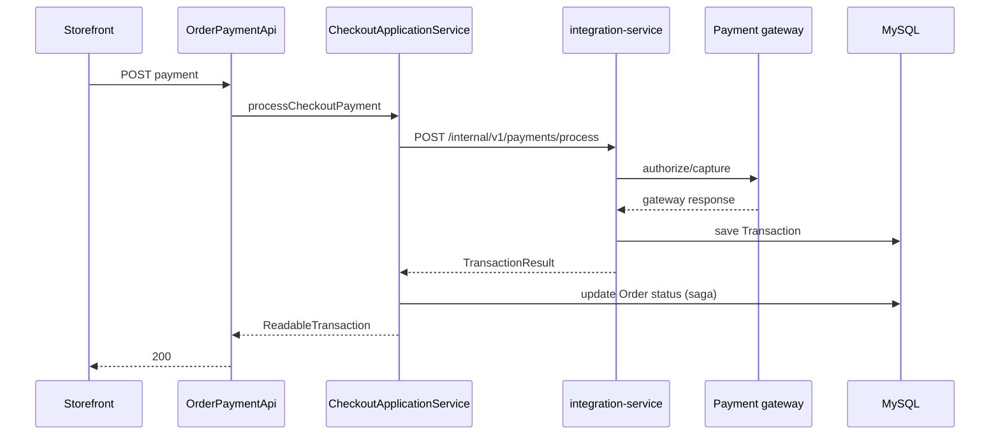

# Onda 5 — Integration Service Design

**Spec:** `.specs/features/onda-5-integration-service/spec.md`
**Context:** `.specs/features/onda-5-integration-service/context.md` (OQ-01..06 confirmed)
**Status:** Approved — Execute blocked on Onda 3 + Onda 4 partial
**Exploration:** Payment/shipping services, `sm-core-modules` contracts, checkout hub (2026-07-04 master plan)

---

## Architecture Overview

Wave 5 extracts **one Spring Boot service** — `integration-service` (:8086) — owning payment/shipping **orchestration** and the **plugin registry**, while `sm-shop` remains the Strangler BFF and checkout application service (from Onda 3) owns order lifecycle mutations.


### Principles (inherited + Wave 5)

1. **Frozen REST paths** — STR-06; BFF keeps original controllers
2. **DTOs without JPA** in JSON — `shopizer-api-contracts` + Onda 3 integration DTOs
3. **RestTemplate** clients — `wave5.integration-service.base-url`
4. **JWT replicated** for `/private/**` admin routes
5. **Stateless order boundary** — integration returns `TransactionResult`; checkout saga updates order (OQ-01)
6. **Plugin registry in-process** inside integration-service (OQ-03) — no separate gateway microservice per provider
7. **Shared DB** for merchant integration configuration (AD-003, OQ-04)
8. **Catalog read via HTTP** for shipping weights — no in-process `PricingService` (OQ-02)

---

## Design Decisions (OQ-01 – OQ-06)

| ID | Decision | Choice | Rationale |
|----|----------|--------|-----------|
| **OQ-01** | Order mutation on payment | **Stateless integration** | Breaks `PaymentServiceImpl` → `OrderService` cycle; saga owns order status |
| **OQ-02** | Shipping product data | **Catalog HTTP snapshots** | Aligns with Onda 4 read extraction; `ShippingProductSnapshot` subset |
| **OQ-03** | Plugin hosting | **In-process Spring beans** | Existing `Map<String, PaymentModule>` pattern; plugins are libraries not services |
| **OQ-04** | Config persistence | **Shared MySQL** | `MERCHANT_CONFIGURATION` already keyed by store; split DB deferred |
| **OQ-05** | Admin config APIs | **Migrate to integration-service** | Full orchestration ownership |
| **OQ-06** | Checkout APIs location | **BFF + checkout service** | `OrderPaymentApi` orchestrates; integration is capability provider |

**AD-015:** Port 8086; Maven module `integration-service`; thin core `sm-integration-core`.

**AD-016:** Runtime uses `PaymentModuleV2` / `ShippingQuoteModuleV2` (Onda 3); legacy adapters delegate until plugins rewritten.

**AD-017:** `PaymentServiceImpl` order writes gated behind `!wave5.strangler.enabled` for rollback.

**AD-018:** `Encryption` bean and credential handling stay in integration-service only.

**AD-019:** `DefaultPackagingImpl`, preprocessors, and shipping rules move to `sm-integration-core`.

**AD-020:** Internal payment APIs require `orderSnapshotId` (Long) — not full `Order` entity.

---

## Module Structure

```
shopizer-api-contracts/
  integration/
    PaymentProcessRequest, TransactionResult, ShippingQuoteRequest
    IntegrationModuleDto, PaymentMethodDto, ShippingOptionDto
  client/
    IntegrationServiceClient

sm-core-modules/
  integration/payment/model/PaymentModuleV2.java    # Onda 3 deliverable
  integration/shipping/model/ShippingQuoteModuleV2.java

sm-integration-core/                               # NEW
  services/payments/PaymentOrchestratorImpl
  services/shipping/ShippingOrchestratorImpl
  modules/integration/payment/impl/*               # moved from sm-core
  modules/integration/shipping/impl/*
  configuration/ModulesConfiguration

integration-service/                               # NEW :8086
  IntegrationServiceApplication
  api/v1/payment/*
  api/v1/shipping/*
  internal/v1/payments/*
  security/JwtAuthenticationFilter
  health/*

sm-shop/
  strangler/integration/PaymentFacadeHttpAdapter
  strangler/integration/ShippingFacadeHttpAdapter
  strangler/config/Wave5ClientConfig
  checkout/CheckoutApplicationService (Onda 3)
```

---

## Key Interfaces

```java
// shopizer-api-contracts — integration client
package com.salesmanager.contracts.client;

import com.salesmanager.contracts.integration.*;

public interface IntegrationServiceClient {
  TransactionResult processPayment(PaymentProcessRequest request);
  TransactionResult capturePayment(PaymentCaptureRequest request);
  TransactionResult refundPayment(PaymentRefundRequest request);
  TransactionResult initPayment(PaymentInitRequest request);
  ShippingQuoteResponse getShippingQuote(ShippingQuoteRequest request);
  ShippingSummaryDto getShippingSummary(ShippingSummaryRequest request);
}
```

```java
// sm-core-modules — V2 payment plugin (Onda 3)
package com.salesmanager.core.modules.integration.payment.model;

public interface PaymentModuleV2 {
  void validateModuleConfiguration(IntegrationConfigDto config, StoreContext store);
  TransactionResult initTransaction(PaymentContext ctx);
  TransactionResult authorize(PaymentContext ctx);
  TransactionResult capture(CaptureContext ctx);
  TransactionResult authorizeAndCapture(PaymentContext ctx);
  TransactionResult refund(RefundContext ctx);
}
```

```java
// sm-integration-core — orchestrator port
package com.salesmanager.integration.services;

public interface PaymentOrchestrator {
  TransactionResult process(PaymentProcessRequest request);
  TransactionResult capture(PaymentCaptureRequest request);
  TransactionResult refund(PaymentRefundRequest request);
  List<PaymentMethodDto> getAcceptedMethods(String storeCode);
  // config CRUD ...
}
```

Error convention: remote/strangler failures → **503** `{ error, correlationId }`; validation → **400**; gateway/integration → **502** with `IntegrationErrorCode`; invalid module → **404**; never silent in-process fallback when strangler enabled.

---

## Data Models

### PaymentProcessRequest (`shopizer-api-contracts`)

| Field | Type | Notes |
| ----- | ---- | ----- |
| `storeCode` | String | tenant |
| `orderSnapshotId` | Long | reference only — no Order entity |
| `customerSnapshot` | CustomerSnapshot | Onda 3 |
| `lineItems` | List\<CartLineSnapshot\> | |
| `payment` | PersistablePaymentDto | card/token details |
| `amount` | BigDecimal | |
| `currency` | String | |

### TransactionResult

| Field | Type | Notes |
| ----- | ---- | ----- |
| `transactionId` | Long | persisted in shared DB |
| `gatewayTransactionId` | String | |
| `type` | enum | AUTH, CAPTURE, REFUND, INIT |
| `success` | boolean | |
| `errorCode` | String | optional |
| `amount` | BigDecimal | |

### ShippingQuoteRequest

| Field | Type | Notes |
| ----- | ---- | ----- |
| `storeCode` | String | |
| `cartId` | Long | optional |
| `delivery` | DeliveryDto | |
| `products` | List\<ShippingProductSnapshot\> | from catalog read |
| `languageCode` | String | |
| `orderTotal` | BigDecimal | |

### Persistence (shared schema)

- `MERCHANT_CONFIGURATION` — encrypted module configs
- `TRANSACTION` — payment transaction records (integration-service writes)
- `SHIPPING_ORIGIN`, shipping merchant configs — as today
- **No `ORDERS` table writes** from integration-service

---

## API Endpoints

### integration-service (:8086) — public/admin (frozen paths via BFF)

| Area | Paths | Auth |
| ---- | ----- | ---- |
| Payment modules | `/api/v1/private/modules/payment*` | JWT |
| Payment config | `/api/v1/payment/*` | public/store |
| Shipping modules | `/api/v1/private/modules/shipping*` | JWT |
| Shipping config | `/api/v1/private/shipping/*` | JWT |
| Ship countries | `/api/v1/shipping/countries` | public |

### Internal (BFF / checkout only)

| Method | Path | Auth |
| ------ | ---- | ---- |
| POST | `/internal/v1/payments/process` | `X-Internal-Token` |
| POST | `/internal/v1/payments/capture` | token |
| POST | `/internal/v1/payments/refund` | token |
| POST | `/internal/v1/payments/init` | token |
| POST | `/internal/v1/shipping/quote` | token |
| POST | `/internal/v1/shipping/summary` | token |

### Strangler configuration (`sm-shop`)

```properties
wave5.strangler.enabled=true
wave5.integration-service.base-url=http://integration-service:8086
wave5.integration-service.internal-token=${INTEGRATION_INTERNAL_TOKEN}
wave5.http.client.timeout-ms=10000
wave5.catalog-service.base-url=http://catalog-service:8087
# coexist wave1–4
```

---

## Integration Points

| Integration | Purpose | Failure |
| ----------- | ------- | ------- |
| integration → reference-service | country/language resolution | 503 |
| integration → catalog-service | product weight/dimensions for packaging | 503; quote may degrade with documented GAP-INT-01 |
| monolith → integration | facades + checkout client | 503 no fallback |
| Plugins → external gateways | Stripe, PayPal, UPS, USPS | 502 mapped to `TransactionResult.success=false` |
| Checkout saga → integration | payment process after order draft | compensating refund on saga failure |

### Payment flow (stateless)



---

## Impact Analysis

| Component | Impact | Action |
| --------- | ------ | ------ |
| `shopizer-api-contracts` | modified | Integration DTOs + client |
| `sm-core-modules` | modified | V2 module interfaces (Onda 3) |
| `sm-integration-core` | **new** | Extract orchestration + plugins |
| `integration-service` | **new** | Boot app :8086 |
| `sm-core` | modified | Delegate/remove moved services |
| `sm-shop` | modified | Wave5 adapters, checkout wiring |
| `PaymentServiceImpl` | modified | Remove order writes in strangler path |
| `docker-compose-wave5.yml` | **new** | Extend topology |

---

## Known Gaps (document only)

| ID | Gap | Mitigation |
|----|-----|------------|
| GAP-INT-01 | Catalog snapshot missing dimensions | Fallback to monolith packaging defaults; log WARN |
| GAP-INT-02 | Legacy plugins still use entity adapters | AD-017 bridge until plugin rewrite |
| GAP-INT-03 | No outbox for failed post-payment order update | Onda 3 saga handles; document compensation |
| GAP-INT-04 | `ConfigurationsApi` payment/shipping stubs | Out of scope — remain null in BFF |
| GAP-INT-05 | Credit card validation regex in PaymentServiceImpl | Move as-is to orchestrator |

---

## Testing Approach

- Unit: orchestrators with mocked `PaymentModuleV2` / catalog client
- Unit: DTO mappers; encryption round-trip
- Integration: config CRUD; quote with fixture snapshots
- Integration: payment process asserts no `Order` UPDATE
- Pact: provider on integration-service; consumer `Wave5ConsumerPactTest`
- Gate: `./mvnw -pl integration-service,sm-shop -am verify`

---

## Build Order

1. Confirm Onda 3 contracts (`PaymentModuleV2`, snapshots, checkout service)
2. Contracts in `shopizer-api-contracts` + Wave5 properties
3. Extract `sm-integration-core` (shipping track can start with snapshots)
4. `integration-service` Boot + admin APIs
5. Internal payment APIs + stateless boundary
6. Strangler adapters + checkout wiring
7. Pact + Compose + STATE
