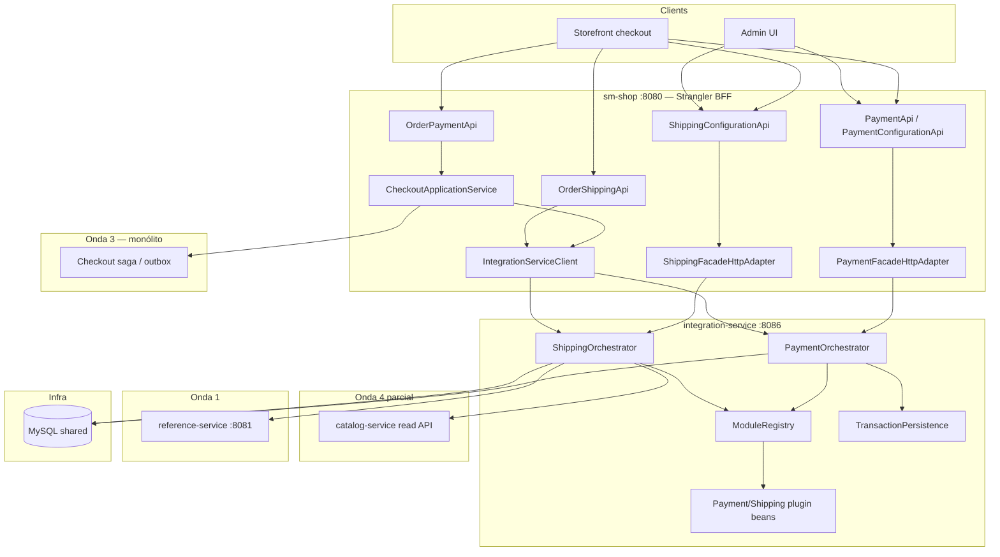
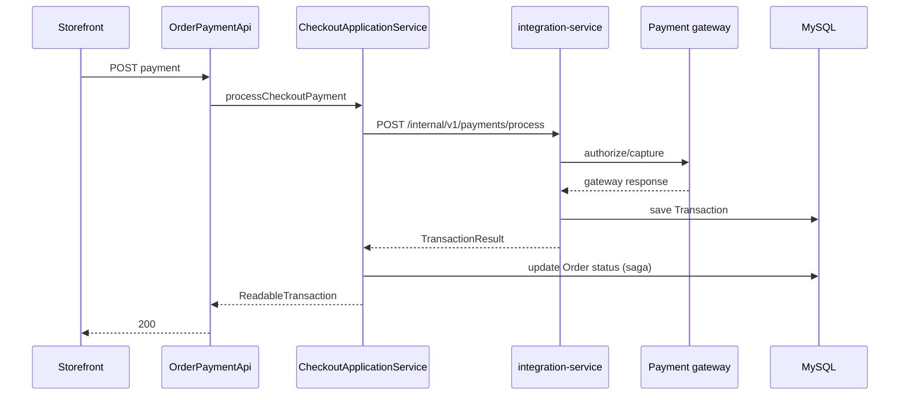

# Onda 5 — Integration Service Design

**Spec:** `.specs/features/onda-5-integration-service/spec.md`
**Context:** `.specs/features/onda-5-integration-service/context.md` (OQ-01..06 confirmadas)
**Status:** Aprovado — Execute bloqueado em Onda 3 + Onda 4 parcial
**Exploração:** Serviços payment/shipping, contratos `sm-core-modules`, hub checkout (plano mestre 2026-07-04)

---

## Visão geral da arquitetura

A Onda 5 extrai **um serviço Spring Boot** — `integration-service` (:8086) — dono da **orquestração** de pagamento/frete e do **registry de plugins**, enquanto `sm-shop` permanece o Strangler BFF e o application service de checkout (da Onda 3) é dono das mutações do ciclo de vida do pedido.



### Princípios (herdados + Onda 5)

1. **Caminhos REST congelados** — STR-06; BFF mantém controllers originais
2. **DTOs sem JPA** em JSON — `shopizer-api-contracts` + DTOs integration Onda 3
3. **Clients RestTemplate** — `wave5.integration-service.base-url`
4. **JWT replicado** para rotas admin `/private/**`
5. **Fronteira stateless de pedido** — integration retorna `TransactionResult`; saga checkout atualiza pedido (OQ-01)
6. **Registry de plugins in-process** dentro de integration-service (OQ-03) — sem microsserviço gateway separado por provedor
7. **DB compartilhado** para configuração de integração merchant (AD-003, OQ-04)
8. **Leitura de catálogo via HTTP** para pesos de frete — sem `PricingService` in-process (OQ-02)

---

## Decisões de design (OQ-01 – OQ-06)

| ID | Decisão | Escolha | Fundamentação |
|----|----------|--------|-----------|
| **OQ-01** | Mutação de pedido no pagamento | **Integration stateless** | Quebra ciclo `PaymentServiceImpl` → `OrderService`; saga é dona do status do pedido |
| **OQ-02** | Dados de produto para frete | **Snapshots HTTP catálogo** | Alinha com extração de leitura Onda 4; subset `ShippingProductSnapshot` |
| **OQ-03** | Hospedagem de plugins | **Beans Spring in-process** | Padrão existente `Map<String, PaymentModule>`; plugins são bibliotecas, não serviços |
| **OQ-04** | Persistência de config | **MySQL compartilhado** | `MERCHANT_CONFIGURATION` já keyed por loja; split DB adiado |
| **OQ-05** | APIs admin config | **Migrar para integration-service** | Ownership completo de orquestração |
| **OQ-06** | Localização APIs checkout | **BFF + checkout service** | `OrderPaymentApi` orquestra; integration é capability provider |

**AD-015:** Porta 8086; módulo Maven `integration-service`; core thin `sm-integration-core`.

**AD-016:** Runtime usa `PaymentModuleV2` / `ShippingQuoteModuleV2` (Onda 3); adaptadores legados delegam até plugins reescritos.

**AD-017:** Writes de pedido em `PaymentServiceImpl` condicionados a `!wave5.strangler.enabled` para rollback.

**AD-018:** Bean `Encryption` e tratamento de credenciais permanecem apenas em integration-service.

**AD-019:** `DefaultPackagingImpl`, preprocessors e regras de frete movem para `sm-integration-core`.

**AD-020:** APIs internas de pagamento exigem `orderSnapshotId` (Long) — não entidade `Order` completa.

---

## Estrutura de módulos

```
shopizer-api-contracts/
  integration/
    PaymentProcessRequest, TransactionResult, ShippingQuoteRequest
    IntegrationModuleDto, PaymentMethodDto, ShippingOptionDto
  client/
    IntegrationServiceClient

sm-core-modules/
  integration/payment/model/PaymentModuleV2.java    # entregável Onda 3
  integration/shipping/model/ShippingQuoteModuleV2.java

sm-integration-core/                               # NOVO
  services/payments/PaymentOrchestratorImpl
  services/shipping/ShippingOrchestratorImpl
  modules/integration/payment/impl/*               # movido de sm-core
  modules/integration/shipping/impl/*
  configuration/ModulesConfiguration

integration-service/                               # NOVO :8086
  IntegrationServiceApplication
  api/v1/payment/*
  api/v1/shipping/*
  internal/v1/payments/*
  security/JwtAuthenticationFilter
  health/*

sm-shop/
  strangler/integration/PaymentFacadeHttpAdapter
  strangler/integration/ShippingFacadeHttpAdapter
  strangler/config/Wave5ClientConfig
  checkout/CheckoutApplicationService (Onda 3)
```

---

## Interfaces principais

```java
// shopizer-api-contracts — client integration
package com.salesmanager.contracts.client;

import com.salesmanager.contracts.integration.*;

public interface IntegrationServiceClient {
  TransactionResult processPayment(PaymentProcessRequest request);
  TransactionResult capturePayment(PaymentCaptureRequest request);
  TransactionResult refundPayment(PaymentRefundRequest request);
  TransactionResult initPayment(PaymentInitRequest request);
  ShippingQuoteResponse getShippingQuote(ShippingQuoteRequest request);
  ShippingSummaryDto getShippingSummary(ShippingSummaryRequest request);
}
```

```java
// sm-core-modules — plugin pagamento V2 (Onda 3)
package com.salesmanager.core.modules.integration.payment.model;

public interface PaymentModuleV2 {
  void validateModuleConfiguration(IntegrationConfigDto config, StoreContext store);
  TransactionResult initTransaction(PaymentContext ctx);
  TransactionResult authorize(PaymentContext ctx);
  TransactionResult capture(CaptureContext ctx);
  TransactionResult authorizeAndCapture(PaymentContext ctx);
  TransactionResult refund(RefundContext ctx);
}
```

```java
// sm-integration-core — porta orquestrador
package com.salesmanager.integration.services;

public interface PaymentOrchestrator {
  TransactionResult process(PaymentProcessRequest request);
  TransactionResult capture(PaymentCaptureRequest request);
  TransactionResult refund(PaymentRefundRequest request);
  List<PaymentMethodDto> getAcceptedMethods(String storeCode);
  // config CRUD ...
}
```

Convenção de erro: falhas remotas/strangler → **503** `{ error, correlationId }`; validação → **400**; gateway/integration → **502** com `IntegrationErrorCode`; módulo inválido → **404**; nunca fallback in-process silencioso quando strangler habilitado.

---

## Modelos de dados

### PaymentProcessRequest (`shopizer-api-contracts`)

| Campo | Tipo | Notas |
| ----- | ---- | ----- |
| `storeCode` | String | tenant |
| `orderSnapshotId` | Long | apenas referência — sem entidade Order |
| `customerSnapshot` | CustomerSnapshot | Onda 3 |
| `lineItems` | List\<CartLineSnapshot\> | |
| `payment` | PersistablePaymentDto | detalhes card/token |
| `amount` | BigDecimal | |
| `currency` | String | |

### TransactionResult

| Campo | Tipo | Notas |
| ----- | ---- | ----- |
| `transactionId` | Long | persistido no DB compartilhado |
| `gatewayTransactionId` | String | |
| `type` | enum | AUTH, CAPTURE, REFUND, INIT |
| `success` | boolean | |
| `errorCode` | String | opcional |
| `amount` | BigDecimal | |

### ShippingQuoteRequest

| Campo | Tipo | Notas |
| ----- | ---- | ----- |
| `storeCode` | String | |
| `cartId` | Long | opcional |
| `delivery` | DeliveryDto | |
| `products` | List\<ShippingProductSnapshot\> | da leitura catálogo |
| `languageCode` | String | |
| `orderTotal` | BigDecimal | |

### Persistência (schema compartilhado)

- `MERCHANT_CONFIGURATION` — configs de módulo criptografadas
- `TRANSACTION` — registros de transação de pagamento (integration-service escreve)
- `SHIPPING_ORIGIN`, configs merchant de frete — como hoje
- **Sem writes na tabela `ORDERS`** a partir de integration-service

---

## Endpoints de API

### integration-service (:8086) — público/admin (caminhos congelados via BFF)

| Área | Caminhos | Auth |
| ---- | ----- | ---- |
| Módulos pagamento | `/api/v1/private/modules/payment*` | JWT |
| Config pagamento | `/api/v1/payment/*` | público/loja |
| Módulos frete | `/api/v1/private/modules/shipping*` | JWT |
| Config frete | `/api/v1/private/shipping/*` | JWT |
| Países entrega | `/api/v1/shipping/countries` | público |

### Internos (apenas BFF / checkout)

| Método | Caminho | Auth |
| ------ | ---- | ---- |
| POST | `/internal/v1/payments/process` | `X-Internal-Token` |
| POST | `/internal/v1/payments/capture` | token |
| POST | `/internal/v1/payments/refund` | token |
| POST | `/internal/v1/payments/init` | token |
| POST | `/internal/v1/shipping/quote` | token |
| POST | `/internal/v1/shipping/summary` | token |

### Configuração Strangler (`sm-shop`)

```properties
wave5.strangler.enabled=true
wave5.integration-service.base-url=http://integration-service:8086
wave5.integration-service.internal-token=${INTEGRATION_INTERNAL_TOKEN}
wave5.http.client.timeout-ms=10000
wave5.catalog-service.base-url=http://catalog-service:8087
# coexist wave1–4
```

---

## Pontos de integração

| Integração | Propósito | Falha |
| ----------- | ------- | ------- |
| integration → reference-service | resolução país/idioma | 503 |
| integration → catalog-service | peso/dimensões produto para empacotamento | 503; cotação pode degradar com GAP-INT-01 documentado |
| monólito → integration | facades + client checkout | 503 sem fallback |
| Plugins → gateways externos | Stripe, PayPal, UPS, USPS | 502 mapeado para `TransactionResult.success=false` |
| Saga checkout → integration | process payment após rascunho pedido | reembolso compensatório em falha de saga |

### Fluxo de pagamento (stateless)



---

## Análise de impacto

| Componente | Impacto | Ação |
| --------- | ------ | ------ |
| `shopizer-api-contracts` | modificado | DTOs integration + client |
| `sm-core-modules` | modificado | Interfaces módulo V2 (Onda 3) |
| `sm-integration-core` | **novo** | Extrair orquestração + plugins |
| `integration-service` | **novo** | App Boot :8086 |
| `sm-core` | modificado | Delegar/remover serviços movidos |
| `sm-shop` | modificado | Adaptadores Wave5, wiring checkout |
| `PaymentServiceImpl` | modificado | Remover writes de pedido no caminho strangler |
| `docker-compose-wave5.yml` | **novo** | Estender topologia |

---

## Known Gaps (apenas documentar)

| ID | Lacuna | Mitigação |
|----|-----|------------|
| GAP-INT-01 | Snapshot catálogo sem dimensões | Fallback para defaults de empacotamento do monólito; log WARN |
| GAP-INT-02 | Plugins legados ainda usam adaptadores entity | Ponte AD-017 até rewrite de plugin |
| GAP-INT-03 | Sem outbox para update de pedido pós-pagamento falho | Saga Onda 3 trata; documentar compensação |
| GAP-INT-04 | Stubs payment/shipping em `ConfigurationsApi` | Fora de escopo — permanecem null no BFF |
| GAP-INT-05 | Regex validação cartão de crédito em PaymentServiceImpl | Mover as-is para orquestrador |

---

## Abordagem de testes

- Unitário: orquestradores com `PaymentModuleV2` / client catálogo mockados
- Unitário: mappers DTO; round-trip criptografia
- Integração: CRUD config; cotação com snapshots fixture
- Integração: process payment asserta sem UPDATE `Order`
- Pact: provider em integration-service; consumer `Wave5ConsumerPactTest`
- Gate: `./mvnw -pl integration-service,sm-shop -am verify`

---

## Ordem de construção

1. Confirmar contratos Onda 3 (`PaymentModuleV2`, snapshots, checkout service)
2. Contratos em `shopizer-api-contracts` + properties Wave5
3. Extrair `sm-integration-core` (trilha frete pode iniciar com snapshots)
4. Boot `integration-service` + APIs admin
5. APIs internas de pagamento + fronteira stateless
6. Adaptadores Strangler + wiring checkout
7. Pact + Compose + STATE
