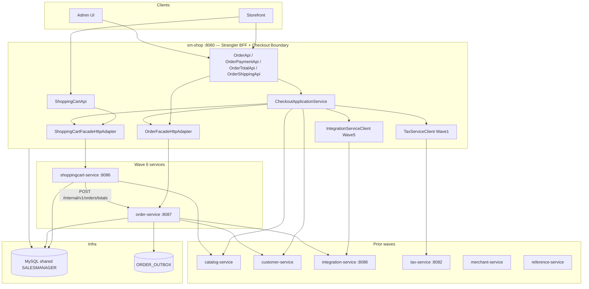

# Onda 6 — ShoppingCart + Order Design

**Spec:** `.specs/features/onda-6-shoppingcart-order/spec.md`
**Context:** `.specs/features/onda-6-shoppingcart-order/context.md` (OQ-01..08 confirmed)
**Status:** Approved — Execute blocked until Ondas 3–5 gate
**Prerequisites:** Onda 3 (snapshots, saga/outbox, CheckoutApplicationService), Onda 4 (catalog, customer), Onda 5 (integration-service)

---

## Architecture Overview

Onda 6 extracts the **last two core commerce domains** while the monolith remains the **checkout orchestration BFF**. The Checkout Application Service (introduced in Onda 3) becomes the **only** entry point for `processOrder` and related checkout flows. Cart and order services own persistence and domain rules; cross-domain coordination uses HTTP + saga, not global AOP transactions.



### Principles (inherited + Wave 6)

1. **Frozen REST paths** — STR/HUB-04; BFF keeps original controllers
2. **DTOs without JPA** — `shopizer-api-contracts` extended with cart/order/checkout types
3. **Checkout boundary** — AD-024; `CheckoutApplicationService` in `sm-shop`
4. **Saga + outbox** — ADR-003/004; no `TransactionalAspectAwareService` for checkout commit
5. **Cycle break** — cart totals via HTTP only (OQ-01)
6. **Tax at BFF** — ADR-006; order receives computed tax lines
7. **Phased flags** — `wave6.shoppingcart.strangler.enabled`, `wave6.order.strangler.enabled`, `wave6.checkout.saga.enabled`
8. **RestTemplate** clients — `wave6.*.base-url`; correlation ID preserved

---

## Design Decisions (OQ-01 – OQ-08)

| ID | Decision | Choice | Rationale |
|----|----------|--------|-----------|
| OQ-01 | Cart↔order cycle | HTTP totals API | Eliminates `ShoppingCartCalculationServiceImpl` → `OrderService` in-process |
| OQ-02 | processOrder | Saga + outbox | Breaks order↔payments cycle; eventual consistency with compensation |
| OQ-03 | Tax | BFF calls tax-service | Avoids order-service depending on tax rules; pre-computed lines in snapshot |
| OQ-04 | Hub facade | CheckoutApplicationService | Collapses 12-service injection into one orchestrator |
| OQ-05 | Order | Cart before order cutover | Lower blast radius; totals API stable before saga |
| OQ-06 | Database | Shared MySQL | AD-003; runtime split only |
| OQ-07 | Rollback | Per-flag disable | Independent cart/order/checkout rollback |
| OQ-08 | Bypass APIs | Through checkout | Single orchestration path |

---

## Cycle Break: Cart Totals

**Before (cycle):**

```
ShoppingCartCalculationServiceImpl → OrderService.calculateShoppingCartTotal
OrderServiceImpl → ShoppingCartService
```

**After:**

```
shoppingcart-service → POST /internal/v1/orders/totals (order-service)
order-service: stateless totals calculation from CartTotalsRequest (line snapshots + shipping/promo context)
CheckoutApplicationService → order-service for checkout totals (same endpoint, richer context)
```

`CartTotalsRequest` contains:

- `storeCode`, `languageCode`, `customerId` (optional)
- `List<CartLineSnapshot>` (productId, sku, qty, price snapshots from catalog)
- `shippingAddress` snapshot (optional, for tax/shipping modules)
- `promoCode` (optional)

`CartTotalsResponse` maps to existing `OrderTotalSummary` DTO shape for BFF compatibility.

---

## Saga: processOrder Choreography

Steps (happy path):

| Step | Actor | Action | Compensation |
|------|-------|--------|----------------|
| 1 | CheckoutApplicationService | Validate cart + customer + inventory (catalog HTTP) | — |
| 2 | CheckoutApplicationService | Compute tax (tax-service) + shipping quote (integration-service) | — |
| 3 | CheckoutApplicationService | `POST /internal/v1/checkout/commit` → order-service | Cancel order if later steps fail |
| 4 | order-service | Persist order + outbox in local transaction | Mark order CANCELLED |
| 5 | CheckoutApplicationService | `integration-service` process payment | Void/refund per PaymentModule |
| 6 | order-service | Update payment status + outbox `OrderPaid` | Reverse payment status |
| 7 | CheckoutApplicationService | Clear cart (shoppingcart-service) | Restore cart from snapshot (best-effort) |
| 8 | Outbox relay | Publish events (email, inventory) | Retry; DLQ after N attempts |

**Idempotency:** `Idempotency-Key` header on commit; order-service stores key → orderId mapping (24h TTL).

**Flag:** `wave6.checkout.saga.enabled=true` routes through saga; `false` uses legacy `orderService.processOrder`.

---

## Transactional Outbox

Table `ORDER_OUTBOX` (order-service):

| Column | Type | Notes |
|--------|------|-------|
| id | BIGINT PK | |
| aggregate_id | BIGINT | order id |
| event_type | VARCHAR | OrderPlaced, OrderPaid, OrderCancelled |
| payload | JSON | OrderSnapshot fragment |
| created_at | TIMESTAMP | |
| published_at | TIMESTAMP NULL | |
| correlation_id | VARCHAR | |

Relay: `@Scheduled` poller in `order-service` (ADR-023); upgrade path to standalone worker documented.

---

## Hub Decomposition

### Current: `OrderFacadeImpl` injections (checkout hub)

12 sm-core services + facades:

- `OrderService`, `ProductService`, `ProductAttributeService`, `ShoppingCartService`
- `DigitalProductService`, `ShippingService`, `PricingService`, `ShippingQuoteService`
- `PaymentService`, `CountryService`, `ZoneService`, `TransactionService`
- Plus `CustomerFacade`, `ShoppingCartFacade`

### Target

| Component | Responsibility |
|-----------|----------------|
| `CheckoutApplicationService` | place order, payment, shipping, totals orchestration |
| `OrderFacadeHttpAdapter` | read order, list, history → order-service |
| `ShoppingCartFacadeHttpAdapter` | cart CRUD → shoppingcart-service |
| `OrderFacadeImpl` (thin) | Delegates checkout → CheckoutApplicationService; read → adapter |

Bypass APIs refactored:

- `OrderPaymentApi` → `CheckoutApplicationService.processPayment(...)`
- `OrderTotalApi` → `CheckoutApplicationService.calculateTotals(...)`
- `OrderShippingApi` → `CheckoutApplicationService.getShippingQuotes(...)`

---

## Maven Module Structure

```xml
<!-- root pom.xml additions -->
<module>sm-shoppingcart-core</module>
<module>shoppingcart-service</module>
<module>sm-order-core</module>
<module>order-service</module>
```

| Module | Port | JPA | Outbox | Key deps |
|--------|------|-----|--------|----------|
| `shoppingcart-service` | 8086 | ✅ | — | catalog-service |
| `order-service` | 8087 | ✅ | ✅ | customer, integration (HTTP) |

### `shopizer-api-contracts` — Wave 6 extensions

```
com.salesmanager.contracts.cart       → ReadableShoppingCart, PersistableCartLine, CartLineSnapshot
com.salesmanager.contracts.order      → ReadableOrder, OrderSnapshot, CartTotalsRequest/Response
com.salesmanager.contracts.checkout   → CheckoutCommitRequest, CheckoutCommitResponse, SagaStepStatus
com.salesmanager.contracts.client     → ShoppingCartServiceClient, OrderServiceClient, CartTotalsClient
```

### `sm-shoppingcart-core`

Extract from `sm-core`:

- `services/shoppingcart/` (except calculation impl — replaced by HTTP totals client)
- `repositories/shoppingcart/`
- Entities remain in `sm-core-model` (shared)

### `sm-order-core`

Extract from `sm-core`:

- `services/order/`, `services/ordertotal/`
- `repositories/order/`
- Saga commit handler, outbox repository
- **Exclude** direct `PaymentService` calls from commit path — payment orchestration in BFF

---

## Strangler Configuration (`sm-shop`)

```properties
# application-strangler-wave6.properties
wave6.shoppingcart-service.base-url=http://localhost:8086
wave6.order-service.base-url=http://localhost:8087
wave6.shoppingcart.strangler.enabled=false
wave6.order.strangler.enabled=false
wave6.checkout.saga.enabled=false
wave6.order-service.internal-token=${WAVE6_ORDER_INTERNAL_TOKEN:dev-token}
```

Profile: `strangler-wave6` (activates with `docker-compose-wave6.yml`).

---

## Internal APIs

| Service | Path | Auth | Purpose |
|---------|------|------|---------|
| order-service | `POST /internal/v1/orders/totals` | `X-Internal-Token` | Cart/checkout totals (cycle break) |
| order-service | `POST /internal/v1/checkout/commit` | `X-Internal-Token` | Saga step 3 — persist order |
| order-service | `PATCH /internal/v1/orders/{id}/payment-status` | `X-Internal-Token` | Saga step 6 |
| shoppingcart-service | `DELETE /internal/v1/carts/{id}/after-checkout` | `X-Internal-Token` | Saga step 7 |

Public APIs mirror existing monolith paths under `/api/v1/cart/**` and `/api/v1/orders/**`.

---

## Tax Decision (ADR-006)

**Decision:** Tax calculation remains invoked from **CheckoutApplicationService** (BFF) calling `tax-service` (Onda 1). Order-service stores tax lines from `OrderSnapshot.taxItems` — does not call `TaxService` in-process.

**Rationale:**

- Tax rules depend on shipping address, store config, product tax class — already integrated in monolith checkout flow
- Moving tax into order-service adds another remote hop during highest-risk saga
- `tax-service` admin CRUD already extracted; **checkout calculation** can move remote in a follow-up without blocking Wave 6

**Upgrade path:** Optional `wave6.tax.remote-in-order-service` flag in future; document in ADR-006.

---

## Phasing and Milestones

| Milestone | Criteria | Rollback |
|-----------|----------|----------|
| `TOT-ready` | Totals API live (monolith or order-service); cart uses HTTP | N/A — backward compatible |
| `SC-ready` | shoppingcart-service CRUD remote | `wave6.shoppingcart.strangler.enabled=false` |
| `OR-read-ready` | Order GET/list remote | `wave6.order.strangler.enabled=false` |
| `CHK-ready` | Saga checkout end-to-end | `wave6.checkout.saga.enabled=false` |

**Recommended cutover sequence:**

1. Enable totals HTTP (no user-visible change)
2. Shadow cart reads remote
3. Cart writes remote
4. Order reads remote
5. Saga checkout in staging → canary → production

---

## Docker Compose (wave6)

Extends `docker-compose-wave1.yml` / wave2 topology:

```yaml
services:
  shoppingcart-service:
    ports: ["8086:8086"]
    environment:
      WAVE6_CATALOG_BASE_URL: http://catalog-service:8089
      WAVE6_ORDER_BASE_URL: http://order-service:8087
  order-service:
    ports: ["8087:8087"]
    environment:
      WAVE6_CUSTOMER_BASE_URL: http://customer-service:8090
      WAVE6_INTEGRATION_BASE_URL: http://integration-service:8088
```

`sm-shop` adds `spring.profiles.active=strangler-wave6` and enables flags per environment.

---

## Testing Strategy

| Layer | Scope |
|-------|-------|
| Unit | Saga step handlers, outbox relay, totals calculator |
| Integration | `@DataJpaTest` cart/order repos; saga commit with H2 |
| Contract | Pact consumer sm-shop; providers cart + order |
| E2E | Place order happy path + payment failure compensation |
| Chaos | Kill integration-service mid-saga → order CANCELLED, no orphan payment |

Gate command (full wave):

```bash
./mvnw -pl sm-shop,shoppingcart-service,order-service -am test \
  -Dtest=Wave6ConsumerPactTest,ShoppingCartProviderPactTest,OrderProviderPactTest \
  -DfailIfNoTests=false
```

---

## Key Source Files

| Role | Path |
|------|------|
| Order hub facade | `sm-shop/.../order/facade/OrderFacadeImpl.java` |
| Cart facade | `sm-shop/.../shoppingCart/facade/ShoppingCartFacadeImpl.java` |
| Cart calculation cycle | `sm-core/.../shoppingcart/ShoppingCartCalculationServiceImpl.java` |
| processOrder | `sm-core/.../order/OrderServiceImpl.java` |
| Global transaction AOP | `sm-core/.../spring/shopizer-core-config.xml` |
| Cart API | `sm-shop/.../api/v1/shoppingCart/ShoppingCartApi.java` |
| Order APIs | `sm-shop/.../api/v1/order/OrderApi.java`, `OrderPaymentApi.java`, `OrderTotalApi.java`, `OrderShippingApi.java` |

---

## ADR Index (Compozy)

| ADR | Topic |
|-----|-------|
| ADR-001 | Single workflow Cart + Order |
| ADR-002 | Checkout Application Service boundary |
| ADR-003 | Saga choreography for processOrder |
| ADR-004 | Transactional outbox |
| ADR-005 | Hub OrderFacade decomposition |
| ADR-006 | Tax calculation at BFF (deferred remote in order-service) |
| ADR-007 | ShoppingCart before Order phasing |
| ADR-008 | Feature flags and rollback |

---

## Gaps and Known Limitations (Wave 6)

| ID | Gap | Mitigation |
|----|-----|------------|
| GAP-CHK-01 | Cart restore on saga failure is best-effort | Document; optional cart snapshot table |
| GAP-CHK-02 | Global AOP still applies to non-checkout paths | Narrow pointcut in Wave 6 task; full removal post-wave |
| GAP-CHK-03 | Email still triggered via outbox async | Accept latency vs in-process |
| GAP-ORD-01 | Two `OrderFacadeImpl` packages | Consolidate to thin delegate in hub task |
