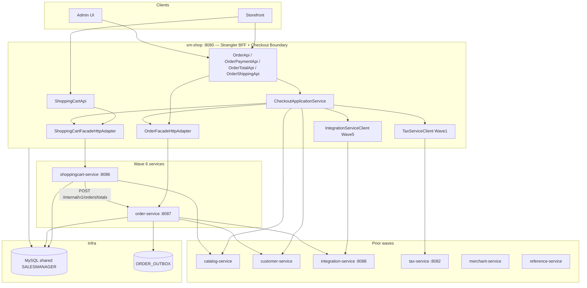

# Onda 6 — Design ShoppingCart + Order

**Spec:** `.specs/features/onda-6-shoppingcart-order/spec.md`
**Context:** `.specs/features/onda-6-shoppingcart-order/context.md` (OQ-01..08 confirmadas)
**Status:** Aprovado — Execute bloqueado até gate Ondas 3–5
**Pré-requisitos:** Onda 3 (snapshots, saga/outbox, CheckoutApplicationService), Onda 4 (catalog, customer), Onda 5 (integration-service)

---

## Visão geral da arquitetura

A Onda 6 extrai os **dois últimos domínios centrais de comércio** enquanto o monólito permanece **BFF de orquestração de checkout**. O Checkout Application Service (introduzido na Onda 3) torna-se o **único** ponto de entrada para `processOrder` e fluxos relacionados de checkout. Serviços cart e order são donos de persistência e regras de domínio; coordenação cross-domain usa HTTP + saga, não transações globais AOP.



### Princípios (herdados + Wave 6)

1. **Caminhos REST congelados** — STR/HUB-04; BFF mantém controllers originais
2. **DTOs sem JPA** — `shopizer-api-contracts` estendido com tipos cart/order/checkout
3. **Fronteira checkout** — AD-024; `CheckoutApplicationService` em `sm-shop`
4. **Saga + outbox** — ADR-003/004; sem `TransactionalAspectAwareService` para checkout commit
5. **Quebra de ciclo** — totais de cart somente via HTTP (OQ-01)
6. **Tax no BFF** — ADR-006; order recebe linhas de tax computadas
7. **Flags faseadas** — `wave6.shoppingcart.strangler.enabled`, `wave6.order.strangler.enabled`, `wave6.checkout.saga.enabled`
8. **Clients RestTemplate** — `wave6.*.base-url`; correlation ID preservado

---

## Decisões de design (OQ-01 – OQ-08)

| ID | Decisão | Escolha | Racional |
|----|----------|--------|-----------|
| OQ-01 | Ciclo cart↔order | API HTTP totals | Elimina `ShoppingCartCalculationServiceImpl` → `OrderService` in-process |
| OQ-02 | processOrder | Saga + outbox | Quebra ciclo order↔payments; consistência eventual com compensação |
| OQ-03 | Tax | BFF chama tax-service | Evita order-service depender de regras de tax; linhas pré-computadas no snapshot |
| OQ-04 | Hub facade | CheckoutApplicationService | Colapsa injeção de 12 serviços em um orquestrador |
| OQ-05 | Order | Cart antes de order cutover | Menor blast radius; API totals estável antes da saga |
| OQ-06 | Database | MySQL compartilhado | AD-003; somente split de runtime |
| OQ-07 | Rollback | Desabilitar por flag | Rollback independente cart/order/checkout |
| OQ-08 | Bypass APIs | Pelo checkout | Caminho único de orquestração |

---

## Quebra de ciclo: Cart Totals

**Antes (ciclo):**

```
ShoppingCartCalculationServiceImpl → OrderService.calculateShoppingCartTotal
OrderServiceImpl → ShoppingCartService
```

**Depois:**

```
shoppingcart-service → POST /internal/v1/orders/totals (order-service)
order-service: cálculo stateless de totais a partir de CartTotalsRequest (snapshots de linha + contexto shipping/promo)
CheckoutApplicationService → order-service para totais checkout (mesmo endpoint, contexto mais rico)
```

`CartTotalsRequest` contém:

- `storeCode`, `languageCode`, `customerId` (opcional)
- `List<CartLineSnapshot>` (productId, sku, qty, snapshots de preço do catalog)
- snapshot `shippingAddress` (opcional, para módulos tax/shipping)
- `promoCode` (opcional)

`CartTotalsResponse` mapeia para formato DTO `OrderTotalSummary` existente para compatibilidade BFF.

---

## Saga: choreography de processOrder

Passos (happy path):

| Passo | Ator | Ação | Compensação |
|------|-------|--------|----------------|
| 1 | CheckoutApplicationService | Validar cart + cliente + inventário (HTTP catalog) | — |
| 2 | CheckoutApplicationService | Computar tax (tax-service) + cotação frete (integration-service) | — |
| 3 | CheckoutApplicationService | `POST /internal/v1/checkout/commit` → order-service | Cancelar pedido se passos posteriores falharem |
| 4 | order-service | Persistir pedido + outbox em transação local | Marcar pedido CANCELLED |
| 5 | CheckoutApplicationService | `integration-service` processa pagamento | Void/refund conforme PaymentModule |
| 6 | order-service | Atualizar status pagamento + outbox `OrderPaid` | Reverter status pagamento |
| 7 | CheckoutApplicationService | Limpar cart (shoppingcart-service) | Restaurar cart do snapshot (best-effort) |
| 8 | Relay outbox | Publicar eventos (email, inventário) | Retry; DLQ após N tentativas |

**Idempotência:** header `Idempotency-Key` no commit; order-service armazena mapeamento key → orderId (TTL 24h).

**Flag:** `wave6.checkout.saga.enabled=true` roteia pela saga; `false` usa `orderService.processOrder` legado.

---

## Transactional outbox

Tabela `ORDER_OUTBOX` (order-service):

| Coluna | Tipo | Notas |
|--------|------|-------|
| id | BIGINT PK | |
| aggregate_id | BIGINT | order id |
| event_type | VARCHAR | OrderPlaced, OrderPaid, OrderCancelled |
| payload | JSON | fragmento OrderSnapshot |
| created_at | TIMESTAMP | |
| published_at | TIMESTAMP NULL | |
| correlation_id | VARCHAR | |

Relay: poller `@Scheduled` em `order-service` (ADR-023); caminho de upgrade para worker standalone documentado.

---

## Decomposição do Hub

### Atual: injeções `OrderFacadeImpl` (hub checkout)

12 serviços sm-core + facades:

- `OrderService`, `ProductService`, `ProductAttributeService`, `ShoppingCartService`
- `DigitalProductService`, `ShippingService`, `PricingService`, `ShippingQuoteService`
- `PaymentService`, `CountryService`, `ZoneService`, `TransactionService`
- Mais `CustomerFacade`, `ShoppingCartFacade`

### Alvo

| Componente | Responsabilidade |
|-----------|----------------|
| `CheckoutApplicationService` | place order, payment, shipping, orquestração totals |
| `OrderFacadeHttpAdapter` | ler order, list, history → order-service |
| `ShoppingCartFacadeHttpAdapter` | CRUD cart → shoppingcart-service |
| `OrderFacadeImpl` (fino) | Delega checkout → CheckoutApplicationService; leitura → adapter |

Bypass APIs refatoradas:

- `OrderPaymentApi` → `CheckoutApplicationService.processPayment(...)`
- `OrderTotalApi` → `CheckoutApplicationService.calculateTotals(...)`
- `OrderShippingApi` → `CheckoutApplicationService.getShippingQuotes(...)`

---

## Estrutura de módulos Maven

```xml
<!-- adições root pom.xml -->
<module>sm-shoppingcart-core</module>
<module>shoppingcart-service</module>
<module>sm-order-core</module>
<module>order-service</module>
```

| Módulo | Porta | JPA | Outbox | Deps principais |
|--------|------|-----|--------|----------|
| `shoppingcart-service` | 8086 | ✅ | — | catalog-service |
| `order-service` | 8087 | ✅ | ✅ | customer, integration (HTTP) |

### `shopizer-api-contracts` — extensões Wave 6

```
com.salesmanager.contracts.cart       → ReadableShoppingCart, PersistableCartLine, CartLineSnapshot
com.salesmanager.contracts.order      → ReadableOrder, OrderSnapshot, CartTotalsRequest/Response
com.salesmanager.contracts.checkout   → CheckoutCommitRequest, CheckoutCommitResponse, SagaStepStatus
com.salesmanager.contracts.client     → ShoppingCartServiceClient, OrderServiceClient, CartTotalsClient
```

### `sm-shoppingcart-core`

Extrair de `sm-core`:

- `services/shoppingcart/` (exceto impl calculation — substituída por client HTTP totals)
- `repositories/shoppingcart/`
- Entidades permanecem em `sm-core-model` (compartilhado)

### `sm-order-core`

Extrair de `sm-core`:

- `services/order/`, `services/ordertotal/`
- `repositories/order/`
- Handler saga commit, repositório outbox
- **Excluir** chamadas diretas `PaymentService` do caminho commit — orquestração payment no BFF

---

## Configuração Strangler (`sm-shop`)

```properties
# application-strangler-wave6.properties
wave6.shoppingcart-service.base-url=http://localhost:8086
wave6.order-service.base-url=http://localhost:8087
wave6.shoppingcart.strangler.enabled=false
wave6.order.strangler.enabled=false
wave6.checkout.saga.enabled=false
wave6.order-service.internal-token=${WAVE6_ORDER_INTERNAL_TOKEN:dev-token}
```

Profile: `strangler-wave6` (ativa com `docker-compose-wave6.yml`).

---

## APIs internas

| Serviço | Caminho | Auth | Propósito |
|---------|------|------|---------|
| order-service | `POST /internal/v1/orders/totals` | `X-Internal-Token` | Totais cart/checkout (quebra de ciclo) |
| order-service | `POST /internal/v1/checkout/commit` | `X-Internal-Token` | Passo saga 3 — persistir pedido |
| order-service | `PATCH /internal/v1/orders/{id}/payment-status` | `X-Internal-Token` | Passo saga 6 |
| shoppingcart-service | `DELETE /internal/v1/carts/{id}/after-checkout` | `X-Internal-Token` | Passo saga 7 |

APIs públicas espelham caminhos monólito existentes em `/api/v1/cart/**` e `/api/v1/orders/**`.

---

## Decisão Tax (ADR-006)

**Decisão:** Cálculo de tax permanece invocado do **CheckoutApplicationService** (BFF) chamando `tax-service` (Onda 1). Order-service armazena linhas de tax de `OrderSnapshot.taxItems` — não chama `TaxService` in-process.

**Racional:**

- Regras de tax dependem de endereço de frete, config de loja, classe fiscal de produto — já integradas no fluxo checkout do monólito
- Mover tax para order-service adiciona outro hop remoto durante saga de maior risco
- CRUD admin `tax-service` já extraído; **cálculo checkout** pode ir remoto em follow-up sem bloquear Onda 6

**Caminho de upgrade:** Flag opcional `wave6.tax.remote-in-order-service` no futuro; documentar em ADR-006.

---

## Faseamento e marcos

| Marco | Critérios | Rollback |
|-----------|----------|----------|
| `TOT-ready` | API Totals live (monólito ou order-service); cart usa HTTP | N/A — retrocompatível |
| `SC-ready` | shoppingcart-service CRUD remoto | `wave6.shoppingcart.strangler.enabled=false` |
| `OR-read-ready` | Order GET/list remoto | `wave6.order.strangler.enabled=false` |
| `CHK-ready` | Saga checkout end-to-end | `wave6.checkout.saga.enabled=false` |

**Sequência de cutover recomendada:**

1. Habilitar totals HTTP (sem mudança visível ao usuário)
2. Shadow leituras cart remotas
3. Escritas cart remotas
4. Leituras order remotas
5. Saga checkout em staging → canary → produção

---

## Docker Compose (wave6)

Estende topologia `docker-compose-wave1.yml` / wave2:

```yaml
services:
  shoppingcart-service:
    ports: ["8086:8086"]
    environment:
      WAVE6_CATALOG_BASE_URL: http://catalog-service:8089
      WAVE6_ORDER_BASE_URL: http://order-service:8087
  order-service:
    ports: ["8087:8087"]
    environment:
      WAVE6_CUSTOMER_BASE_URL: http://customer-service:8090
      WAVE6_INTEGRATION_BASE_URL: http://integration-service:8088
```

`sm-shop` adiciona `spring.profiles.active=strangler-wave6` e habilita flags por ambiente.

---

## Estratégia de testes

| Camada | Escopo |
|-------|-------|
| Unit | Handlers passo saga, relay outbox, calculadora totals |
| Integração | `@DataJpaTest` repos cart/order; saga commit com H2 |
| Contract | Pact consumer sm-shop; providers cart + order |
| E2E | Happy path place order + compensação falha payment |
| Chaos | Matar integration-service mid-saga → order CANCELLED, sem pagamento órfão |

Comando gate (onda completa):

```bash
./mvnw -pl sm-shop,shoppingcart-service,order-service -am test \
  -Dtest=Wave6ConsumerPactTest,ShoppingCartProviderPactTest,OrderProviderPactTest \
  -DfailIfNoTests=false
```

---

## Arquivos-fonte principais

| Papel | Caminho |
|------|------|
| Hub facade order | `sm-shop/.../order/facade/OrderFacadeImpl.java` |
| Facade cart | `sm-shop/.../shoppingCart/facade/ShoppingCartFacadeImpl.java` |
| Ciclo calculation cart | `sm-core/.../shoppingcart/ShoppingCartCalculationServiceImpl.java` |
| processOrder | `sm-core/.../order/OrderServiceImpl.java` |
| AOP transação global | `sm-core/.../spring/shopizer-core-config.xml` |
| API Cart | `sm-shop/.../api/v1/shoppingCart/ShoppingCartApi.java` |
| APIs Order | `sm-shop/.../api/v1/order/OrderApi.java`, `OrderPaymentApi.java`, `OrderTotalApi.java`, `OrderShippingApi.java` |

---

## Índice ADR (Compozy)

| ADR | Tópico |
|-----|-------|
| ADR-001 | Workflow único Cart + Order |
| ADR-002 | Fronteira Checkout Application Service |
| ADR-003 | Saga choreography para processOrder |
| ADR-004 | Transactional outbox |
| ADR-005 | Decomposição hub OrderFacade |
| ADR-006 | Cálculo tax no BFF (remoto em order-service adiado) |
| ADR-007 | ShoppingCart antes de Order phasing |
| ADR-008 | Feature flags e rollback |

---

## Lacunas e limitações conhecidas (Wave 6)

| ID | Lacuna | Mitigação |
|----|-----|------------|
| GAP-CHK-01 | Restauração cart em falha saga é best-effort | Documentar; tabela opcional snapshot cart |
| GAP-CHK-02 | AOP global ainda aplica a caminhos não-checkout | Estreitar pointcut na task Wave 6; remoção completa pós-onda |
| GAP-CHK-03 | Email ainda disparado via outbox async | Aceitar latência vs in-process |
| GAP-ORD-01 | Dois pacotes `OrderFacadeImpl` | Consolidar em delegate fino na task hub |
