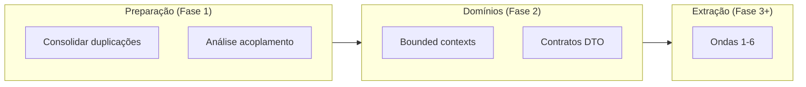
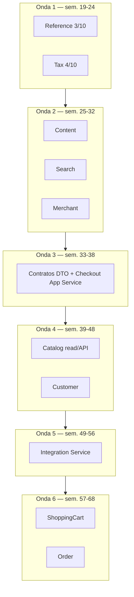

# Plano Mestre de Decomposição — Shopizer

**Versão:** 1.0  
**Data:** 2026-07-04  
**Codebase:** Shopizer 3.2.5 — Spring Boot 2.5.12, Java 11  
**Objetivo:** Migrar incrementalmente o monólito Maven para serviços de domínio, com consolidação interna antes da extração.

---

## Sumário

1. [Visão executiva](#1-visão-executiva)
2. [Skills e métodos utilizados](#2-skills-e-métodos-utilizados)
3. [Estado atual do monólito](#3-estado-atual-do-monólito)
4. [Análise de sobreposição de componentes](#4-análise-de-sobreposição-de-componentes)
5. [Roadmap de decomposição (fases)](#5-roadmap-de-decomposição-fases)
6. [Análise de acoplamento (dados concretos)](#6-análise-de-acoplamento-dados-concretos)
7. [Ondas de extração revisadas](#7-ondas-de-extração-revisadas)
8. [Padrões de decomposição — status](#8-padrões-de-decomposição--status)
9. [Issues críticos e quick wins](#9-issues-críticos-e-quick-wins)
10. [Pré-requisitos globais](#10-pré-requisitos-globais)
11. [Backlog de architecture stories](#11-backlog-de-architecture-stories)
12. [Decisão TLC vs plano avulso](#12-decisão-tlc-vs-plano-avulso)
13. [Próximos passos](#13-próximos-passos)

---

## 1. Visão executiva

O Shopizer é um monólito Java multi-módulo com ~1.167 arquivos Java. A migração deve seguir três princípios:

1. **Consolidar antes de extrair** — duplicações (Mapper/Populator, facades V1/V2) aumentam o custo de split.
2. **Respeitar a sequência de padrões** — análise → consolidação → domínios → serviços.
3. **Extrair por ordem de acoplamento**, não por intuição — dados mostram que Order é o último (9/10), Reference o primeiro (3/10).

**Saúde arquitetural atual:** ATTENTION — existe arquitetura de plugins (`sm-core-modules`), mas ~95% das facades usam MODEL coupling (entidades JPA expostas).



**Horizonte estimado:** 8–12 meses (projeto médio, 1–2 devs em tempo parcial de arquitetura).

---

## 2. Skills e métodos utilizados

| Skill | Caminho | Uso na discussão |
|-------|---------|------------------|
| `component-common-domain-detection` | `.cursor/skills/component-common-domain-detection/SKILL.md` | Sobreposição de componentes antes da refatoração |
| `decomposition-planning-roadmap` | `.cursor/skills/decomposition-planning-roadmap/SKILL.md` | Roadmap inicial em fases e padrões 1–6 |
| `coupling-analysis` | `.cursor/skills/coupling-analysis/SKILL.md` | Modelo 3D (strength × distance × volatility); substituiu hipóteses da Fase 3 |
| `tlc-spec-driven` | `~/.cursor/skills/tlc-spec-driven/SKILL.md` | Recomendado para Specify/Design/Tasks da Onda 1 |

**Subagentes (coupling-analysis):**

- `sm-core` domain services — inventário de 22 pares cross-domain, ciclos order↔payments
- `sm-shop` facades — 52 facades, hub de checkout com 12 services
- Integrações/Maven — `sm-core-modules`, payment/shipping/CMS, viabilidade de extração

---

## 3. Estado atual do monólito

### 3.1 Módulos Maven

| Módulo | Arquivos Java | Papel |
|--------|---------------|-------|
| `sm-core-model` | 186 | Entidades JPA / modelo de domínio |
| `sm-core-modules` | 14 | Contratos de integração (publicável) |
| `sm-core` | 335 | Serviços, repositórios, CMS, integrações |
| `sm-shop-model` | 322 | DTOs e interfaces de API |
| `sm-shop` | 310 | REST APIs, facades, mappers, populators |
| **Total** | **~1.167** | |

**Dependência Maven:**

```
sm-shop → sm-core, sm-core-model, sm-shop-model
sm-shop-model → sm-core-model (34 arquivos importam core.model.*)
sm-core → sm-core-model, sm-core-modules
sm-core-modules → sm-core-model
sm-core-model → (sem dependência de sm-shop-model)
```

### 3.2 Domínios de serviço (`sm-core`)

| Domínio | Services (impl) | Tipo inferido | Volatilidade (git histórico) |
|---------|-----------------|---------------|------------------------------|
| catalog | 22 | Core | Alta (51 commits) |
| customer | 7 | Supporting | Média (14 commits) |
| order | 4+ | Core | Média (8 commits) |
| reference | 4 | Generic | Baixa (19 commits) |
| system | 6 | Supporting | — |
| shipping | 3 | Generic | Média (6 commits) |
| payments | 2 | Generic | Baixa (4 commits) |
| tax | 3 | Supporting | — |
| shoppingcart | 2 | Core | — |
| content | 1 | Generic | Mínima (2 commits) |
| search | 1 | Supporting | — |
| merchant | 1 | Supporting | — |
| user | 3 | Generic | — |

### 3.3 Sinais de dívida técnica

- **76 facades** em `sm-shop`
- **~54 populators** + **~42 mappers** (transformação duplicada)
- **4 facades de produto** (`ProductFacadeImpl`, `V2`, `Common`, `Definition`)
- **2 `OrderFacadeImpl`** em pacotes diferentes
- **`AbstractConfigurationFacadeImpl`** vazio; `ShippingConfigurationFacadeImpl` com stubs
- Transação global AOP em `TransactionalAspectAwareService`

---

## 4. Análise de sobreposição de componentes

Skill: `component-common-domain-detection`

### 4.1 Matriz de consolidação

| Funcionalidade | Componentes | Viabilidade | Recomendação |
|----------------|-------------|-------------|--------------|
| Transformação Product→DTO | `ReadableProductPopulator` (~730L) + `ReadableProductMapper` (~692L) | Alta | Biblioteca compartilhada; deprecar Populator |
| Facades de produto | 4 implementações | Alta | Merge + `ProductCategoryCriteriaExpander` |
| Agregação de ratings | `ProductReviewServiceImpl` + `CustomerReviewServiceImpl` | Alta | `RatingAggregateUpdater` |
| Endereços de cliente | 5 populators | Alta | `AbstractAddressPopulator` |
| Validação Bean Validation | `FieldMatchValidator` duplicado | Alta | Só em `sm-shop-model` |
| CMS cloud (S3/GCP) | Managers paralelos | Média | `AbstractCloudContentAssetsManager` |
| Configuration facades | Payment + Shipping + base vazia | Alta | Implementar base abstrata |
| Pagamentos | Stripe, Stripe3, Braintree… | Alta | `IntegrationConfigValidator` + `TransactionBuilder` |
| Optin (shop layer) | Populator + Mapper | Alta | Estender Mapper |
| Optin (core) | `OptinService` vs `CustomerOptinService` | Baixa | Manter separado (contextos distintos) |

### 4.2 Quick wins identificados (pré-refatoração)

1. Remover ou implementar `ReadableProductReviewPopulator` (stub retorna `null`, nome errado)
   - `sm-shop/.../populator/customer/ReadableProductReviewPopulator.java`
2. Corrigir bug `stateProvince` → `postalCode` em `PersistableCustomerShippingAddressPopulator`
3. Extrair `ProductCategoryCriteriaExpander` das facades V1/V2
4. Deduplicar `FieldMatchValidator` (manter só em `sm-shop-model/validation`)
5. Implementar `AbstractConfigurationFacadeImpl`
6. Extrair `RatingAggregateUpdater` dos review services
7. Unificar `IntegrationException` em `sm-core-modules`

### 4.3 Maior dívida: Mapper vs Populator

- V1 / `ProductCommonFacadeImpl` / `SearchFacadeImpl` → **Populator**
- V2 / `ProductFacadeV2Impl` → **Mapper**
- Padrão canônico recomendado: **Mapper** (Spring-injectable)

---

## 5. Roadmap de decomposição (fases)

Skill: `decomposition-planning-roadmap`

### Fase 1 — Análise e preparação (semanas 1–10)

| Semana | Entrega |
|--------|---------|
| 1–2 | Quick wins de consolidação |
| 3–4 | Piloto Mapper/Populator (Product) |
| 5–6 | Achatamento de facades |
| 7–8 | Análise de acoplamento ✅ (concluída) |
| 9–10 | Inventário formal de componentes |

### Fase 2 — Organização por domínios (semanas 11–18)

10 bounded contexts candidatos: Catalog, Order, Customer, Merchant, Payment, Shipping, Content, Reference, Identity, System.

### Fase 3 — Extração incremental (semanas 19–42, revisada — ver seção 7)

### Fase 4 — Otimização (semanas 43–48)

Deprecar API V1, observabilidade, fitness functions (ArchUnit).

---

## 6. Análise de acoplamento (dados concretos)

Skill: `coupling-analysis` — modelo Strength × Distance × Volatility

### 6.1 Executive summary

```
MÓDULOS ANALISADOS:     5 Maven + 13 domínios sm-core
PARES CROSS-DOMAIN:     22 (sm-core)
FACADES:                52 (~94% MODEL coupling)
CICLOS:                 2 (order↔payments, order↔cart)
ISSUES CRÍTICAS:        5
SAÚDE GERAL:            ATTENTION
```

### 6.2 Top upstream (afferent coupling)

| Rank | Domínio | Inbound refs | Dependentes |
|------|---------|--------------|-------------|
| 1 | **catalog** | 10 | order, cart, shipping, search, merchant, reference |
| 2 | **system** | 7 | payments, shipping, tax, reference |
| 3 | **order** | 2 | cart, payments |
| 4 | **reference** | 3 | shipping, system |
| 5 | **merchant** | 2 | user, reference |

### 6.3 Top downstream (efferent coupling)

| Rank | Domínio | Outbound | Depende de |
|------|---------|----------|------------|
| 1 | **order** | 6 | catalog, customer, payments, shipping, cart, tax |
| 2 | **reference** (init) | 5 | catalog, merchant, system, tax, user |
| 3 | **shipping** | 3 | catalog, reference, system |
| 4 | **shoppingcart** | 2 | catalog, order |
| 4 | **payments** | 2 | order, system |

**Isolados (0 cross-domain service deps):** `content`, `customer` (top-level), `tax` (exceto system), `user` (exceto merchant).

### 6.4 Scores de dificuldade de extração (sm-core)

| Domínio | Score | Rationale |
|---------|-------|-----------|
| content | 2/10 | Zero deps de serviço |
| reference | 3/10 | CRUD estável |
| user | 4/10 | Dep única: merchant |
| customer | 5/10 | Order cria Customer em transação |
| search | 5/10 | Dep: catalog inventory |
| merchant | 5/10 | Dep: ProductTypeService |
| system | 6/10 | Hub de config |
| tax | 6/10 | Consome modelos order/shipping |
| shipping | 6/10 | catalog + system |
| catalog | 7/10 | Maior afferent coupling |
| shoppingcart | 7/10 | Ciclo com order |
| payments | 8/10 | Ciclo bidirecional com order |
| **order** | **9/10** | Orquestrador central |

### 6.5 Ciclos críticos

**order ↔ payments**

- `OrderServiceImpl.processOrder` → `paymentService.processPayment`
- `PaymentServiceImpl` → `OrderService.saveOrUpdate` / `addOrderStatusHistory`
- Evidência: `sm-core/.../order/OrderServiceImpl.java` (~linha 147)

**order ↔ shoppingcart**

- `ShoppingCartCalculationServiceImpl` → `OrderService.calculateShoppingCartTotal`
- `OrderServiceImpl` → `ShoppingCartService`

### 6.6 Hub de checkout (sm-shop)

`controller/order/OrderFacadeImpl` injeta **12 sm-core services** + `CustomerFacade` + `ShoppingCartFacade`.

APIs que bypassam facade:

- `OrderPaymentApi` — 5 services + facade
- `OrderTotalApi` — 4 services + facade
- `OrderShippingApi` — 3 services + facades

### 6.7 Contratos de integração

`PaymentModule` e `ShippingQuoteModule` em `sm-core-modules` recebem entidades (`Order`, `Customer`, `ShoppingCartItem`) — **MODEL coupling disfarçado de plugin**.

Extração de `integration-service` requer redesign de contratos **antes** do split.

### 6.8 Transação global

AOP em `TransactionalAspectAwareService` (`shopizer-core-config.xml`) — mutações em múltiplos domínios na mesma transação DB.

### 6.9 Hipóteses vs dados (Fase 3 original)

| Hipótese original | Veredito após acoplamento |
|-------------------|---------------------------|
| Reference primeiro | ✅ Confirmado |
| Content cedo | ✅ Confirmado (ressalva: split-brain JPA+blob) |
| Search isolado | ✅ Confirmado (precisa ProductSnapshot) |
| Integration Hub cedo | ❌ Adiar — contratos + ciclo order |
| Customer antes de Catalog | ⚠️ Reordenar — após contratos DTO |
| Catalog antes de Order | ⚠️ Extração parcial (read) primeiro |
| Order por último | ✅ Fortemente confirmado |

### 6.10 Padrões positivos

- `sm-core-modules` publicável (Maven Central)
- Plugin registry: `Map<String, PaymentModule>`
- CMS strategy: `config.cms.method`
- Starters externos: OpenSearch, Canada Post
- `content` e `reference` com coesão interna
- `sm-core-model` não importa `sm-shop-model`

---

## 7. Ondas de extração revisadas

Substitui a Fase 3 hipotética por ordem baseada em acoplamento.

### Visão geral



---

### Onda 1 — Reference + Tax (semanas 19–24)

**Objetivo:** Validar padrão Strangler Fig com domínios de menor risco.

| Serviço | Dificuldade | Acoplamento | Volatilidade |
|---------|-------------|-------------|--------------|
| `reference-service` | 3/10 | 1 svc/facade, sem ciclos | Mínima |
| `tax-service` | 4/10 | Facades mapper-based, APIs isoladas | Baixa |

**Escopo Reference:**

- Entidades: `sm-core-model/.../reference/` (country, zone, language, currency)
- Services: `sm-core/.../services/reference/`
- API atual: `ReferencesApi`, facades `CountryFacadeImpl`, `ZoneFacadeImpl`, `LanguageFacadeImpl`, `CurrencyFacadeImpl`

**Escopo Tax:**

- Services: `TaxClassService`, `TaxRateService`
- Facades: `TaxFacadeImpl`
- APIs: `TaxClassApi`, `TaxRatesApi`

**Critérios de sucesso:**

- [ ] Serviços deployáveis com REST + DTOs (`ReadableCountry`, etc.)
- [ ] Monólito consome via HTTP client (Strangler)
- [ ] `ReferencesApi` não retorna entidade `Language` diretamente
- [ ] Testes de contrato (Pact ou similar)

**Esforço estimado:** 4–5 semanas

**Bloqueadores conhecidos:**

- `sm-shop-model` facade interfaces passam `Language`/`MerchantStore` — precisa contrato DTO na Specify

---

### Onda 2 — Content, Search, Merchant (semanas 25–32)

| Serviço | Dificuldade | Bloqueador | Mitigação |
|---------|-------------|------------|-----------|
| `content-service` | 2–6/10 | Split-brain JPA metadata + blob | Co-localizar DB + storage |
| `search-service` | 5/10 | Indexa `Product` inteiro | `ProductIndexedEvent` + snapshot DTO |
| `merchant-service` | 5/10 | Dep `ProductTypeService` | Extrair merchant sem product types inicialmente |

**Evidências:**

- Content: `ContentServiceImpl` + `shopizer-core-cms.xml`
- Search: `SearchServiceImpl`, `IndexProductEventListener`, starter OpenSearch
- CMS backends: infinispan, local, aws, gcp

---

### Onda 3 — Contratos (semanas 33–38) — SEM extração de serviços

**Objetivo:** Preparar Ondas 4–6. Não deployar microserviços nesta onda.

| Entregável | Desbloqueia |
|------------|-------------|
| `ProductSnapshot`, `OrderSnapshot`, `CustomerSnapshot` | Search, Catalog read, cross-service |
| DTOs em `PaymentModule` / `ShippingQuoteModule` | Integration service |
| Checkout Application Service no monólito | Order service |
| Saga/outbox em `processOrder` | Order + Payments split |
| `MerchantStoreId` / `LanguageCode` em vez de entidades | Todos os serviços |

**Esforço:** ~6 semanas

---

### Onda 4 — Catalog + Customer (semanas 39–48)

**Pré-requisito:** Onda 3 concluída.

| Serviço | Abordagem |
|---------|-----------|
| Catalog | API read-heavy primeiro; write permanece no monólito temporariamente |
| Customer | Após `CustomerSnapshot`; desacoplar merge com cart |

**Nota:** Catalog tem maior afferent coupling (10) — não extrair CRUD completo cedo.

---

### Onda 5 — Integration Service (semanas 49–56)

**Mudança vs hipótese original:** era 4ª prioridade; dados colocam como 9ª.

**Escopo:** `PaymentService`, `ShippingService`, impls em `modules/integration/`, contratos `sm-core-modules`.

**Pré-requisitos obrigatórios:**

- Contratos DTO em `sm-core-modules`
- Saga de checkout funcionando
- Service stateless (sem entidade `Order`)

---

### Onda 6 — ShoppingCart + Order (semanas 57–68)

| Serviço | Por último | Evidência |
|---------|------------|-----------|
| ShoppingCart | Ciclo com order | `ShoppingCartCalculationServiceImpl` → `OrderService` |
| Order | Hub 9/10 | 6 outbound domains, `processOrder` transacional, 12 services no facade |

---

## 8. Padrões de decomposição — status

Sequência de 6 padrões (*Software Architecture: The Hard Parts*):

| # | Padrão | Status | Progresso |
|---|--------|--------|-----------|
| 1 | Identificar e dimensionar componentes | Parcial | ~40% |
| 2 | Reunir componentes de domínio comum | Concluído | 100% |
| 3 | Achatar componentes | Não iniciado | 0% |
| 4 | Determinar dependências | Concluído (acoplamento) | 100% |
| 5 | Criar domínios de componentes | Não iniciado | 0% |
| 6 | Criar serviços de domínio | Não iniciado | 0% |

---

## 9. Issues críticos e quick wins

### 9.1 Issues críticos (por severidade)

| # | Issue | Tipo | Módulos |
|---|-------|------|---------|
| 1 | Ciclo order ↔ payments | FUNCTIONAL + MODEL | sm-core |
| 2 | Hub checkout (12 services) | MODEL + FUNCTIONAL | sm-shop |
| 3 | Contratos integração acoplados a entidades | MODEL | sm-core-modules |
| 4 | Catalog bloqueador upstream | MODEL | sm-core |
| 5 | Transação AOP global | FUNCTIONAL transactional | sm-core |

### 9.2 Matriz de balanceamento (pares críticos)

| Par | Strength | Distance | Volatility | Diagnóstico |
|-----|----------|----------|------------|-------------|
| order → payments | HIGH | HIGH | HIGH | 🔴 CRITICAL |
| order → catalog | HIGH | HIGH | HIGH | 🔴 CRITICAL |
| shoppingcart → order | HIGH | HIGH | HIGH | 🔴 CRITICAL |
| shipping → reference | CONTRACT | MEDIUM | LOW | 🟢 GOOD |
| search → catalog (read) | MODEL | HIGH | MEDIUM | 🟡 ACCEPTABLE com CQRS |
| content (isolado) | — | — | LOW | 🟢 GOOD |

---

## 10. Pré-requisitos globais

| # | Ação | Impacto | Esforço |
|---|------|---------|---------|
| 1 | DTOs de integração em `sm-core-modules` | Desbloqueia integration-service | ~3 sem |
| 2 | Checkout Application Service | Desbloqueia order-service | ~4 sem |
| 3 | `ProductSnapshot` para reads cross-service | Desbloqueia search + catalog read | ~2 sem |
| 4 | Saga/outbox em `processOrder` | Desbloqueia order + payments | ~5 sem |
| 5 | Tenant context (IDs, não entidades) | Todos os serviços | ~3 sem |

---

## 11. Backlog de architecture stories

### Fase 1 — Preparação

| ID | Story | Prioridade | Estimativa |
|----|-------|------------|------------|
| S1 | Quick wins consolidação | Alta | 3 pts |
| S2 | Análise acoplamento | Alta | 5 pts ✅ |
| S3 | Unificar ReadableProductMapper | Alta | 8 pts |
| S4 | Merge facades produto | Alta | 8 pts |
| S5 | Achatamento facades config | Média | 5 pts |
| S6 | Definir bounded contexts | Alta | 8 pts |

### Onda 1

| ID | Story | Prioridade | Estimativa |
|----|-------|------------|------------|
| A | Extrair Reference Service | Alta | 5 pts |
| — | Tax incluído na Onda 1 Specify | Alta | — |

### Onda 3 (contratos)

| ID | Story | Bloqueia |
|----|-------|----------|
| B | ProductSnapshot + eventos indexação | search-service |
| C | Redesign PaymentModule com DTOs | integration-service |
| D | Checkout Application Service | order-service |

### Onda 6

| ID | Story | Depende de |
|----|-------|------------|
| E | Extrair Order Service | B, C, D |

---

## 12. Decisão TLC vs plano avulso

**Decisão:** Usar `tlc-spec-driven` para a Onda 1, não plano avulso.

**Rationale:**

- Onda 1 é escopo **Large** (multi-módulo, contratos, Strangler)
- Decomposição multi-onda exige memória persistente (`STATE.md`, traceability)
- Onda 1 define padrão para Ondas 2–6
- Subagentes alinham com `tasks.md` + gates

**Fluxo acordado:**

```
1. Este documento (concluído)
2. Inicializar .specs/ (próxima janela)
3. Brownfield mínimo (reaproveitar este doc)
4. Specify Onda 1 (Reference + Tax)
5. Design → Tasks → Execute (sem código na primeira sessão Specify)
```

**Estrutura `.specs/` planejada:**

```
.specs/
├── project/
│   ├── PROJECT.md
│   ├── ROADMAP.md
│   └── STATE.md
├── codebase/          # brownfield mínimo
│   ├── ARCHITECTURE.md
│   └── CONCERNS.md
└── features/
    └── onda-1-reference-tax/
        ├── spec.md
        ├── design.md
        └── tasks.md
```

---

## 13. Próximos passos

1. **Nova janela de contexto** — carregar este doc + `docs/decomposition/README.md`
2. **Inicializar `.specs/`** via `tlc-spec-driven` (`project-init`)
3. **Brownfield mínimo** — derivar `ARCHITECTURE.md` e `CONCERNS.md` deste plano
4. **Specify Onda 1** — requisitos com IDs (REF-001, TAX-001, …)
5. **Design Onda 1** — boundaries, DTOs, HTTP client, Strangler
6. **Tasks Onda 1** — tarefas atômicas com gates de teste
7. **Execute** — somente após aprovação das tasks

**Não iniciar código** até `tasks.md` da Onda 1 estar definido.

---

## Apêndice A — Domínios candidatos (bounded contexts)

| Domínio | Componentes principais | Tipo | Volatilidade |
|---------|------------------------|------|--------------|
| Catalog | product, category, inventory, manufacturer, pricing | Core | Alta |
| Order | order, ordertotal, shoppingcart, orderstatus | Core | Alta |
| Customer | customer, optin, review, attribute | Supporting | Média |
| Merchant | merchant, store config | Supporting | Baixa |
| Payment | payments, transaction, módulos | Generic | Média |
| Shipping | shipping, quote rules, carriers | Generic | Média |
| Content | CMS, content service | Generic | Baixa |
| Reference | country, currency, language, zone | Generic | Mínima |
| Identity | user, security, permissions | Generic | Baixa |
| System | configuration, notification, search | Supporting | Média |

---

## Apêndice B — Arquivos-chave para Onda 1

### Reference

| Papel | Caminho |
|-------|---------|
| Entidades | `sm-core-model/src/main/java/com/salesmanager/core/model/reference/` |
| Services | `sm-core/src/main/java/com/salesmanager/core/business/services/reference/` |
| API | `sm-shop/src/main/java/com/salesmanager/shop/store/api/v1/references/ReferencesApi.java` |
| Facades | `sm-shop/.../country/facade/CountryFacadeImpl.java`, `ZoneFacadeImpl`, `LanguageFacadeImpl`, `CurrencyFacadeImpl` |
| DTOs existentes | `sm-shop-model/.../ReadableCountry`, etc. |

### Tax

| Papel | Caminho |
|-------|---------|
| Services | `sm-core/src/main/java/com/salesmanager/core/business/services/tax/` |
| Facade | `sm-shop/.../facade/tax/TaxFacadeImpl.java` |
| APIs | `sm-shop/.../api/v1/tax/TaxClassApi.java`, `TaxRatesApi.java` |
| Mappers | `sm-shop/.../mapper/tax/ReadableTaxClassMapper.java`, etc. |

---

## Apêndice C — Grafo de dependências sm-core (cross-domain)

```
order ──→ catalog, customer, payments, shipping, shoppingcart, tax
shoppingcart ──→ catalog, order
payments ──→ order, system
shipping ──→ catalog, reference, system
tax ──→ system
merchant ──→ catalog
user ──→ merchant
search ──→ catalog
reference(init) ──→ catalog, merchant, system, tax, user
system ──→ reference (loader)

Ciclos: order ↔ payments, order ↔ shoppingcart
```

---

## Apêndice D — Referências

- Neal Ford et al., *Software Architecture: The Hard Parts* — padrões de decomposição component-based
- Vlad Khononov, *Balancing Coupling in Software Design* — modelo 3D de acoplamento
- Skills do projeto: `.cursor/skills/`, `.claude/skills/`

---

*Documento gerado para handoff entre sessões. Versão 1.0 — base para `.specs/project/ROADMAP.md`.*
